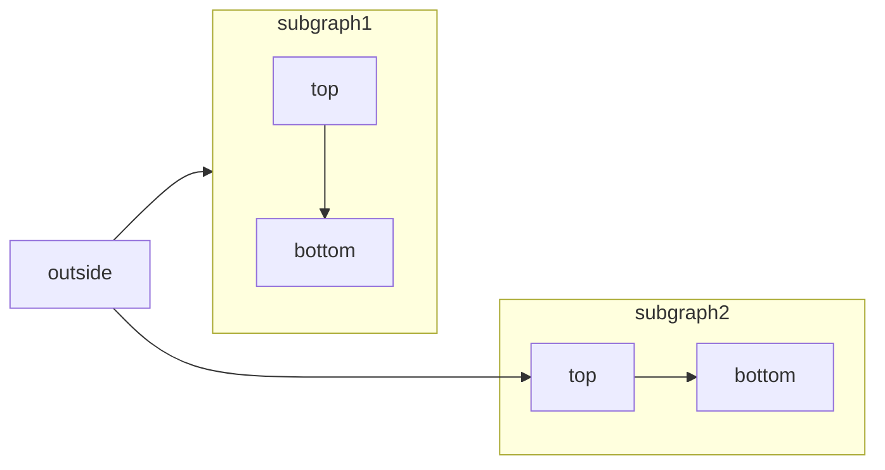

This file contains the complete current docs repo for Mintlify. Use as needed.

<file_summary>
This section contains a summary of this file.

<purpose>
This file contains a packed representation of the entire repository's contents.
It is designed to be easily consumable by AI systems for analysis, code review,
or other automated processes.
</purpose>

<file_format>
The content is organized as follows:
1. This summary section
2. Repository information
3. Directory structure
4. Repository files (if enabled)
5. Multiple file entries, each consisting of:
  - File path as an attribute
  - Full contents of the file
</file_format>

<usage_guidelines>
- This file should be treated as read-only. Any changes should be made to the
  original repository files, not this packed version.
- When processing this file, use the file path to distinguish
  between different files in the repository.
- Be aware that this file may contain sensitive information. Handle it with
  the same level of security as you would the original repository.
</usage_guidelines>

<notes>
- Some files may have been excluded based on .gitignore rules and Repomix's configuration
- Binary files are not included in this packed representation. Please refer to the Repository Structure section for a complete list of file paths, including binary files
- Files matching patterns in .gitignore are excluded
- Files matching default ignore patterns are excluded
- Security check has been disabled - content may contain sensitive information
- Files are sorted by Git change count (files with more changes are at the bottom)
</notes>

</file_summary>

<directory_structure>
.github/
  workflows/
    check-links.yml
    index-sitemap.yml
  pull_request_template.md
advanced/
  dashboard/
    permissions.mdx
    roles.mdx
    sso.mdx
  subpath/
    cloudflare.mdx
    route53-cloudfront.mdx
    vercel.mdx
api-playground/
  asyncapi/
    playground.mdx
    setup.mdx
  customization/
    adding-sdk-examples.mdx
    complex-data-types.mdx
    managing-page-visibility.mdx
    multiple-responses.mdx
  mdx/
    authentication.mdx
    configuration.mdx
  openapi-setup.mdx
  overview.mdx
  troubleshooting.mdx
api-reference/
  chat/
    create-topic.mdx
    generate-message.mdx
  update/
    status.mdx
    trigger.mdx
  introduction.mdx
authentication-personalization/
  authentication-setup.mdx
  overview.mdx
  partial-authentication-setup.mdx
  personalization-setup.mdx
  sending-data.mdx
components/
  accordions.mdx
  callouts.mdx
  cards.mdx
  code-groups.mdx
  columns.mdx
  examples.mdx
  expandables.mdx
  fields.mdx
  frames.mdx
  icons.mdx
  mermaid-diagrams.mdx
  panel.mdx
  responses.mdx
  steps.mdx
  tabs.mdx
  tooltips.mdx
  update.mdx
guides/
  auth0.mdx
  cursor.mdx
  hidden-pages.mdx
  migration.mdx
  monorepo.mdx
integrations/
  analytics/
    amplitude.mdx
    clearbit.mdx
    fathom.mdx
    google-analytics.mdx
    google-tag-manager.mdx
    heap.mdx
    hotjar.mdx
    koala.mdx
    logrocket.mdx
    mixpanel.mdx
    overview.mdx
    pirsch.mdx
    plausible.mdx
    posthog.mdx
    segment.mdx
  privacy/
    osano.mdx
    overview.mdx
  sdks/
    speakeasy.mdx
    stainless.mdx
  support/
    front.mdx
    intercom.mdx
    overview.mdx
logo/
  dark.svg
  light.svg
settings/
  broken-links.mdx
  ci.mdx
  custom-domain.mdx
  custom-scripts.mdx
  github.mdx
  gitlab.mdx
  preview-deployments.mdx
  seo.mdx
snippets/
  color-generator.mdx
  counter.mdx
  custom-subpath-gating.mdx
.gitignore
ai-ingestion.mdx
asyncapi.yaml
changelog.mdx
code.mdx
contact-support.mdx
discovery-openapi.json
docs.json
editor.mdx
favicon.svg
fonts.css
image-embeds.mdx
index.mdx
installation.mdx
list-table.mdx
mcp.mdx
navigation.mdx
openapi.json
pages.mdx
quickstart.mdx
react-components.mdx
reusable-snippets.mdx
settings.mdx
text.mdx
themes.mdx
translations.mdx
</directory_structure>

<files>
This section contains the contents of the repository's files.

<file path=".github/workflows/check-links.yml">
name: Check links

on: pull_request

jobs:
  check-links:
    name: Check links
    runs-on: ubuntu-latest
    steps:
      - uses: actions/checkout@v4
      - name: Set up Node
        uses: actions/setup-node@v4
        with:
          node-version: "latest"
      - name: Install Mintlify CLI
        run: npm i -g mint
      - name: Run broken link checker
        run: mint broken-links
</file>

<file path=".github/workflows/index-sitemap.yml">
name: Index docs

on:
  schedule:
    - cron: "0 */3 * * *"  

jobs:
  lint:
    name: Lint
    runs-on: ubuntu-latest
    steps:
      - uses: actions/checkout@v2

      - uses: actions/setup-node@v3
        with:
          node-version: '18'

      - name: Install CLI
        run: npm install -g @team-plain/cli@latest
        
      - name: Index Docs
        run: plain index-sitemap https://mintlify.com/docs/sitemap.xml
        env:
          PLAIN_API_KEY: ${{ secrets.PLAIN_API_KEY }}
</file>

<file path=".github/pull_request_template.md">
## Documentation changes

{/* Brief description of what's being updated */}

Closes {/* Linear ticket or GitHub issue */}

---

## For Reviewers

When reviewing documentation PRs, please consider:

### ✅ Technical accuracy
- [ ] Code examples work as written
- [ ] Commands and configurations are correct
- [ ] Links resolve to the right destinations
- [ ] Prerequisites and requirements are accurate

### ✅ Clarity and completeness
- [ ] Instructions are clear and easy to follow
- [ ] Steps are in logical order
- [ ] Nothing important is missing
- [ ] Examples help illustrate the concepts

### ✅ User experience
- [ ] A new user could follow these docs successfully
- [ ] Common gotchas or edge cases are addressed
- [ ] Error messages or troubleshooting guidance is helpful
</file>

<file path="advanced/dashboard/permissions.mdx">
---
title: 'Editor Permissions'
description: 'Allow more members of your team to update your docs'
---

The team member who created your initial docs will have update access to your docs, as long as they push to your documentation repo with the same GitHub account that was used while signing up for Mintlify.

If another editor attempts to update the docs while on the free plan, you will see a warning in your git commit check.

<Frame>
  
</Frame>

In the details of the git check warning, you'll find the link to upgrade your plan. You can also upgrade your plan on the [dashboard](https://dashboard.mintlify.com) to enable unlimited editors to update your docs. Once you upgrade your plan, trigger a manual update or push another change to deploy your updates.

Learn more about our pricing [here](https://mintlify.com/pricing).
</file>

<file path="advanced/dashboard/roles.mdx">
---
title: "Roles"
description: "Control access to your dashboard with roles."
---

Mintlify provides two dashboard access levels: Editor and Admin.

The following describes actions that are limited to the Admin role:

|                         | Editor | Admin |
| ----------------------- | :----: | :---: |
| Update user roles       |   ❌   |  ✅   |
| Delete users            |   ❌   |  ✅   |
| Invite admin users      |   ❌   |  ✅   |
| Manage & update billing |   ❌   |  ✅   |
| Update custom domain    |   ❌   |  ✅   |
| Update Git source       |   ❌   |  ✅   |
| Delete org              |   ❌   |  ✅   |

Other actions on the dashboard are available to both roles.

You can invite as many admins as you want, but we recommend limiting admin
access to users who need it.
</file>

<file path="advanced/dashboard/sso.mdx">
---
title: "Single Sign-On (SSO)"
description: "Customize how your team can login to your admin dashboard"
---

<Info>
  SSO functionality is available on our [Enterprise plan](https://mintlify.com/pricing?ref=sso). Please{" "}
  <a href="mailto:sales@mintlify.com">contact sales</a> for more information.
</Info>

Use single sign-on to your dashboard via SAML and OIDC. If you use Okta or Google Workspace, we have provider-specific documentation for setting up SSO, but if you use another provider, please contact us!

## Okta

<Tabs>
    <Tab title="SAML">
        <Steps>
            <Step title="Create an application">
                Under `Applications`, click to create a new app integration using SAML 2.0.
            </Step>
            <Step title="Configure integration">
                Enter the following:
                * Single sign-on URL (provided by Mintlify)
                * Audience URI (provided by Mintlify)
                * Name ID Format: `EmailAddress`
                * Attribute Statements:
                    | Name | Name format | Value
                    | ---- | ----------- | -----
                    | `firstName` | Basic | `user.firstName` |
                    | `lastName` | Basic | `user.lastName` |
            </Step>
            <Step title="Send us your IdP information">
                Once the application is set up, navigate to the sign-on tab and send us the metadata URL.
                We'll enable the connection from our side using this information.
            </Step>
        </Steps>
    </Tab>
    <Tab title="OIDC">
        <Steps>
            <Step title="Create an application">
                Under `Applications`, click to create a new app integration using OIDC.
                You should choose the `Web Application` application type.
            </Step>
            <Step title="Configure integration">
                Select the authorization code grant type and enter the Redirect URI provided by Mintlify.
            </Step>
            <Step title="Send us your IdP information">
                Once the application is set up, navigate to the General tab and locate the client ID & client secret.
                Please securely provide us with these, along with your Okta instance URL (e.g. `<your-tenant-name>.okta.com`). You can send these via a service like 1Password or SendSafely.
            </Step>
        </Steps>
    </Tab>
</Tabs>

## Google Workspace

<Tabs>
    <Tab title="SAML">
        <Steps>
            <Step title="Create an application">
                Under `Web and mobile apps`, select `Add custom SAML app` from the `Add app` dropdown.  
                <Frame>
                    
                </Frame>              
            </Step>
            <Step title="Send us your IdP information">
                Copy the provided SSO URL, Entity ID, and x509 certificate and send it to the Mintlify team.
                <Frame>
                                        
                </Frame>
            </Step>
            <Step title="Configure integration">
                On the Service provider details page, enter the following:
                * ACS URL (provided by Mintlify)
                * Entity ID (provided by Mintlify)
                * Name ID format: `EMAIL`
                * Name ID: `Basic Information > Primary email`

                <Frame>
                    
                </Frame>

                On the next page, enter the following attribute statements:
                | Google Directory Attribute | App Attribute |
                | -------------------------- | ------------- |
                | `First name` | `firstName`  |
                | `Last name` | `lastName` |

                Once this step is complete and users are assigned to the application, let our team know and we'll enable SSO for your account!
            </Step>
        </Steps>
    </Tab>

</Tabs>
</file>

<file path="advanced/subpath/cloudflare.mdx">
---
title: "Cloudflare"
description: "Host documentation at a /docs subpath using Cloudflare Workers"
---

## Create Cloudflare Worker

Navigate to the `Workers & Pages > Create application > Create worker`. You
should be presented with the following screen where you can create a new
Cloudflare worker.

<Frame>
  
</Frame>

<Warning>
    Keep in mind: If your DNS provider is Cloudflare you should not use proxying for the CNAME record
</Warning>

### Add custom domain

Once the worker is created, click `Configure worker`. Navigate to the worker
`Settings > Triggers`. Click on `Add Custom Domain` to add your desired domain
into the list - we recommend you add both the version with and without `www.`
prepended to the domain.

<Frame>
  
</Frame>

If you have trouble setting up a custom subdirectory,
[contact our support team](https://mintlify.com/docs/support) and we'll walk you through
upgrading your hosting with us.

### Edit Worker Script

Click on `Edit Code` and add the following script into the worker's code.

<Frame>
  
</Frame>

<Tip>
  Edit `DOCS_URL` by replacing `[SUBDOMAIN]` with your unique subdomain and
  `CUSTOM_URL` with your website's base URL.
</Tip>

```javascript
addEventListener("fetch", (event) => {
  event.respondWith(handleRequest(event.request));
});

async function handleRequest(request) {
  try {
    const urlObject = new URL(request.url);
    // If the request is to the docs subdirectory
    if (/^\/docs/.test(urlObject.pathname)) {
      // Then Proxy to Mintlify
      const DOCS_URL = "[SUBDOMAIN].mintlify.dev";
      const CUSTOM_URL = "[YOUR_DOMAIN]";

      let url = new URL(request.url);
      url.hostname = DOCS_URL;

      let proxyRequest = new Request(url, request);

      proxyRequest.headers.set("Host", DOCS_URL);
      proxyRequest.headers.set("X-Forwarded-Host", CUSTOM_URL);
      proxyRequest.headers.set("X-Forwarded-Proto", "https");

      return await fetch(proxyRequest);
    }
  } catch (error) {
    // if no action found, play the regular request
    return await fetch(request);
  }
}
```

Click on `Deploy` and wait for the changes to propagate (it can take up to a few
hours).
</file>

<file path="advanced/subpath/route53-cloudfront.mdx">
---
title: "AWS Route 53 and Cloudfront"
sidebarTitle: "AWS"
description: "Host documentation at a /docs subdirectory using AWS services"
---

## Create Cloudfront Distribution

Navigate to [Cloudfront](https://aws.amazon.com/cloudfront) inside the AWS console and click on `Create distribution`

<Frame>
  
</Frame>

For the Origin domain, input `[SUBDOMAIN].mintlify.dev` where `[SUBDOMAIN]` is the project's unique subdomain. Click on `Use: [SUBDOMAIN].mintlify.dev`

<Frame></Frame>

For **Cache key and origin requests**, select `Caching Optimized`.

<Frame>
  
</Frame>

And for **Web Application Firewall (WAF)**, enable security protections

<Frame>
  
</Frame>

The remaining settings should be default. Click `Create distribution`.

## Add Default Origin

After creating the distribution, navigate to the `Origins` tab.

<Frame></Frame>

We want to find a staging URL that mirrors where the main domain (example.com). This is highly variant depending on how your landing page is hosted.

<Info>
For instance, if your landing page is hosted on Webflow, you can use the
Webflow's staging URL. It would look like `.webflow.io`.

If you use Vercel, you use the `.vercel.app` domain available for every project.

</Info>
<Note>

If you're unsure on how to get a staging URL for your landing page, [contact
support](https://mintlify.com/docs/support) and we'd be happy to help

</Note>

Once you have the staging URL, ours for instance is [mintlify-landing-page.vercel.app](https://mintlify-landing-page.vercel.app), create a new Origin and add it as the **Origin domain**.

<Frame>
  
</Frame>

By this point, you should have two Origins - one with `[SUBDOMAIN].mintlify.app` and another with with staging URL.

## Set Behaviors

Behaviors in Cloudfront enables control over the subpath logic. At a high level, we're looking to create the following logic.

- **If a user lands on /docs**, go to `[SUBDOMAIN].mintlify.dev`
- **If a user lands on any other page**, go the current landing page

We're going to create three behaviors by clicking on the `Create behavior` button.

### `/docs/*`

The first behavior should have a **Path pattern** of `/docs/*` with **Origin and origin groups** pointing to the `.mintlify.dev` URL (in our case `acme.mintlify.dev`)

<Frame></Frame>

For **Cache policy**, select `CachingOptimized` and create behavior.

### `/docs`

The second behavior should be the same as the first one but with a **Path pattern** of `/docs` and **Origin and origin groups** pointing to the same `.mintlify.dev` URL.

<Frame></Frame>

### `Default (*)`

Lastly, we're going to edit the `Default (*)` behavior.

<Frame>
  
</Frame>

We're going to change the default behavior's **Origin and origin groups** to the staging URL (in our case `mintlify-landing-page.vercel.app`).

<Frame>
  
</Frame>

Click on `Save changes`.

## Preview Distribution

You can now test if your distribution is set up properly by going to the `General` tab and visiting the **Distribution domain name** URL.

<Frame>
  
</Frame>

All pages should be directing to your main landing page, but if you append `/docs` to the URL, you should see it going to the Mintlify documentation instance.

## Connecting it with Route53

Now, we're going to bring the functionality of the Cloudfront distribution into your primary domain.

<Note>
  For this section, you can also refer to AWS's official guide on [Configuring
  Amazon Route 53 to route traffic to a CloudFront
  distribution](https://docs.aws.amazon.com/Route53/latest/DeveloperGuide/routing-to-cloudfront-distribution.html#routing-to-cloudfront-distribution-config)
</Note>

Navigate to [Route53](https://aws.amazon.com/route53) inside the AWS console, and click into the `Hosted zone` for your primary domain. Click on `Create record`

<Frame>
  
</Frame>

Toggle `Alias` and then **Route traffic to** the `Alias to CloudFront distribution` option.

<Frame>
  
</Frame>

Click `Create records`.

<Note>
  You may need to remove the existing A record if one currently exists.
</Note>

And voila! You should be able to have your documentation served at `/docs` for your primary domain.
</file>

<file path="advanced/subpath/vercel.mdx">
---
title: "Vercel"
description: "Host documentation at a /docs subpath using Vercel"
---

## vercel.json Configuration

To host your documentation at a custom subpath using Vercel, you need to add the
following configuration to your `vercel.json` file.

```json
{
  "rewrites": [
    {
      "source": "/docs",
      "destination": "https://[subdomain].mintlify.dev/docs"
    },
    {
      "source": "/docs/:match*",
      "destination": "https://[subdomain].mintlify.dev/docs/:match*"
    }
  ]
}
```

<Note>
  For more information, you can also refer to Vercel's offical guide on
  rewrites: [Project Configuration:
  Rewrites](https://vercel.com/docs/projects/project-configuration#rewrites)
</Note>
</file>

<file path="api-playground/asyncapi/playground.mdx">
---
title: "Playground"
description: "Enable users to interact with your websockets"
asyncapi: "/asyncapi.yaml channelOne"
---
</file>

<file path="api-playground/asyncapi/setup.mdx">
---
title: "AsyncAPI Setup"
description: "Create websocket reference pages with AsyncAPI"
---

## Add an AsyncAPI specification file

To begin to create pages for your websockets, make sure you have a valid AsyncAPI schema document in either JSON or YAML format that follows the [AsyncAPI specification](https://www.asyncapi.com/docs/reference/specification/v3.0.0). Your schema must follow the AsyncAPI specification 3.0+.

<Tip>
  To make sure your AsyncAPI schema is valid, you can paste it into the
  [AsyncAPI Studio](https://studio.asyncapi.com/)
</Tip>

## Auto-populate websockets pages

You can add an `asyncapi` field to any tab or group in the navigation of your `docs.json`. This field can contain either the path to an AsyncAPI schema document in your docs repo, the URL of a hosted AsyncAPI schema document, or an array of links to AsyncAPI schema documents. Mintlify will automatically generate a page for each AsyncAPI websocket channel.

**Examples with Tabs:**

<CodeGroup>

```json Local File {5}
"navigation": {
  "tabs": [
    {
        "tab": "API Reference",
        "asyncapi": "/path/to/asyncapi.json"
    }
  ]
}

```

```json Remote URL {5}
"navigation": {
  "tabs": [
    {
        "tab": "API Reference",
        "asyncapi": "https://github.com/asyncapi/spec/blob/master/examples/simple-asyncapi.yml"
    }
  ]
}
```

</CodeGroup>

**Examples with Groups:**

```json {8-11}
"navigation": {
  "tabs": [
    {
      "tab": "AsyncAPI",
      "groups": [
        {
          "group": "Websockets",
          "asyncapi": {
            "source": "/path/to/asyncapi.json",
            "directory": "api-reference"
          }
        }
      ]
    }
  ]
}
```

<Note>
  The directory field is optional. If not specified, the files will be placed in
  the **api-reference** folder of the docs repo.
</Note>

## Channel page

If you want more control over how you order your channels or if you want to just reference a single channel, you can create an MDX file with the `asyncapi` field in the frontmatter.

```mdx
---
title: "Websocket Channel"
asyncapi: "/path/to/asyncapi.json channelName"
---
```
</file>

<file path="api-playground/customization/adding-sdk-examples.mdx">
---
title: "Adding SDK examples"
description: "Display language-specific code samples alongside your API endpoints to show developers how to use your SDKs"
---

If your users interact with your API using an SDK rather than directly through a network request, you can use the `x-codeSamples` extension to add code samples to your OpenAPI document and display them in your OpenAPI pages.

This property can be added to any request method and has the following schema.

<ParamField body="lang" type="string" required>
  The language of the code sample.
</ParamField>

<ParamField body="label" type="string">
  The label for the sample. This is useful when providing multiple examples for a single endpoint.
</ParamField>

<ParamField body="source" type="string" required>
  The source code of the sample.
</ParamField>

Here is an example of code samples for a plant tracking app, which has both a Bash CLI tool and a JavaScript SDK.

```yaml
paths:
  /plants:
    get:
      ...
      x-codeSamples:
        - lang: bash
          label: List all unwatered plants
          source: |
            planter list -u
        - lang: javascript
          label: List all unwatered plants
          source: |
            const planter = require('planter');
            planter.list({ unwatered: true });
        - lang: bash
          label: List all potted plants
          source: |
            planter list -p
        - lang: javascript
          label: List all potted plants
          source: |
            const planter = require('planter');
            planter.list({ potted: true });
```
</file>

<file path="api-playground/customization/complex-data-types.mdx">
---
title: "Complex data types"
description: "Describe APIs with flexible schemas, optional properties, and multiple data formats using `oneOf`, `anyOf`, and `allOf` keywords"
---

When your API accepts multiple data formats, has conditional fields, or uses inheritance patterns, OpenAPI's schema composition keywords help you document these flexible structures. Using `oneOf`, `anyOf`, and `allOf`, you can describe APIs that handle different input types or combine multiple schemas into comprehensive data models.

## `oneOf`, `anyOf`, `allOf` keywords

For complex data types, OpenAPI provides keywords for combining schemas:

- `allOf`: Combines multiple schemas (like merging objects or extending a base schema). Functions like an `and` operator. 
- `anyOf`: Accepts data matching any of the provided schemas. Functions like an `or` operator.
- `oneOf`: Accepts data matching exactly one of the provided schemas. Functions like an `exclusive-or` operator.

<Warning>Mintlify treats `oneOf` and `anyOf` identically since the practical difference rarely affects using the API.</Warning>

For detailed specifications of these keywords see the [OpenAPI documentation](https://swagger.io/docs/specification/data-models/oneof-anyof-allof-not/).

<Info>The `not` keyword is currently unsupported.</Info>

### Combining schemas with `allOf`

When you use `allOf`, Mintlify performs some preprocessing on your OpenAPI document to display complex combinations in a readable way. For example, when you combine two object schemas with `allOf`, Mintlify combines the properties of both into a single object. This becomes especially useful when leveraging OpenAPI's reusable [components](https://swagger.io/docs/specification/components/).

```yaml
org_with_users:
  allOf:
    - $ref: '#/components/schemas/Org'
    - type: object
      properties:
        users:
          type: array
          description: An array containing all users in the organization
...
components:
  schemas:
    Org:
      type: object
      properties:
        id:
          type: string
          description: The ID of the organization
```

<ParamField body="org_with_users" type="object">
  <Expandable>
    <ParamField body="id" type="string">
      The ID of the organization
    </ParamField>
    <ParamField body="users" type="object[]">
      An array containing all users in the organization
    </ParamField>
  </Expandable>
</ParamField>

### Providing options with `oneOf` and `anyOf`

When you use `oneOf` or `anyOf`, the options are displayed in a tabbed container. Specify a `title` field in each subschema to give your options names. For example, here's how you might display two different types of delivery addresses:

```yaml
delivery_address:
  oneOf:
    - title: StreetAddress
      type: object
      properties:
        address_line_1:
          type: string
          description: The street address of the recipient
        ...
    - title: POBox
      type: object
      properties:
        box_number:
          type: string
          description: The number of the PO Box
        ...
```

<ParamField body="delivery_address" type="object">
  <div className="mt-4 rounded-xl border border-gray-100 px-4 pb-4 pt-2 dark:border-white/10">
    <Tabs>
      <Tab title="StreetAddress">
        <ParamField body="address_line_1" type="string">
          The street address of the residence
        </ParamField>
      </Tab>
      <Tab title="POBox">
        <ParamField body="box_number" type="string">
          The number of the PO Box
        </ParamField>
      </Tab>
    </Tabs>
  </div>
</ParamField>
</file>

<file path="api-playground/customization/managing-page-visibility.mdx">
---
title: "Managing page visibility"
description: "Control which endpoints from your OpenAPI specification appear in your documentation navigation"
---

You can control which OpenAPI operations get published as documentation pages and their visibility in navigation. This is useful for internal-only endpoints, deprecated operations, beta features, or endpoints that should be accessible via direct URL but not discoverable through site navigation.

If your pages are autogenerated from an OpenAPI document, you can manage page visibility with the `x-hidden` and `x-excluded` extensions.

## `x-hidden`

The `x-hidden` extension creates a page for an endpoint, but hides it from navigation. The page is only accessible by navigating directly to its URL.

Common use cases for `x-hidden` are:

- Endpoints you want to document, but not promote.
- Pages that you will link to from other content.
- Endpoints for specific users.

## `x-excluded`


The `x-excluded` extension completely excludes an endpoint from your documentation.

Common use cases for `x-excluded` are:

- Internal-only endpoints.
- Deprecated endpoints that you don't want to document.
- Beta features that are not ready for public documentation.

## Implementation 

Add the `x-hidden` or `x-excluded` extension under the HTTP method in your OpenAPI specification.

Here are examples of how to use each property in an OpenAPI schema document for an endpoint and a webhook path.

```json {11, 19}
"paths": {
  "/plants": {
    "get": {
      "description": "Returns all plants from the store",
      "parameters": { ... },
      "responses": { ... }
    }
  },
  "/hidden_plants": {
    "get": {
      "x-hidden": true,
      "description": "Returns all somewhat secret plants from the store",
      "parameters": { ... },
      "responses": { ... }
    }
  },
  "/secret_plants": {
    "get": {
      "x-excluded": true,
      "description": "Returns all top secret plants from the store (do not publish this endpoint!)",
      "parameters": { ... },
      "responses": { ... }
    }
  }
},
```

```json {9, 15}
"webhooks": {
  "/plants_hook": {
    "post": {
      "description": "Webhook for information about a new plant added to the store",
    }
  },
  "/hidden_plants_hook": {
    "post": {
      "x-hidden": true,
      "description": "Webhook for somewhat secret information about a new plant added to the store"
    }
  },
  "/secret_plants_hook": {
    "post": {
      "x-excluded": true,
      "description": "Webhook for top secret information about a new plant added to the store (do not publish this endpoint!)"
    }
  }
}
```
</file>

<file path="api-playground/customization/multiple-responses.mdx">
---
title: "Multiple responses"
description: "Show response variations for the same endpoint"
---

If your API returns different responses based on input parameters, user context, or other conditions of the request, you can document multiple response examples with the `examples` property.

This property can be added to any response and has the following schema.

```yaml
responses:
  "200":
    description: Successful response
    content:
      application/json:
        schema:
          $ref: "#/components/schemas/YourResponseSchema"
        examples:
          us:
            summary: Response for United States
            value:
              countryCode: "US"
              currencyCode: "USD"
              taxRate: 0.0825
          gb:
            summary: Response for United Kingdom
            value:
              countryCode: "GB"
              currencyCode: "GBP"
              taxRate: 0.20
```
</file>

<file path="api-playground/mdx/authentication.mdx">
---
title: "Authentication"
description: "You can set authentication parameters to let users use their real API keys."
---

## Enabling authentication

You can add an authentication method to your `docs.json` to enable it globally on every page or you can set it on a per-page basis.

A page's authentication method will override a global method if both are set.

### Bearer token

<CodeGroup>

```json docs.json
"api": {
    "mdx": {
      "auth": {
        "method": "bearer"
      }
    }
}
```

```md Page Metadata
---
title: "Your page title"
authMethod: "bearer"
---
```

</CodeGroup>

### Basic authentication

<CodeGroup>

```json docs.json
"api": {
    "mdx": {
      "auth": {
        "method": "basic"
      }
    }
}
```

```md Page Metadata
---
title: "Your page title"
authMethod: "basic"
---
```

</CodeGroup>

### API key

<CodeGroup>

```json docs.json
"api": {
    "mdx": {
      "auth": {
        "method": "key",
        "name": "x-api-key"
      }
    }
}
```

```md Page Metadata
---
title: "Your page title"
authMethod: "key"
---
```

</CodeGroup>

### None

The "none" authentication method is useful to disable authentication on a specific endpoint after setting a default in docs.json.

<CodeGroup>
```md Page Metadata
---
title: "Your page title"
authMethod: "none"
---
```
</CodeGroup>
</file>

<file path="api-playground/mdx/configuration.mdx">
---
title: 'MDX Setup'
description: 'Generate docs pages for your API endpoints using `MDX`'
---

You can manually define API endpoints in individual `MDX` files rather than using an OpenAPI specification. This method provides flexibility for custom content, but we recommend generating API documentation from an OpenAPI specification file for most API documentation projects as it's more maintainable and feature-rich. However, MDX can be useful for documenting small APIs, prototyping, or when you want to feature API endpoints alongside other content.

To generate pages for API endpoints using `MDX`, configure your API settings in `docs.json`, create individual `MDX` files for each endpoint, and use components like `<ParamFields />` to define parameters. From these definitions, Mintlify generates interactive API playgrounds, request examples, and response examples.

<Steps>
  <Step title="Configure your API">
    In your `docs.json` file, define your base URL and auth method:

    ```json
     "api": {
      "mdx": {
        "server": "https://mintlify.com/api", // string array for multiple base URLs
        "auth": {
          "method": "key",
          "name": "x-api-key" // options: bearer, basic, key.
        }
      }
    }
    ```

    If you want to hide the API playground, use the `display` field. You do not need to include an auth method if you hide the playground.

    ```json
    "api": {
      "playground": {
        "display": "none"
      }
    }
    ```

    Find a full list of API configurations in [Settings](/settings#api-configurations).
  </Step>
  
  <Step title="Create your endpoint pages">

    Each API endpoint page should have a corresponding `MDX` file. At the top of each file, define `title` and `api`:

    ```md
    ---
    title: 'Create new user'
    api: 'POST https://api.mintlify.com/user'
    ---
    ```

    You can specify path parameters by adding the parameter name to the path, wrapped with `{}`:

    ```bash
    https://api.example.com/v1/endpoint/{userId}
    ```

    <Note>

    If you have a `server` field configured in `docs.json`, you can use relative paths like `/v1/endpoint`.

    </Note>

    You can override the globally-defined display mode for the API playground per page by adding `playground` at the top of the `MDX` file:

    ```md
    ---
    title: 'Create new user'
    api: 'POST https://api.mintlify.com/user'
    playground: 'none'
    ```
    
  </Step>

  <Step title="Add your endpoints to your docs">
    Add your endpoint pages to the sidebar by adding the paths to the `navigation` field in your `docs.json`. Learn more about structuring your docs in [Navigation](/navigation).
  </Step>
</Steps>

## Enabling authentication

You can add an authentication method to your `docs.json` to enable it globally on every page or you can set it on a per-page basis.

A page's authentication method will override a global method if both are set.

### Bearer token

<CodeGroup>

```json docs.json
"api": {
    "mdx": {
      "auth": {
        "method": "bearer"
      }
    }
}
```

```md Page Metadata
---
title: "Your page title"
authMethod: "bearer"
---
```

</CodeGroup>

### Basic authentication

<CodeGroup>

```json docs.json
"api": {
    "mdx": {
      "auth": {
        "method": "basic"
      }
    }
}
```

```md Page Metadata
---
title: "Your page title"
authMethod: "basic"
---
```

</CodeGroup>

### API key

<CodeGroup>

```json docs.json
"api": {
    "mdx": {
      "auth": {
        "method": "key",
        "name": "x-api-key"
      }
    }
}
```

```md Page Metadata
---
title: "Your page title"
authMethod: "key"
---
```

</CodeGroup>

### None

The `none` authentication method is useful to disable authentication on a specific endpoint after setting a default in docs.json.

<CodeGroup>
```md Page Metadata
---
title: "Your page title"
authMethod: "none"
---
```
</CodeGroup>
</file>

<file path="api-playground/openapi-setup.mdx">
---
title: "OpenAPI Setup"
description: "Reference OpenAPI endpoints in your docs pages"
icon: "file-json"
---

OpenAPI is a specification for describing REST APIs. Mintlify supports OpenAPI 3.0+ documents to generate interactive API documentation and keep it up to date.

## Add an OpenAPI specification file

To document your endpoints with OpenAPI, you need a valid OpenAPI document in either JSON or YAML format that follows the [OpenAPI specification 3.0\+](https://swagger.io/specification/).

### Describing your API

We recommend the following resources to learn about and construct your OpenAPI documents.

- [Swagger's OpenAPI Guide](https://swagger.io/docs/specification/v3_0/basic-structure/) to learn the OpenAPI syntax.
- [The OpenAPI specification Markdown sources](https://github.com/OAI/OpenAPI-Specification/blob/main/versions/) to reference details of the latest OpenAPI specification.
- [Swagger Editor](https://editor.swagger.io/) to edit, validate, and debug your OpenAPI document.
- [The Mint CLI](https://www.npmjs.com/package/mint) to validate your OpenAPI document with the command: `mint openapi-check <openapiFilenameOrUrl>`.

<Note>
  Swagger's OpenAPI Guide is for OpenAPI v3.0, but nearly all of the information is applicable to v3.1. For more information on the differences between v3.0 and v3.1, see [Migrating from OpenAPI 3.0 to 3.1.0](https://www.openapis.org/blog/2021/02/16/migrating-from-openapi-3-0-to-3-1-0) in the OpenAPI blog.
</Note>

### Specifying the URL for your API

To enable Mintlify features like the API playground, add a `servers` field to your OpenAPI document with your API's base URL.

```json
{
  "servers": [
    {
      "url": "https://api.example.com/v1"
    }
  ]
}
```

In an OpenAPI document, different API endpoints are specified by their paths, like `/users/{id}` or simply `/`. The base URL defines where these paths should be appended. For more information on how to configure the `servers` field, see [API Server and Base Path](https://swagger.io/docs/specification/api-host-and-base-path/) in the OpenAPI documentation.

The API playground uses these server URLs to determine where to send requests. If you specify multiple servers, a dropdown will allow users to toggle between servers. If you do not specify a server, the API playground will use simple mode since it cannot send requests without a base URL.

If your API has endpoints that exist at different URLs, you can [override the server field](https://swagger.io/docs/specification/v3_0/api-host-and-base-path/#overriding-servers) for a given path or operation.

### Specifying authentication

To enable authentication in your API documentation and playground, configure the `securitySchemes` and `security` fields in your OpenAPI document. The API descriptions and API Playground will add authentication fields based on the security configurations in your OpenAPI document.

<Steps>
  <Step title="Define your authentication method.">
  Add a `securitySchemes` field to define how users authenticate.

  This example shows a configuration for bearer authentication.

  ```json
  {
    "components": {
      "securitySchemes": {
        "bearerAuth": {
        "type": "http",
        "scheme": "bearer"
        }
      }
    }
  }
  ```

  </Step>
  <Step title="Apply authentication to your endpoints.">
  Add a `security` field to require authentication.

  ```json
  {
    "security": [
      {
        "bearerAuth": []
      }
    ]
  }
  ```

  </Step>
</Steps>

Common authentication types include:

- [API Keys](https://swagger.io/docs/specification/authentication/api-keys/): For header, query, or cookie-based keys.
- [Bearer](https://swagger.io/docs/specification/authentication/bearer-authentication/): For JWT or OAuth tokens.
- [Basic](https://swagger.io/docs/specification/authentication/basic-authentication/): For username and password.

If different endpoints within your API require different methods of authentication, you can [override the security field](https://swagger.io/docs/specification/authentication/#:~:text=you%20can%20apply%20them%20to%20the%20whole%20API%20or%20individual%20operations%20by%20adding%20the%20security%20section%20on%20the%20root%20level%20or%20operation%20level%2C%20respectively.) for a given operation.

For more information on defining and applying authentication, see [Authentication](https://swagger.io/docs/specification/authentication/) in the OpenAPI documentation.

## Auto-populate API pages

You can add an `openapi` field to any navigation element in your `docs.json` to auto-populate your docs with a page for each specified endpoint. The `openapi` field can contain the path to an OpenAPI document in your docs repo or the URL of a hosted OpenAPI document.

The metadata for the generated pages will have the following default values:

- `title`: The `summary` field from the OpenAPI operation, if present. Otherwise a title generated from the HTTP method and endpoint.
- `description`: The `description` field from the OpenAPI operation, if present.
- `version`: The `version` value from the anchor or tab, if present.
- `deprecated`: The `deprecated` field from the OpenAPI operation, if present. If `true`, a deprecated label will appear next to the endpoint title in the side navigation and on the endpoint page.

<Tip>
  If you have some endpoints in your OpenAPI schema that you want to exclude from your auto-populated API pages, add the [x-hidden](/api-playground/customization/managing-page-visibility#x-hidden) property to the endpoint.
</Tip>

### Example with navigation tabs

```json {5}
"navigation": {
  "tabs": [
    {
        "tab": "API Reference",
        "openapi": "https://petstore3.swagger.io/api/v3/openapi.json"
    }
  ]
}
```

### Example with navigation groups

```json {8-11}
"navigation": {
  "tabs": [
    {
      "tab": "API Reference",
      "groups": [
        {
          "group": "Endpoints",
          "openapi": {
            "source": "/path/to/openapi-1.json",
            "directory": "api-reference"
          }
        }
      ]
    }
  ]
}
```

<Note>
  The directory field is optional. If not specified, the files will be placed in the `api-reference` directory of the docs repo.
</Note>

## Create `MDX` files for API pages

If you want to customize the page metadata, add additional content, omit certain OpenAPI operations, or reorder OpenAPI pages in your navigation, you can create `MDX` pages for each operation. See an [example MDX OpenAPI page from MindsDB](https://github.com/mindsdb/mindsdb/blob/main/docs/rest/databases/create-databases.mdx?plain=1) and how it appears in their [live documentation](https://docs.mindsdb.com/rest/databases/create-databases).

### Manually specify files

Create an `MDX` page for each endpoint and specify which OpenAPI operation to display using the `openapi` field in the frontmatter.

When you reference an OpenAPI operation this way, the name, description, parameters, responses, and API playground are automatically generated from your OpenAPI document.

If you have multiple OpenAPI files, include the file path in your reference to ensure Mintlify finds the correct OpenAPI document. If you have only one OpenAPI file, Mintlify will detect it automatically.

If you want to reference an external OpenAPI file, add the file's URL to your `docs.json`.

<CodeGroup>

```md Example
---
title: "Get users"
description: "Returns all plants from the system that the user has access to"
openapi: "/path/to/openapi-1.json GET /users"
deprecated: true
version: "1.0"
---
```

```md Format
---
title: "title of the page"
description: "description of the page"
openapi: openapi-file-path method path
deprecated: boolean (not required)
version: "version-string" (not required)
---
```

</CodeGroup>

<Note>
  The method and path must exactly match the definition in your OpenAPI specification. If the endpoint doesn't exist in the OpenAPI file, the page will be empty.

  For webhooks, use `webhook` (case insensitive) instead of the HTTP method (like `GET` or `POST`) in your reference.
</Note>

### Autogenerate `MDX` files

Use our Mintlify [scraper](https://www.npmjs.com/package/@mintlify/scraping) to autogenerate `MDX` pages for large OpenAPI documents.

<Note>
  Your OpenAPI document must be valid or the files will not autogenerate.
</Note>

The scraper generates:

- An `MDX` page for each operation in the `paths` field of your OpenAPI document.
- If your OpenAPI document is version 3.1\+, an `MDX` page for each operation in the `webhooks` field of your OpenAPI document.
- An array of navigation entries that you can add to your `docs.json`.

<Steps>
  <Step title="Generate `MDX` files.">
    ```bash
    npx @mintlify/scraping@latest openapi-file <path-to-openapi-file>
    ```
  </Step>
  <Step title="Specify an output folder.">
    ```bash
    npx @mintlify/scraping@latest openapi-file <path-to-openapi-file> -o api-reference
    ```

    Add the `-o` flag to specify a folder to populate the files into. If a folder is not specified, the files will populate in the working directory.
  </Step>
</Steps>

### Create `MDX` files for OpenAPI schemas

You can create individual pages for any OpenAPI schema defined in an OpenAPI document's `components.schema` field:

<CodeGroup>

```md Example
---
openapi-schema: OrderItem
---
```


```md Format
---
openapi-schema: "schema-key"
---
```

</CodeGroup>
</file>

<file path="api-playground/overview.mdx">
---
title: "Playground"
description: "Enable users to interact with your API"
icon: "play"
---

## Overview

The API playground is an interactive environment that lets users test and explore your API endpoints. Developers can craft API requests, submit them, and view responses without leaving your documentation.

<Frame>
  
  
</Frame>

The playground is automatically generated from your OpenAPI specification or AsyncAPI schema so any updates to your API are automatically reflected in the playground. You can also manually create API reference pages after defining a base URL and authentication method in your `docs.json`.

We recommend generating your API playground from an OpenAPI specification. See [OpenAPI Setup](/api-playground/openapi-setup) for more information on creating your OpenAPI document.

## Getting started

<Steps>
  <Step title="Add your OpenAPI specification file.">
    <Info>
    Make sure that your OpenAPI specification file is valid using the [Swagger Editor](https://editor.swagger.io/) or [Mint CLI](https://www.npmjs.com/package/mint).
    </Info>

    ``` {2}
    /your-project
      |- docs.json
      |- openapi.json
    ```

  </Step>
  <Step title="Configure `docs.json`.">
    Update your `docs.json` to reference your OpenAPI specification. You can add an `openapi` property to any navigation element to auto-populate your docs with a page for each endpoint specified in your OpenAPI document.
    
    In this example, Mintlify will generate a page for each endpoint specified in `openapi.json` and organize them under the "API reference" group in your navigation.

    ```json
    {
        "navigation": [
          {
            "group": "API reference",
            "openapi": "openapi.json"
          }
      ]
    }
    ```

  </Step>
</Steps>

## Customizing your playground

You can customize your API playground by defining the following properties in your `docs.json`.

<ResponseField name="playground" type="object">
    Configurations for the API playground.
    <Expandable title="playground" defaultOpen="True">
    <ResponseField name="display" type="&quot;interactive&quot; | &quot;simple&quot; | &quot;none&quot;">
        The display mode of the API playground.
        - `"interactive"`: Display the interactive playground.
        - `"simple"`: Display a copyable endpoint with no playground.
        - `"none"`: Display nothing.

        Defaults to `interactive`.
    </ResponseField>
    <ResponseField name="proxy" type="boolean" defaultOpen="True">
        Whether to pass API requests through a proxy server. Defaults to `true`.
    </ResponseField>
    </Expandable>
</ResponseField>

<ResponseField name="examples" type="object">
    Configurations for the autogenerated API examples.
    <Expandable title="examples" defaultOpen="True">
    <ResponseField name="languages" type="array of string">
        Example languages for the autogenerated API snippets.

        Languages display in the order specified.
    </ResponseField>
        <ResponseField name="defaults" type="&quot;required&quot; | &quot;all&quot;">
        Whether to show optional parameters in API examples. Defaults to `all`.
    </ResponseField>
    </Expandable>
</ResponseField>

### Example configuration

```json
{
 "api": {
   "playground": {
     "display": "interactive"
   },
   "examples": {
     "languages": ["curl", "python", "javascript"],
     "defaults": "required"
   }
 }
}
```

This example configures the API playground to be interactive with example code snippets for cURL, Python, and JavaScript. Only required parameters are shown in the code snippets.

### Custom `MDX` pages

When you need more control over your API documentation, create individual `MDX` pages for your endpoints. This allows you to:

- Customize page metadata
- Add additional content like examples
- Hide specific operations
- Reorder pages in your navigation

See [MDX Setup](/api-playground/mdx/configuration) for more information on creating individual pages for your API endpoints.

## Further reading

- [AsyncAPI Setup](/api-playground/asyncapi/setup) for more information on creating your AsyncAPI schema to generate WebSocket reference pages.
</file>

<file path="api-playground/troubleshooting.mdx">
---
title: "Troubleshooting"
description: "Common issues with API References"
icon: "message-square-warning"
---

If your API pages aren't displaying correctly, check these common configuration issues:

<AccordionGroup>
  <Accordion title="All of my OpenAPI pages are completely blank">
    In this scenario, it's likely that either Mintlify cannot find your OpenAPI document,
    or your OpenAPI document is invalid.

    Running `mint dev` locally should reveal some of these issues.

    To verify your OpenAPI document will pass validation:

    1. Visit [this validator](https://editor.swagger.io/)
    2. Switch to the "Validate text" tab
    3. Paste in your OpenAPI document
    4. Click "Validate it\!"

    If the text box that appears below has a green border, your document has passed validation.
    This is the exact validation package Mintlify uses to validate OpenAPI documents, so if your document
    passes validation here, there's a great chance the problem is elsewhere.

    Additionally, Mintlify does not support OpenAPI 2.0. If your document uses this version of the specification,
    you could encounter this issue. You can convert your document at [editor.swagger.io](https://editor.swagger.io/) (under Edit \> Convert to OpenAPI 3):

    <Frame>
      
    </Frame>
  </Accordion>
  <Accordion title="One of my OpenAPI pages is completely blank">
    This is usually caused by a misspelled `openapi` field in the page metadata. Make sure
    the HTTP method and path match the HTTP method and path in the OpenAPI document exactly.

    Here's an example of how things might go wrong:

    ```md get-user.mdx
    ---
    openapi: "GET /users/{id}/"
    ---
    ```

    ```yaml openapi.yaml
    paths:
      "/users/{id}":
        get: ...
    ```

    Notice that the path in the `openapi` field has a trailing slash, whereas the path in the OpenAPI
    document does not.

    Another common issue is a misspelled filename. If you are specifying a particular OpenAPI document
    in the `openapi` field, ensure the filename is correct. For example, if you have two OpenAPI
    documents `openapi/v1.json` and `openapi/v2.json`, your metadata might look like this:

    ```md api-reference/v1/users/get-user.mdx
    ---
    openapi: "v1 GET /users/{id}"
    ---
    ```
  </Accordion>
  <Accordion title="Requests from the API Playground don't work">
    If you have a custom domain configured, this could be an issue with your reverse proxy. By
    default, requests made via the API Playground start with a `POST` request to the
    `/api/request` path on the docs site. If your reverse proxy is configured to only allow `GET`
    requests, then all of these requests will fail. To fix this, configure your reverse proxy to
    allow `POST` requests to the `/api/request` path.

    Alternatively, if your reverse proxy prevents you from accepting `POST` requests, you can configure Mintlify to send requests directly to your backend with the `api.playground.proxy` setting in the `docs.json`, as described [here](settings#api-configurations). This will
    likely require you to configure CORS on your server, as these requests will now come directly
    from your users' browsers.
  </Accordion>
</AccordionGroup>
</file>

<file path="api-reference/chat/create-topic.mdx">
---
openapi: POST /chat/topic
---
</file>

<file path="api-reference/chat/generate-message.mdx">
---
openapi: POST /chat/message
---
</file>

<file path="api-reference/update/status.mdx">
---
openapi: "GET /project/update-status/{statusId}"
---
</file>

<file path="api-reference/update/trigger.mdx">
---
openapi: "POST /project/update/{projectId}"
---
</file>

<file path="api-reference/introduction.mdx">
---
title: Introduction
icon: "book-open"
---

## Trigger Updates

You can leverage the REST API to programmatically trigger an update when desired.

## Authentication

You can generate an API key through
[the dashboard](https://dashboard.mintlify.com/settings/organization/api-keys). The API key is
associated with the entire org and can be used across multiple deployments.

<Frame>
  
</Frame>

## Admin API key

The Admin API key is used for the majority of the API. It is used to trigger updates via the [Update endpoint](/api-reference/update/trigger).

## Assistant API key

The Assistant API allows you to embed the AI assistant experience grounded in your docs and continually kept up to date into any application of your choosing.

Responses include citations so you can point your users to the right places they need to get help.

<Note>
  The Assistant API token is a public token that can be referenced in your
  frontend code whereas the API key is a server-side token that should be kept
  secret.
</Note>

Now that you have an API key, check out our [example](https://github.com/mintlify/discovery-api-example) for how to use
the API for AI assistant. You can also see a deployed version of this example at [chat.mintlify.com](https://chat.mintlify.com).
</file>

<file path="authentication-personalization/authentication-setup.mdx">
---
title: "Authentication Setup"
description: "Guarantee privacy of your docs by authenticating users"
icon: "file-lock"
---
Authentication requires users to log in before accessing your documentation. This guide covers setup for each available handshake method.

**Need help choosing?** See the [overview](/authentication-personalization/overview) to compare options.

<Info>
  Authentication methods are available on the [Growth and Enterprise plans](https://mintlify.com/pricing?ref=authentication). Please{" "}
  <a href="mailto:sales@mintlify.com">contact sales</a> for more information.
</Info>

## Configuring authentication

Select the handshake method that you want to configure.

<Tabs>
<Tab title="JWT">
### Prerequisites

* An authentication system that can generate and sign JWTs.
* A backend service that can create redirect URLs.

### Implementation

<Steps>
  <Step title="Generate a private key.">
    1. In your dashboard, go to [Authentication](https://dashboard.mintlify.com/settings/deployment/authentication).
    2. Select **Full Authentication** or **Partial Authentication**.
    3. Select **JWT**.
    4. Enter the URL of your existing login flow and select **Save changes**.
    5. Select **Generate new key**.
    6. Store your key securely where it can be accessed by your backend.
  </Step>
  <Step title="Integrate Mintlify authentication into your login flow.">
    Modify your existing login flow to include these steps after user authentication:
    
    * Create a JWT containing the authenticated user's info in the `User` format. See [Sending Data](/authentication-personalization/sending-data) for more information.
    * Sign the JWT with your secret key, using the EdDSA algorithm.
    * Create a redirect URL back to the `/login/jwt-callback` path of your docs, including the JWT as the hash.
  </Step>
</Steps>

### Example

Your documentation is hosted at `docs.foo.com` with an existing authentication system at `foo.com`. You want to extend your login flow to grant access to the docs while keeping your docs separate from your dashboard (or you don't have a dashboard).

Create a login endpoint at `https://foo.com/docs-login` that extends your existing authentication.

After verifying user credentials:
* Generate a JWT with user data in Mintlify's format.
* Sign the JWT and redirect to `https://docs.foo.com/login/jwt-callback#{SIGNED_JWT}`.

<CodeGroup>
```ts TypeScript
import * as jose from 'jose';
import { Request, Response } from 'express';

const TWO_WEEKS_IN_MS = 1000 * 60 * 60 * 24 * 7 * 2;

const signingKey = await jose.importPKCS8(process.env.MINTLIFY_PRIVATE_KEY, 'EdDSA');

export async function handleRequest(req: Request, res: Response) {
  const user = {
    expiresAt: Math.floor((Date.now() + TWO_WEEKS_IN_MS) / 1000), // 2 week session expiration
    groups: res.locals.user.groups,
    content: {
      firstName: res.locals.user.firstName,
      lastName: res.locals.user.lastName,
    },
  };

  const jwt = await new jose.SignJWT(user)
    .setProtectedHeader({ alg: 'EdDSA' })
    .setExpirationTime('10 s') // 10 second JWT expiration
    .sign(signingKey);

  return res.redirect(`https://docs.foo.com/login/jwt-callback#${jwt}`);
}
```

```python Python
import jwt # pyjwt
import os

from datetime import datetime, timedelta
from fastapi.responses import RedirectResponse

private_key = os.getenv(MINTLIFY_JWT_PEM_SECRET_NAME, '')

@router.get('/auth')
async def return_mintlify_auth_status(current_user):
  jwt_token = jwt.encode(
    payload={
      'exp': int((datetime.now() + timedelta(seconds=10)).timestamp()),    # 10 second JWT expiration
      'expiresAt': int((datetime.now() + timedelta(weeks=2)).timestamp()), # 1 week session expiration
      'groups': ['admin'] if current_user.is_admin else [],
      'content': {
        'firstName': current_user.first_name,
        'lastName': current_user.last_name,
      },
    },
    key=private_key,
    algorithm='EdDSA'
  )

  return RedirectResponse(url=f'https://docs.foo.com/login/jwt-callback#{jwt_token}', status_code=302)
```
</CodeGroup>

### Redirecting unauthenticated users

When an unauthenticated user tries to access a protected page, their intended destination is preserved in the redirect to your login URL:

1. User attempts to visit a protected page: `https://docs.foo.com/quickstart`.
2. Redirect to your login URL with a redirect query parameter: `https://foo.com/docs-login?redirect=%2Fquickstart`.
3. After authentication, redirect to `https://docs.foo.com/login/jwt-callback?redirect=%2Fquickstart#{SIGNED_JWT}`.
4. User lands in their original destination.
</Tab>
<Tab title="OAuth 2.0">
### Prerequisites

* An OAuth server that supports the Authorization Code Flow.
* Ability to create an API endpoint accessible by OAuth access tokens (optional, to enable personalization features).

### Implementation

<Steps>
  <Step title="Configure your OAuth settings.">
    1. In your dashboard, go to [Authentication](https://dashboard.mintlify.com/settings/deployment/authentication).
    2. Select **Full Authentication** or **Partial Authentication**.
    3. Select **OAuth** and configure these fields:
      * **Authorization URL**: Your OAuth endpoint.
      * **Client ID**: Your OAuth 2.0 client identifier.
      * **Client Secret**: Your OAuth 2.0 client secret.
      * **Scopes**: Permissions to request. Use multiple scopes if you need different access levels.
      * **Token URL**: Your OAuth token exchange endpoint.
      * **Info API URL** (optional): Endpoint to retrieve user info for personalization. If omitted, the OAuth flow will only be used to verify identity and the user info will be empty.
    4. Select **Save changes**.
  </Step>
  <Step title="Configure your OAuth server.">
    1. Copy the **Redirect URL** from your [authentication settings](https://dashboard.mintlify.com/settings/deployment/authentication).
    2. Add the redirect URL as an authorized redirect URL for your OAuth server.
  </Step>
  <Step title="Create your user info endpoint (optional).">
    To enable personalization features, create an API endpoint that:
    * Accepts OAuth access tokens for authentication.
    * Returns user data in the `User` format. See [Sending Data](/authentication-personalization/sending-data) for more information.
    
    Add this endpoint URL to the **Info API URL** field in your [authentication settings](https://dashboard.mintlify.com/settings/deployment/authentication).
  </Step>
</Steps>

### Example

Your documentation is hosted at `foo.com/docs` and you have an existing OAuth server at `auth.foo.com` that supports the Authorization Code Flow.

**Configure your OAuth server details** in your dashboard:
- **Authorization URL**: `https://auth.foo.com/authorization`
- **Client ID**: `ydybo4SD8PR73vzWWd6S0ObH`
- **Scopes**: `['docs-user-info']`
- **Token URL**: `https://auth.foo.com/exchange`
- **Info API URL**: `https://api.foo.com/docs/user-info`

**Create a user info endpoint** at `api.foo.com/docs/user-info`, which requires an OAuth access token with the `docs-user-info` scope, and returns:

```json
{
  "content": {
    "firstName": "Jane",
    "lastName": "Doe"
  },
  "groups": ["engineering", "admin"]
}
```

**Configure your OAuth server to allow redirects** to your callback URL.
</Tab>
<Tab title="Mintlify Dashboard">
### Prerequisites

* Your documentation users are also your documentation editors.

### Implementation

<Steps>
  <Step title="Enable Mintlify dashboard authentication.">
    1. In your dashboard, go to [Authentication](https://dashboard.mintlify.com/settings/deployment/authentication).
    2. Select **Full Authentication** or **Partial Authentication**.
    3. Select **Mintlify Auth**.
    4. Select **Enable Mintlify Auth**.
  </Step>
  <Step title="Add authorized users.">
    1. In your dashboard, go to [Members](https://dashboard.mintlify.com/settings/organization/members).
    2. Add each person who should have access to your documentation.
    3. Assign appropriate roles based on their editing permissions.
  </Step>
</Steps>

### Example

Your documentation is hosted at `docs.foo.com` and your team uses the dashboard to edit your docs. You want to restrict access to team members only.

**Enable Mintlify authentication** in your dashboard settings.

**Verify team access** by checking that all team members are added to your organization.
</Tab>
<Tab title="Password">
<Info>
Password authentication provides access control only and does **not** support content personalization.
</Info>

### Prerequisites

* Your security requirements allow sharing passwords among users.

### Implementation

<Steps>
  <Step title="Create a password.">
    1. In your dashboard, go to [Authentication](https://dashboard.mintlify.com/settings/deployment/authentication).
    2. Select **Full Authentication** or **Partial Authentication**.
    3. Select **Password**.
    4. Enter a secure password.
    5. Select **Save changes**.
  </Step>
  <Step title="Distribute access.">
    Securely share the password and documentation URL with authorized users.
  </Step>
</Steps>

## Example

Your documentation is hosted at `docs.foo.com` and you need basic access control without tracking individual users. You want to prevent public access while keeping setup simple. 

**Create a strong password** in your dashboard. **Share credentials** with authorized users. That's it!
</Tab>
</Tabs>
</file>

<file path="authentication-personalization/overview.mdx">
---
title: "Overview"
description: "Control who sees your documentation and customize their experience"
icon: "badge-info"
---
<Info>
  Authentication methods are available on the [Growth and Enterprise plans](https://mintlify.com/pricing?ref=authentication). Please{" "}
  <a href="mailto:sales@mintlify.com">contact sales</a> for more information.
</Info>

There are three approaches to manage access and customize your documentation based on user information.

* **Authentication**: Complete privacy protection for all content with full content customization.
* **Partial authentication**: Page-by-page access control with full content customization.
* **Personalization**: Content customization with **no security guarantees**. All content remains publicly accessible.

**Choose authentication** if you need complete security and privacy for all your documentation, including pages, images, search results, and AI assistant features.

**Choose partial authentication** if you want some pages to be public and others private.

**Choose personalization** if you want to customize content based on user information and your documentation can be publicly accessible.

## Handshake methods

Authentication and personalization offer multiple handshake methods for controlling access to your content.

### Available for all methods

**JSON Web Token (JWT)**: Custom system where you manage user tokens with full control over the login flow.
* Pros of JWT:
  * Reduced risk of API endpoint abuse.
  * No CORS configuration.
  * No restrictions on API URLs.
* Cons of JWT:
  * Must be compatible with your existing login flow.
  * Dashboard sessions and docs authentication are decoupled, so your team will log into your dashboard and your docs separately.
  * When you refresh user data, users must log into your docs again. If your users' data changes frequently, they must log in frequently or risk having stale data in your docs.

**OAuth 2.0**: Third-party login integration like Google, GitHub, or other OAuth providers.
* Pros of OAuth 2.0:
  * Heightened security standard.
  * No restrictions on API URLs.
* Cons of OAuth 2.0:
  * Requires significant work if setting up an OAuth server for the first time.
  * Dashboard sessions and docs authentication are decoupled, so your team will log into your dashboard and your docs separately.

### Available for authentication and partial authentication 

**Mintlify dashboard**: Allow all of your dashboard users to access your docs.
* Pros of Mintlify dashboard:
  * No configuration required.
  * Enables private preview deployments, restricting access to authenticated users only.
* Cons of Mintlify dashboard:
  * Requires all users of your docs to have an account in your Mintlify dashboard.

**Password**: Shared access with a single global password. Used for access control only. Does not allow for personalization.
* Pros of password:
  * Simple setup with no configuration required to add new users, just share the password.
* Cons of password:
  * Lose personalization features since there is no way to differentiate users with the same password.
  * Must change the password to revoke access.

### Available for personalization

**Shared session**: Use the same session token as your dashboard to personalize content.
* Pros of shared session:
  * Users that are logged into your dashboard are automatically logged into your docs.
  * User sessions are persistent so you can refresh data without requiring a new login.
  * Minimal setup.
* Cons of shared session:
  * Your docs will make a request to your backend.
  * You must have a dashboard that uses session authentication.
  * CORS configuration is generally required.

## Content customization

All three methods allow you to customize content with these features.

### Dynamic `MDX` content

Display dynamic content based on user information like name, plan, or organization.

The `user` variable contains information sent to your docs from logged in users. See [Sending data](/authentication-personalization/sending-data) for more information.

**Example**: Hello, {user.name ?? 'reader'}!

```jsx
Hello, {user.name ?? 'reader'}!
```

This feature is more powerful when you pair it with custom data about your users. For example, you can give different instructions based on a user's plan.

**Example**: Authentication is an enterprise feature. {
user.org === undefined
? <>To access this feature, first create an account at the <a href="https://dashboard.mintlify.com/login">Mintlify dashboard</a>.</>
: user.org.plan !== 'enterprise'
? <>You are currently on the ${user.org.plan ?? 'free'} plan. To speak to our team about upgrading, <a href="mailto:sales@mintlify.com">contact our sales team</a>.</>
: <>To request this feature for your enterprise org, <a href="mailto:sales@mintlify.com">contact our team</a>.</>
}

```jsx
Authentication is an enterprise feature. {
  user.org === undefined
    ? <>To access this feature, first create an account at the <a href="https://dashboard.mintlify.com/login">Mintlify dashboard</a>.</>
    : user.org.plan !== 'enterprise'
      ? <>You are currently on the ${user.org.plan ?? 'free'} plan. To speak to our team about upgrading, <a href="mailto:sales@mintlify.com">contact our sales team</a>.</>
      : <>To request this feature for your enterprise org, <a href="mailto:sales@mintlify.com">contact our team</a>.</>
}
```

<Note>
  The information in `user` is only available for logged in users. For
  logged out users, the value of `user` will be `{}`. To prevent the page from
  crashing for logged out users, always use optional chaining on your `user`
  fields. For example, `{user.org?.plan}`.
</Note>

### API key prefilling

Automatically populate API playground fields with user-specific values by returning matching field names in your user data. The field names in your user data must exactly match the names in the API playground for automatic prefilling to work.

### Page visibility

Restrict which pages are visible to your users by adding `groups` fields to your pages' frontmatter. By default, every page is visible to every user.

Users will only see pages for `groups` that they are in.

```md
---
title: "Managing your users"
description: "Adding and removing users from your organization"
groups: ["admin"]
---
```
</file>

<file path="authentication-personalization/partial-authentication-setup.mdx">
---
title: "Partial Authentication Setup"
description: "Control access to specific pages"
icon: "file-lock-2"
---

Partial authentication lets you protect private documentation while keeping other pages publicly viewable. Users can browse public content freely and authenticate only when accessing protected pages.

Partial authentication shares all the same features as authentication, but with the ability to allow unauthenticated users to view certain pages.

## Setup

Follow the [Authentication Setup](/authentication-personalization/authentication-setup) guide and select **Partial Authentication** when configuring your chosen handshake method.

## Making pages public

By default, all pages are protected. Add the `public` property to the page's frontmatter to make it viewable without authentication:

```mdx
---
title: "My Page"
public: true
---
```
</file>

<file path="authentication-personalization/personalization-setup.mdx">
---
title: "Personalization Setup"
description: "Let users log in for customized documentation experiences"
icon: "user-cog"
---

Personalization lets you customize your documentation based on user information. This guide covers setup for each available handshake method.

**Need help choosing?** See the [overview](/authentication-personalization/overview) to compare options.

## Configuring personalization

Select the handshake method that you want to configure.

<Tabs>
  <Tab title="JWT">
### Prerequisites

* A login system that can generate and sign JWTs.
* A backend service that can create redirect URLs.

### Implementation

<Steps>
  <Step title="Generate a private key.">
    1. In your dashboard, go to [Authentication](https://dashboard.mintlify.com/settings/deployment/authentication).
    2. Select **Personalization**.
    3. Select **JWT**.
    4. Enter the URL of your existing login flow and select **Save changes**.
    5. Select **Generate new key**.
    6. Store your key securely where it can be accessed by your backend.
  </Step>
  <Step title="Integrate Mintlify personalization into your login flow.">
    Modify your existing login flow to include these steps after user login:
    
    * Create a JWT containing the logged in user's info in the `User` format. See [Sending Data](/authentication-personalization/sending-data) for more information.
    * Sign the JWT with the secret key, using the ES256 algorithm.
    * Create a redirect URL back to your docs, including the JWT as the hash.
  </Step>
</Steps>

### Example

Your documentation is hosted at `docs.foo.com`. You want your docs to be separate from your dashboard (or you don't have a dashboard) and enable personalization.

Generate a JWT secret. Then create a login endpoint at `https://foo.com/docs-login` that initiates a login flow to your documentation.

After verifying user credentials:
* Generate a JWT with user data in Mintlify's format.
* Sign the JWT and redirect to `https://docs.foo.com#{SIGNED_JWT}`.

```ts
import * as jose from 'jose';
import { Request, Response } from 'express';

const TWO_WEEKS_IN_MS = 1000 * 60 * 60 * 24 * 7 * 2;

const signingKey = await jose.importPKCS8(process.env.MINTLIFY_PRIVATE_KEY, 'ES256');

export async function handleRequest(req: Request, res: Response) {
  const user = {
    expiresAt: Math.floor((Date.now() + TWO_WEEKS_IN_MS) / 1000),
    groups: res.locals.user.groups,
    content: {
      firstName: res.locals.user.firstName,
      lastName: res.locals.user.lastName,
    },
  };

  const jwt = await new jose.SignJWT(user)
    .setProtectedHeader({ alg: 'ES256' })
    .setExpirationTime('10 s')
    .sign(signingKey);

  return res.redirect(`https://docs.foo.com#${jwt}`);
}
```

### Preserving page anchors

To redirect users to specific sections after login, use this URL format: `https://docs.foo.com/page#jwt={SIGNED_JWT}&anchor={ANCHOR}`.

**Example**:
* Original URL: `https://docs.foo.com/quickstart#step-one`
* Redirect URL: `https://docs.foo.com/quickstart#jwt={SIGNED_JWT}&anchor=step-one`

</Tab>
<Tab title="OAuth 2.0">
### Prerequisites
* An OAuth server that supports the Auth Code with PKCE Flow.
* Ability to create an API endpoint accessible by OAuth access tokens.

### Implementation
<Steps>
  <Step title="Create user info API endpoint.">
    Create an API endpoint that:
    * Accepts OAuth access tokens for authentication.
    * Returns user data in the `User` format. See [Sending Data](/authentication-personalization/sending-data) for more information.
    * Defines the scopes for access.
  </Step>
  <Step title="Configure your OAuth personalization settings.">
    1. In your dashboard, go to [Authentication](https://dashboard.mintlify.com/settings/deployment/authentication).
    2. Select **Personalization**.
    3. Select **OAuth** and configure these fields:
      * **Authorization URL**: Your OAuth authorization endpoint.
      * **Client ID**: Your OAuth 2.0 client identifier.
      * **Scopes**: Permissions to request. Must match the scopes of the endpoint that you configured in the first step.
      * **Token URL**: Your OAuth token exchange endpoint.
      * **Info API URL**: Endpoint to retrieve user data for personalization. Created in the first step.
    4. Select **Save changes**
  </Step>
  <Step title="Configure your OAuth server.">
    1. Copy the **Redirect URL** from your [authentication settings](https://dashboard.mintlify.com/settings/deployment/authentication).
    2. Add this URL as an authorized redirect URL in your OAuth server configuration.
  </Step>
</Steps>

### Example

Your documentation is hosted at `foo.com/docs` and you have an existing OAuth server that supports the PKCE flow. You want to personalize your docs based on user data.

**Create a user info endpoint** at `api.foo.com/docs/user-info`, which requires an OAuth access token with the `docs-user-info` scope and responds with the user's custom data:

```json
{
  "content": {
    "firstName": "Jane",
    "lastName": "Doe"
  },
  "groups": ["engineering", "admin"]
}
```

**Configure your OAuth server details** in your dashboard:
* **Authorization URL**: `https://auth.foo.com/authorization`
* **Client ID**: `ydybo4SD8PR73vzWWd6S0ObH`
* **Scopes**: `['docs-user-info']`
* **Token URL**: `https://auth.foo.com/exchange`
* **Info API URL**: `https://api.foo.com/docs/user-info`

**Configure your OAuth server** to allow redirects to your callback URL.
  </Tab>
<Tab title="Shared session">
### Prerequisites

* A dashboard or user portal with cookie-based session authentication.
* Ability to create an API endpoint at the same origin or subdomain as your dashboard.
  * If your dashboard is at `foo.com`, the **API URL** must start with `foo.com` or `*.foo.com`.
  * If your dashboard is at `dash.foo.com`, the **API URL** must start with `dash.foo.com` or `*.dash.foo.com`.
* Your docs are hosted at the same domain or subdomain as your dashboard.
  * If your dashboard is at `foo.com`, your **docs** must be hosted at `foo.com` or `*.foo.com`.
  * If your dashboard is at `*.foo.com`, your **docs** must be hosted at `foo.com` or `*.foo.com`.

### Implementation

<Steps>
  <Step title="Create user info API endpoint.">
    Create an API endpoint that:
    * Uses your existing session authentication to identify users
    * Returns user data in the `User` format (see [Sending Data](/authentication-personalization/sending-data))
    * If the API domain and the docs domain **do not exactly match**:
      * Add the docs domain to your API's `Access-Control-Allow-Origin` header (must not be `*`).
      * Set your API's `Access-Control-Allow-Credentials` header to `true`.
    
      <Warning>
        Only enable CORS headers on this specific endpoint, not your entire dashboard API.
      </Warning>
  </Step>
  <Step title="Configure your personalization settings">
    1. In your dashboard, go to [Authentication](https://dashboard.mintlify.com/settings/deployment/authentication).
    2. Select **Personalization**.
    3. Select **Shared Session**.
    4. Enter your **Info API URL**, which is the endpoint from the first step.
    5. Enter your **Login URL**, where users log into your dashboard.
    6. Select **Save changes**.
  </Step>
</Steps>

### Examples

#### Dashboard at subdomain, docs at subdomain

You have a dashboard at `dash.foo.com`, which uses cookie-based session authentication. Your dashboard API routes are hosted at `dash.foo.com/api`. You want to set up personalization for your docs hosted at `docs.foo.com`.

**Setup process**:
1. **Create endpoint** `dash.foo.com/api/docs/user-info` that identifies users via session authentication and responds with their user data.
2. **Add CORS headers** for this route only:
   * `Access-Control-Allow-Origin`: `https://docs.foo.com`
   * `Access-Control-Allow-Credentials`: `true`
3. **Configure API URL** in authentication settings: `https://dash.foo.com/api/docs/user-info`.

#### Dashboard at subdomain, docs at root

You have a dashboard at `dash.foo.com`, which uses cookie-based session authentication. Your dashboard API routes are hosted at `dash.foo.com/api`. You want to set up personalization for your docs hosted at `foo.com/docs`.

**Setup process**:
1. **Create endpoint** `dash.foo.com/api/docs/user-info` that identifies users via session authentication and responds with their user data.
2. **Add CORS headers** for this route only:
   * `Access-Control-Allow-Origin`: `https://foo.com`
   * `Access-Control-Allow-Credentials`: `true`
3. **Configure API URL** in authentication settings: `https://dash.foo.com/api/docs/user-info`.

#### Dashboard at root, docs at root

You have a dashboard at `foo.com/dashboard`, which uses cookie-based session authentication. Your dashboard API routes are hosted at `foo.com/api`. You want to set up personalization for your docs hosted at `foo.com/docs`.

**Setup process**:
1. **Create endpoint** `foo.com/api/docs/user-info` that identifies users via session authentication and responds with their user data.
2. **Configure API URL** in authentication settings: `https://foo.com/api/docs/user-info`

<Note>
No CORS configuration is needed since the dashboard and docs share the same domain.
</Note>
  </Tab>
</Tabs>
</file>

<file path="authentication-personalization/sending-data.mdx">
---
title: "Sending Data"
description: "User data format for personalizing your documentation"
icon: "send"
---

When implementing authentication or personalization, your system returns user data in a specific format that enables content customization. This data can be sent as either a raw JSON object or within a signed JWT, depending on your handshake method. The shape of the data is the same for both.

## User data format

```tsx
type User = {
  expiresAt?: number;
  groups?: string[];
  content?: Record<string, any>;
  apiPlaygroundInputs?: {
    header?: Record<string, any>;
    query?: Record<string, any>;
    cookie?: Record<string, any>;
    server?: Record<string, string>;
  };
};
```

<ParamField
  path="expiresAt"
  type="number"
>
  Session expiration time in **seconds since epoch**. If the user loads a page after this time, their stored data is automatically deleted and they must reauthenticate.
  <Warning><b>For JWT handshakes:</b> This differs from the JWT's `exp` claim, which determines when a JWT is considered invalid. Set the JWT `exp` claim to a short duration (10 seconds or less) for security. Use `expiresAt` for the actual session length (hours to weeks).</Warning>
</ParamField>
<ParamField
  path="groups"
  type="string[]"
>
  A list of groups that the user belongs to. Pages with a matching `groups` field in their metadata will be visible to this user.

  **Example**: User with `groups: ["admin", "engineering"]` can access pages tagged with either the `admin` or `engineering` groups.
</ParamField>
<ParamField
  path="content"
  type="object"
>
  Custom data accessible in your `MDX` content via the `user` variable. Use this for dynamic personalization throughout your documentation.

  **Example**:
  ```json
  { "firstName": "Ronan", "company": "Acme Corp", "plan": "Enterprise" }
  ```

  **Usage in `MDX`**:
  ```mdx
  Welcome back, {user.firstName}! Your {user.plan} plan includes...
  ```
  With the example `user` data, this would render as: Welcome back, Ronan! Your Enterprise plan includes...
</ParamField>
<ParamField
  path="apiPlaygroundInputs"
  type="object"
>
  User-specific values that will be prefilled in the API playground if supplied. Save users time when testing your APIs with their own data.

  **Example**:
  ```json
  {
  "header": { "X-API-Key": "user_api_key_123" },
  "server": { "subdomain": "foo" },
  "query": { "org_id": "12345" }
  }
  ```
  If a user makes requests at a specific subdomain, you can send `{ server: { subdomain: 'foo' } }` as an `apiPlaygroundInputs` field. This value will be prefilled on any API page with the `subdomain` value.

  <Note>The `header`, `query`, and `cookie` fields will only prefill if they are part of your [OpenAPI security scheme](https://swagger.io/docs/specification/authentication/). If a field is in either the `Authorization` or `Server` sections, it will prefill. Creating a standard header parameter named `Authorization` will not enable this feature.</Note>
</ParamField>

## Example user data

```json
{
  "expiresAt": 1735689600,
  "groups": ["admin", "beta-users"],
  "content": {
    "firstName": "Jane",
    "lastName": "Smith",
    "company": "TechCorp",
    "plan": "Enterprise",
    "region": "us-west"
  },
  "apiPlaygroundInputs": {
    "header": {
      "Authorization": "Bearer abc123",
      "X-Org-ID": "techcorp"
    },
    "server": {
      "environment": "production",
      "region": "us-west"
    }
  }
}
```
</file>

<file path="components/accordions.mdx">
---
title: "Accordions"
description: "A dropdown component to toggle content visibility"
icon: "chevron-down"
---

<Accordion title="I am an Accordion.">
  You can put any content in here, including other components, like code:
   ```java HelloWorld.java
    class HelloWorld {
        public static void main(String[] args) {
            System.out.println("Hello, World!");
        }
    }
    ```
</Accordion>

<RequestExample>

````jsx Accordion Example
<Accordion title="I am an Accordion.">
  You can put any content in here, including other components, like code:

   ```java HelloWorld.java
    class HelloWorld {
        public static void main(String[] args) {
            System.out.println("Hello, World!");
        }
    }
  ```
</Accordion>
````

````jsx Accordion Group Example
<AccordionGroup>
  <Accordion title="FAQ without Icon">
    You can put other components inside Accordions.

    ```java HelloWorld.java
    class HelloWorld {
        public static void main(String[] args) {
            System.out.println("Hello, World!");
        }
    }
    ```

    Check out the [Accordion](/components/accordions) docs for all the supported props.
  </Accordion>

  <Accordion title="FAQ with Icon" icon="alien-8bit">
    Check out the [Accordion](/components/accordions) docs for all the supported props.
  </Accordion>

  <Accordion title="FAQ without Icon">
    Check out the [Accordion](/components/accordions) docs for all the supported props.
  </Accordion>
</AccordionGroup>
````

</RequestExample>

### Props

<ResponseField name="title" type="string" required>
  Title in the Accordion preview.
</ResponseField>

<ResponseField name="description" type="string">
  Detail below the title in the Accordion preview.
</ResponseField>

<ResponseField name="defaultOpen" type="boolean" default="false">
  Whether the Accordion is open by default.
</ResponseField>

<ResponseField name="icon" type="string or svg">
  A [Font Awesome icon](https://fontawesome.com/icons), [Lucide
  icon](https://lucide.dev/icons), or SVG code
</ResponseField>

<ResponseField name="iconType" type="string">
  One of "regular", "solid", "light", "thin", "sharp-solid", "duotone", or
  "brands"
</ResponseField>

## Accordion Groups

You can group multiple accordions into a single display. Simply add `<AccordionGroup>` around your existing `<Accordion>` components.

<AccordionGroup>
  <Accordion title="FAQ without Icon">
    You can put other components inside Accordions.

    ```java HelloWorld.java
    class HelloWorld {
        public static void main(String[] args) {
            System.out.println("Hello, World!");
        }
    }
    ```

    Check out the [Accordion](/components/accordions) docs for all the supported props.

  </Accordion>

  <Accordion title="FAQ with Icon" icon="bot">
    Check out the [Accordion](/components/accordions) docs for all the supported props.
  </Accordion>
  
  <Accordion title="FAQ without Icon">
    Check out the [Accordion](/components/accordions) docs for all the supported props.
  </Accordion>
</AccordionGroup>
</file>

<file path="components/callouts.mdx">
---
title: 'Callouts'
description: 'Use callouts to add eye-catching context to your content'
icon: 'info'
---

Callouts can be styled as a Note, Warning, Info, Tip, or Check:

<Note>This adds a note in the content</Note>

```jsx
<Note>This adds a note in the content</Note>
```

<Warning>This raises a warning to watch out for</Warning>

```jsx
<Warning>This raises a warning to watch out for</Warning>
```

<Info>This draws attention to important information</Info>

```jsx
<Info>This draws attention to important information</Info>
```

<Tip>This suggests a helpful tip</Tip>

```jsx
<Tip>This suggests a helpful tip</Tip>
```

<Check>This brings us a checked status</Check>

```jsx
<Check>This brings us a checked status</Check>
```

<Danger>This is a danger callout</Danger>

```jsx
<Danger>This is a danger callout</Danger>
```

<RequestExample>

```jsx Callout Example
<Note>This adds a note in the content</Note>
```

</RequestExample>
</file>

<file path="components/cards.mdx">
---
title: "Cards"
description: "Highlight main points or links with customizable icons"
icon: 'square-mouse-pointer'
---

<Card title="Card Title" icon="text" href="/components/columns">
  This is how you use a card with an icon and a link. Clicking on this card
  brings you to the Columns page.
</Card>

<RequestExample>
  ```jsx Card Example
  <Card title="Click on me" icon="text" href="/components/columns">
    This is how you use a card with an icon and a link. Clicking on this card
    brings you to the Columns page.
  </Card>
  ```

```jsx Image Card Example
<Card title="Image Card" img="/images/card-with-image.png">
  Here is an example of a card with an image
</Card>
```

</RequestExample>

## Horizontal card

Add a `horizontal` property to display cards horizontally.

<Card title="Horizontal Card" icon="text" horizontal>
  Here is an example of a horizontal card
</Card>

## Image card

Add an `img` property to display an image on the top of the card.

<Card title="Image Card" img="https://mintlify-assets.b-cdn.net/yosemite.jpg">
  Here is an example of a card with an image
</Card>

## Link card

You can customize the CTA and whether or not to display the arrow on the card. By default, the arrow will only show for external links.

<Card
  title="Link card"
  icon="link"
  href="/components/columns"
  arrow="true"
  cta="Click here"
>
  This is how you use a card with an icon and a link. Clicking on this card
  brings you to the Columns page.
</Card>

<RequestExample>
  ```jsx Card Example
  <Card
    title="Link card"
    icon="link"
    href="/components/columns"
    arrow="true"
    cta="Click here"
  >
    This is how you use a card with an icon and a link. Clicking on this card
    brings you to the Columns page.
  </Card>
  ```
</RequestExample>

## Grouping cards

You can group cards in [columns](/components/columns).

<Columns cols={2}>
  <Card title="First Card" icon="panel-left-close">
    This is the first card.
  </Card>
  <Card title="Second Card" icon="panel-right-close">
    This is the second card.
  </Card>
</Columns>

## Props

<ResponseField name="title" type="string" required>
  The title of the card
</ResponseField>

<ResponseField name="icon" type="string or svg">
  A [Font Awesome icon](https://fontawesome.com/icons), [Lucide
  icon](https://lucide.dev/icons), or JSX compatible SVG code in `icon={}`.

  To generate JSX compatible SVG code:

  1. Use the [SVGR converter](https://react-svgr.com/playground/).
  2. Copy the code inside the `<svg/>` tag.
  3. Paste the code into your card. Make sure to only copy and paste the code inside the `<svg/>` tag.
  4. You may need to decrease the height and width to make the image fit.
</ResponseField>

<ResponseField name="iconType" type="string">
  One of `regular`, `solid`, `light`, `thin`, `sharp-solid`, `duotone`, `brands`
</ResponseField>

<ResponseField name="color" type="string">
  The color of the icon as a hex code
</ResponseField>

<ResponseField name="href" type="string">
  The url that clicking on the card would navigate the user to
</ResponseField>

<ResponseField name="horizontal" type="boolean">
  Makes the card more compact and horizontal
</ResponseField>

<ResponseField name="img" type="string">
  The url or local path to an image to display on the top of the card
</ResponseField>

<ResponseField name="cta" type="string">
  Label for the action button
</ResponseField>

<ResponseField name="arrow" type="boolean">
  Enable or disable the link arrow icon
</ResponseField>
</file>

<file path="components/code-groups.mdx">
---
title: "Code Groups"
description: "The CodeGroup component lets you combine code blocks in a display separated by tabs"
icon: 'group'
---

You will need to make [Code Blocks](/code) then add the `<CodeGroup>` component around them. Every Code Block must have a filename because we use the names for the tab buttons.

See below for an example of the end result.

<CodeGroup>

```javascript helloWorld.js
console.log("Hello World");
```

```python hello_world.py
print('Hello World!')
```

```java HelloWorld.java
class HelloWorld {
    public static void main(String[] args) {
        System.out.println("Hello, World!");
    }
}
```

</CodeGroup>

<RequestExample>

````md Code Group Example
<CodeGroup>

```javascript helloWorld.js
console.log("Hello World");
```

```python hello_world.py
print('Hello World!')
```

```java HelloWorld.java
class HelloWorld {
    public static void main(String[] args) {
        System.out.println("Hello, World!");
    }
}
```

</CodeGroup>
````
</RequestExample>
</file>

<file path="components/columns.mdx">
---
title: 'Columns'
description: 'Show cards side by side in a grid format'
icon: 'columns-2'
keywords: ['card groups']
---

The `Columns` component lets you group multiple `Card` components together. It's most often used to put multiple cards in a grid, by specifying the number of grid columns.

<Columns cols={2}>
  <Card title="First Card" icon="panel-left-close">
    Neque porro quisquam est qui dolorem ipsum quia dolor sit amet
  </Card>
  <Card title="Second Card" icon="panel-right-close">
    Lorem ipsum dolor sit amet, consectetur adipiscing elit
  </Card>
</Columns>

<RequestExample>

```jsx Card Group Example
<Columns cols={2}>
  <Card title="First Card">
    Neque porro quisquam est qui dolorem ipsum quia dolor sit amet
  </Card>
  <Card title="Second Card">
    Lorem ipsum dolor sit amet, consectetur adipiscing elit
  </Card>
</Columns>
```

</RequestExample>

### Props

<ResponseField name="cols" default={2}>
  The number of columns per row
</ResponseField>
</file>

<file path="components/examples.mdx">
---
title: "Examples"
description: "Display code blocks at the top-right of the page on desktop devices"
icon: 'between-horizontal-start'
---

The `<RequestExample>` and `<ResponseExample>` stick code blocks to the top-right of a page even as you scroll. The components work on all pages even if you don't use an API playground.

`<RequestExample>` and `<ResponseExample>` show up like regular code blocks on mobile.

## Request Example

The `<RequestExample>` component works similar to [CodeGroup](/components/code-groups), but displays the request content on the right sidebar. Thus, you can put multiple code blocks inside `<RequestExample>`.

Please set a name on every code block you put inside RequestExample.

<RequestExample>
````md RequestExample Example
<RequestExample>

```bash Request
  curl --request POST \
    --url https://dog-api.kinduff.com/api/facts
```

</RequestExample>
````
</RequestExample>

## Response Example

The `<ResponseExample>` component is the same as `<RequestExample>` but will show up underneath it.

<ResponseExample>
````md ResponseExample Example
<ResponseExample>

```json Response
{ "status": "success" }
```

</ResponseExample>
````
</ResponseExample>
</file>

<file path="components/expandables.mdx">
---
title: "Expandables"
description: "Toggle to display nested properties."
icon: 'list-tree'
---

<ResponseField name="user" type="User Object">
  <Expandable title="properties">

<ResponseField name="full_name" type="string">
  The full name of the user
</ResponseField>

<ResponseField name="is_over_21" type="boolean">
  Whether the user is over 21 years old
</ResponseField>

  </Expandable>
</ResponseField>

<RequestExample>

```jsx Expandable Example
<ResponseField name="user" type="User Object">
  <Expandable title="properties">
    <ResponseField name="full_name" type="string">
      The full name of the user
    </ResponseField>

    <ResponseField name="is_over_21" type="boolean">
      Whether the user is over 21 years old
    </ResponseField>
  </Expandable>
</ResponseField>
```

</RequestExample>

## Props

<ResponseField name="title" type="string">
  The name of the object you are showing. Used to generate the "Show NAME" and
  "Hide NAME" text.
</ResponseField>

<ResponseField name="defaultOpen" type="boolean" default="false">
  Set to true to show the component as open when the page loads.
</ResponseField>
</file>

<file path="components/fields.mdx">
---
title: "Fields"
description: "Set parameters for your API or SDK references"
icon: 'letter-text'
---

There are two types of fields: Parameter Fields and Response Fields.

## Parameter Field

A `ParamField` component is used to define the parameters for your APIs or SDKs. Adding a `ParamField` will automatically add an [API Playground](/api-playground/overview).

<ParamField path="param" type="string" required>
  An example of a parameter field
</ParamField>

<RequestExample>

```jsx Path Example
<ParamField path="param" type="string">
  An example of a parameter field
</ParamField>
```

```jsx Body Example
<ParamField body="user_age" type="integer" default="0" required>
  The age of the user. Cannot be less than 0
</ParamField>
```

```jsx Response Example
<ResponseField name="response" type="string" required>
  A response field example
</ResponseField>
```

</RequestExample>

### Props

<ParamField body="query, path, body, or header" type="string">
  Whether it is a query, path, body, or header parameter followed by the name
</ParamField>

<ParamField body="type" type="string">
  Expected type of the parameter's value
  
  Supports `number`, `string`, `bool`, `object`.

  Arrays can be defined using the `[]` suffix. For example `string[]`.
</ParamField>

<ParamField body="required" type="boolean">
  Indicate whether the parameter is required
</ParamField>

<ParamField body="deprecated" type="boolean">
  Indicate whether the parameter is deprecated
</ParamField>

<ParamField body="default" type="string">
  Default value used by the server if the request does not provide a value
</ParamField>

<ParamField body="initialValue" type="any">
  Value that will be used to initialize the playground
</ParamField>

<ParamField body="placeholder" type="string">
  Placeholder text for the input in the playground
</ParamField>

<ParamField body="children" type="string">
  Description of the parameter (markdown enabled)
</ParamField>

## Response Field

The `<ResponseField>` component is designed to define the return values of an API. Many docs also use `<ResponseField>` on pages when you need to list the types of something.

<ResponseField name="response" type="string" required>
  A response field example
</ResponseField>

```jsx
<ResponseField name="response" type="string" required>
  A response field example
</ResponseField>
```

### Props

<ResponseField name="name" type="string" required>
  The name of the response value.
</ResponseField>

<ResponseField name="type" type="string" required>
  Expected type of the response value - this can be any arbitrary string.
</ResponseField>

<ResponseField name="default" type="string">
  The default value.
</ResponseField>

<ResponseField name="required" type="boolean">
  Show "required" beside the field name.
</ResponseField>

<ResponseField name="deprecated" type="boolean">
  Whether a field is deprecated or not.
</ResponseField>

<ResponseField name="pre" type="string[]">
  Labels that are shown before the name of the field
</ResponseField>

<ResponseField name="post" type="string[]">
  Labels that are shown after the name of the field
</ResponseField>
</file>

<file path="components/frames.mdx">
---
title: "Frames"
description: "Use the Frame component to wrap images or other components in a container."
icon: 'frame'
---

Frames are very helpful if you want to center an image.

<Frame>
  
</Frame>

## Captions

You can add additional context to an image using the optional `caption` prop.

<Frame caption="Yosemite National Park is visited by over 3.5 million people every year">
  
</Frame>

## Props

<ResponseField name="caption" type="string">
  Optional caption text to show centered under your component.
</ResponseField>

<RequestExample>

```jsx Frame
<Frame>
  
</Frame>
```

```jsx Frame with Captions
<Frame caption="Caption Text">
  
</Frame>
```

</RequestExample>
</file>

<file path="components/icons.mdx">
---
title: "Icons"
description: "Use icons from popular icon libraries"
icon: 'flag'
---

<Icon icon="flag" size={32} />

<RequestExample>

```jsx Icon Example
<Icon icon="flag" size={32} />
```
</RequestExample>

## Inline Icons

The icon will be placed inline when used in a paragraph.

```markdown Inline Icon Example
<Icon icon="flag" iconType="solid" /> The documentation you want, effortlessly 
```

<Icon icon="flag" iconType="solid" /> The documentation you want, effortlessly

### Props

<ResponseField name="icon" type="string" required>
  A [Font Awesome](https://fontawesome.com/icons) or [Lucide](https://lucide.dev/icons) icon
</ResponseField>

<ResponseField name="iconType" type="string">
  One of `regular`, `solid`, `light`, `thin`, `sharp-solid`, `duotone`, `brands` (only for [Font Awesome](https://fontawesome.com/icons) icons).
</ResponseField>

<ResponseField name="color" type="string">
  The color of the icon as a hex code (e.g., `#FF5733`)
</ResponseField>

<ResponseField name="size" type="number">
  The size of the icon in pixels
</ResponseField>
</file>

<file path="components/mermaid-diagrams.mdx">
---
title: 'Mermaid'
description: 'Display diagrams using Mermaid'
icon: 'waypoints'
---

<RequestExample>

````md Mermaid Flowchart Example

````

</RequestExample>

[Mermaid](https://mermaid.js.org/) lets you create visual diagrams using text and code.


For a complete list of diagrams supported by Mermaid, check out their [website](https://mermaid.js.org/).

## Syntax for Mermaid diagrams

To create a flowchart, you can write the Mermaid flowchart inside a Mermaid code block.

````md
```mermaid
// Your mermaid code block here
```
````
</file>

<file path="components/panel.mdx">
---
title: 'Panel'
description: 'Specify the content of the right side panel'
icon: 'panel-right'
---

You can use the `<Panel>` component to customize the right side panel of a page with any components that you want.

If a page has a `<Panel>` component, any [RequestExample](/components/examples#request-example) and [ResponseExample](/components/examples#response-example) components must be inside `<Panel>`.

The components in a `<Panel>` will replace a page's table of contents.

````md
<Panel>
  <Info>Pin info to the side panel. Or add any other component.</Info>
</Panel>
````

<Panel>
  <Info>Pin info to the side panel. Or add any other component.</Info>
</Panel>
</file>

<file path="components/responses.mdx">
---
title: 'Response Fields'
description: 'Display API response values'
---

The `<ResponseField>` component is designed to define the return values of an API. Many docs also use `<ResponseField>` on pages when you need to list the types of something.

<ResponseField name="response" type="string" required>
  A response field example
</ResponseField>

```jsx
<ResponseField name="response" type="string" required>
  A response field example
</ResponseField>
```

## Props

<ResponseField name="name" type="string" required>
  The name of the response value.
</ResponseField>

<ResponseField name="type" type="string" required>
  Expected type of the response value - this can be any arbitrary string.
</ResponseField>

<ResponseField name="default" type="string">
  The default value.
</ResponseField>

<ResponseField name="required" type="boolean">
  Show "required" beside the field name.
</ResponseField>

<ResponseField name="deprecated" type="boolean">
  Whether a field is deprecated or not.
</ResponseField>

<ResponseField name="pre" type="string[]">
  Labels that are shown before the name of the field
</ResponseField>

<ResponseField name="post" type="string[]">
  Labels that are shown after the name of the field
</ResponseField>

<RequestExample>

```jsx Response Field Example
<ResponseField name="response" type="string" required>
  A response field example
</ResponseField>
```

</RequestExample>
</file>

<file path="components/steps.mdx">
---
title: 'Steps'
description: 'Sequence content using the Steps component'
icon: 'list-todo'
---

Steps are the best way to display a series of actions of events to your users. You can add as many steps as desired.

<Steps>
  <Step title="First Step">
    These are instructions or content that only pertain to the first step.
  </Step>
  <Step title="Second Step">
    These are instructions or content that only pertain to the second step.
  </Step>
  <Step title="Third Step">
    These are instructions or content that only pertain to the third step.
  </Step>
</Steps>

<RequestExample>

```jsx Steps Example
<Steps>
  <Step title="First Step">
    These are instructions or content that only pertain to the first step.
  </Step>
  <Step title="Second Step">
    These are instructions or content that only pertain to the second step.
  </Step>
  <Step title="Third Step">
    These are instructions or content that only pertain to the third step.
  </Step>
</Steps>
```

</RequestExample>

## Steps Props

<ResponseField name="children" type="ReactElement<StepProps>[]" required>
  A list of `Step` components.
</ResponseField>

<ResponseField name="titleSize" type="string" default="p">
  The size of the step titles. One of `p`, `h2` and `h3`.
</ResponseField>

## Individual Step Props

<ResponseField name="children" type="string | ReactNode" required>
  The content of a step either as plain text, or components.
</ResponseField>

<ResponseField name="icon" type="string or svg">
  A [Font Awesome icon](https://fontawesome.com/icons), [Lucide icon](https://lucide.dev/icons), or SVG code in `icon={}`
</ResponseField>

<ResponseField name="iconType" type="string">
  One of `regular`, `solid`, `light`, `thin`, `sharp-solid`, `duotone`, `brands`
</ResponseField>

<ResponseField name="title" type="string">
  The title is the primary text for the step and shows up next to the indicator.
</ResponseField>

<ResponseField name="stepNumber" type="number">
  The number of the step.
</ResponseField>

<ResponseField name="titleSize" type="string" default="p">
  The size of the step titles. One of `p`, `h2` and `h3`.
</ResponseField>
</file>

<file path="components/tabs.mdx">
---
title: "Tabs"
description: "Toggle content using the Tabs component"
icon: 'panel-top'
---

You can add any number of tabs, and other components inside of tabs.

<Tabs>
  <Tab title="First Tab">
    ☝️ Welcome to the content that you can only see inside the first Tab.
    You can add any number of components inside of tabs.
    ```java HelloWorld.java
      class HelloWorld {
          public static void main(String[] args) {
              System.out.println("Hello, World!");
          }
      }
    ```
  </Tab>
  <Tab title="Second Tab">
    ✌️ Here's content that's only inside the second Tab.
  </Tab>
  <Tab title="Third Tab">
    💪 Here's content that's only inside the third Tab.
  </Tab>
</Tabs>

<RequestExample>

````jsx Tabs Example
<Tabs>
  <Tab title="First Tab">
    ☝️ Welcome to the content that you can only see inside the first Tab.
    ```java HelloWorld.java
      class HelloWorld {
          public static void main(String[] args) {
              System.out.println("Hello, World!");
          }
      }
    ```
  </Tab>
  <Tab title="Second Tab">
    ✌️ Here's content that's only inside the second Tab.
  </Tab>
  <Tab title="Third Tab">
    💪 Here's content that's only inside the third Tab.
  </Tab>
</Tabs>
````

</RequestExample>

## Tab Props

<ResponseField name="title" type="string" required>
  The title of the tab. Short titles are easier to navigate.
</ResponseField>
</file>

<file path="components/tooltips.mdx">
---
title: 'Tooltips'
description: 'Show a definition when you hover over text'
icon: 'message-square'
---

Tooltips are a way to show a definition when you hover over text.

<Tooltip tip="This is a tooltip!">Hover over me</Tooltip> and see a tooltip in action

<RequestExample>

```jsx Tooltip Example
<Tooltip tip="This is a tooltip!">Hover over me</Tooltip>
```

</RequestExample>
</file>

<file path="components/update.mdx">
---
title: "Update"
description: "Keep track of changes and updates"
icon: 'list-collapse'
---

The `Update` component is used to keep track of changes and updates.

<Update label="2024-10-12" description="v0.1.1">
  <Frame>
    
  </Frame>

  ## Changelog

  You can add anything here, like a screenshot, a code snippet, or a list of changes.

  #### Features
  - Responsive design
  - Sticky section for each changelog
</Update>

<Update label="2024-10-11" description="v0.1.0">
  ### How to use 
  ```md
  <Update label="2024-10-12" description="v0.1.1">
    This is how you use a changelog with a label 
    and a description.
  </Update>
  <Update label="2024-10-11" description="v0.1.0">
    This is how you use a changelog with a label 
    and a description.
  </Update>
  ```

  You can use multiple `Update` components to create changelogs.
</Update>

<Tip>
  Each `label` creates an anchor and also shows up on the table of contents on the right.
</Tip>

## Props

<ResponseField name="label" type="string" required>
  The label give to the update, appears as sticky text to the left of the changelog.
</ResponseField>

<ResponseField name="tags" type="string[]">
  Tags for the changelog, will be shown as filters in the right side panel.
</ResponseField>

<ResponseField name="description" type="string">
  Description of the update, appears below the label and tag.
</ResponseField>


<RequestExample>

```jsx Update Example
<Update label="2024-10-12" description="v0.1.1">
  This is how you use a changelog with a label 
  and a description.
</Update>
```

</RequestExample>
</file>

<file path="guides/auth0.mdx">
---
title: "Using Auth0 with the OAuth Handshake"
description: "If Auth0 is the source of truth for your user data, you can set up Mintlify as an OAuth client app to authenticate your users."
---

<Note>
  **Security Disclaimer**: While we provide this guide to help you integrate Auth0 with Mintlify, please consult with your security team before implementing any authentication solution. Mintlify is not responsible for any security issues that may arise from your specific implementation.
</Note>

## Overview

This guide walks you through setting up Auth0 as an authentication provider for your Mintlify documentation. By the end, your users will be able to log in to your documentation using their Auth0 credentials.

<Steps>
  <Step title="Create a Regular Web Application in Auth0">
    Log in to your Auth0 dashboard and navigate to **Applications** > **Applications**. Click the **Create Application** button, give your application a name (e.g., "Mintlify"), and select **Regular Web Applications** as the application type. Then click **Create**.
    
    <Frame></Frame>
  </Step>
  <Step title="Get client information">
    After creating your application, you'll be taken to the application settings page. Here, you'll find the essential credentials needed for the OAuth integration:
    
    <Frame></Frame>
    
    Make note of the following information:
    - **Domain**: This is your Auth0 tenant domain (e.g., `your-tenant.auth0.com`)
    - **Client ID**: The public identifier for your application
    - **Client Secret**: The secret key for your application (keep this secure)
    
    You'll need these values for configuring Mintlify in the next step.
  </Step>
  <Step title="Setup Mintlify client">
    Navigate to your Mintlify Dashboard and go to the **Settings** > **Authentication** section. Select **OAuth** as your authentication method and you'll see the OAuth configuration form:
    
    <Frame></Frame>
    
    Fill in the form with the following values:
    
    - **Authorization URL**: `https://YOUR_AUTH0_DOMAIN/authorize` (replace `YOUR_AUTH0_DOMAIN` with your actual Auth0 domain from step 2)
    - **Client ID**: Enter the Client ID from your Auth0 application
    - **Client Secret**: Enter the Client Secret from your Auth0 application
    - **Scopes**: Leave blank unless you have custom scopes set in Auth0
    - **Token URL**: `https://YOUR_AUTH0_DOMAIN/oauth/token` (replace `YOUR_AUTH0_DOMAIN` with your actual Auth0 domain)
    
    After filling in these details, click **Save changes** to store your OAuth configuration.
  </Step>
  <Step title="Configure Callback URL">
    Mintlify will generate a unique Redirect URL that Auth0 needs to recognize for the OAuth flow to work properly.
    
    Copy the Redirect URL from your Mintlify Dashboard's Authentication settings:
    <Frame></Frame>
    
    Return to your Auth0 application settings page, scroll down to the **Application URIs** section, and paste the Redirect URL into the **Allowed Callback URLs** field:
    <Frame></Frame>
    
    Click **Save Changes** at the bottom of the Auth0 page to apply this configuration.
  </Step>
</Steps>
</file>

<file path="guides/cursor.mdx">
---
title: "Cursor"
description: "Configure Cursor to be your writing assistant"
icon: "box"
---

Transform Cursor into a documentation expert that knows your components, style guide, and best practices.

## Using Cursor with Mintlify

Cursor rules provide persistent context about your documentation, ensuring more consistent suggestions that fit your standards and style.

* **Project rules** are stored in your documentation repository and shared with your team.
* **User rules** apply to your personal Cursor environment.

We recommend creating project rules for your docs so that all contributors have access to the same rules.

Create rules files in the `.cursor/rules` directory of your docs repo. See the [Cursor Rules documentation](https://docs.cursor.com/context/rules) for complete setup instructions.

## Example project rule

This rule provides Cursor with context for frequently used Mintlify components and technical writing best practices.

You can use this example as-is or customize it for your documentation:

* **Writing standards**: Update language guidelines to match your style guide.
* **Component patterns**: Add project-specific components or modify existing examples.
* **Code examples**: Replace generic examples with real API calls and responses for your product.
* **Style and tone preferences**: Adjust terminology, formatting, and other rules.

Add this rule with any modifications as an `.mdc` file in your `.cursor/rules` directory.

````
---
description: Mintlify writing assistant guidelines
type: always
---
# Mintlify technical writing assistant

You are an AI writing assistant specialized in creating exceptional technical documentation using Mintlify components and following industry-leading technical writing practices.

## Core writing principles

### Language and style requirements
- Use clear, direct language appropriate for technical audiences
- Write in second person ("you") for instructions and procedures
- Use active voice over passive voice
- Employ present tense for current states, future tense for outcomes
- Maintain consistent terminology throughout all documentation
- Keep sentences concise while providing necessary context
- Use parallel structure in lists, headings, and procedures

### Content organization standards
- Lead with the most important information (inverted pyramid structure)
- Use progressive disclosure: basic concepts before advanced ones
- Break complex procedures into numbered steps
- Include prerequisites and context before instructions
- Provide expected outcomes for each major step
- End sections with next steps or related information
- Use descriptive, keyword-rich headings for navigation and SEO

### User-centered approach
- Focus on user goals and outcomes rather than system features
- Anticipate common questions and address them proactively
- Include troubleshooting for likely failure points
- Provide multiple pathways when appropriate (beginner vs advanced), but offer an opinionated path for people to follow to avoid overwhelming with options

## Mintlify component reference

### Callout components

#### Note - Additional helpful information

<Note>
Supplementary information that supports the main content without interrupting flow
</Note>

#### Tip - Best practices and pro tips

<Tip>
Expert advice, shortcuts, or best practices that enhance user success
</Tip>

#### Warning - Important cautions

<Warning>
Critical information about potential issues, breaking changes, or destructive actions
</Warning>

#### Info - Neutral contextual information

<Info>
Background information, context, or neutral announcements
</Info>

#### Check - Success confirmations

<Check>
Positive confirmations, successful completions, or achievement indicators
</Check>

### Code components

#### Single code block

```javascript config.js
const apiConfig = {
baseURL: 'https://api.example.com',
timeout: 5000,
headers: {
    'Authorization': `Bearer ${process.env.API_TOKEN}`
}
};
```

#### Code group with multiple languages

<CodeGroup>
```javascript Node.js
const response = await fetch('/api/endpoint', {
    headers: { Authorization: `Bearer ${apiKey}` }
});
```

```python Python
import requests
response = requests.get('/api/endpoint', 
    headers={'Authorization': f'Bearer {api_key}'})
```

```curl cURL
curl -X GET '/api/endpoint' \
    -H 'Authorization: Bearer YOUR_API_KEY'
```
</CodeGroup>

#### Request/Response examples

<RequestExample>
```bash cURL
curl -X POST 'https://api.example.com/users' \
    -H 'Content-Type: application/json' \
    -d '{"name": "John Doe", "email": "john@example.com"}'
```
</RequestExample>

<ResponseExample>
```json Success
{
    "id": "user_123",
    "name": "John Doe", 
    "email": "john@example.com",
    "created_at": "2024-01-15T10:30:00Z"
}
```
</ResponseExample>

### Structural components

#### Steps for procedures

<Steps>
<Step title="Install dependencies">
    Run `npm install` to install required packages.
    
    <Check>
    Verify installation by running `npm list`.
    </Check>
</Step>

<Step title="Configure environment">
    Create a `.env` file with your API credentials.
    
    ```bash
    API_KEY=your_api_key_here
    ```
    
    <Warning>
    Never commit API keys to version control.
    </Warning>
</Step>
</Steps>

#### Tabs for alternative content

<Tabs>
<Tab title="macOS">
    ```bash
    brew install node
    npm install -g package-name
    ```
</Tab>

<Tab title="Windows">
    ```powershell
    choco install nodejs
    npm install -g package-name
    ```
</Tab>

<Tab title="Linux">
    ```bash
    sudo apt install nodejs npm
    npm install -g package-name
    ```
</Tab>
</Tabs>

#### Accordions for collapsible content

<AccordionGroup>
<Accordion title="Troubleshooting connection issues">
    - **Firewall blocking**: Ensure ports 80 and 443 are open
    - **Proxy configuration**: Set HTTP_PROXY environment variable
    - **DNS resolution**: Try using 8.8.8.8 as DNS server
</Accordion>

<Accordion title="Advanced configuration">
    ```javascript
    const config = {
    performance: { cache: true, timeout: 30000 },
    security: { encryption: 'AES-256' }
    };
    ```
</Accordion>
</AccordionGroup>

### API documentation components

#### Parameter fields

<ParamField path="user_id" type="string" required>
Unique identifier for the user. Must be a valid UUID v4 format.
</ParamField>

<ParamField body="email" type="string" required>
User's email address. Must be valid and unique within the system.
</ParamField>

<ParamField query="limit" type="integer" default="10">
Maximum number of results to return. Range: 1-100.
</ParamField>

<ParamField header="Authorization" type="string" required>
Bearer token for API authentication. Format: `Bearer YOUR_API_KEY`
</ParamField>

#### Response fields

<ResponseField name="user_id" type="string" required>
Unique identifier assigned to the newly created user.
</ResponseField>

<ResponseField name="created_at" type="timestamp">
ISO 8601 formatted timestamp of when the user was created.
</ResponseField>

<ResponseField name="permissions" type="array">
List of permission strings assigned to this user.
</ResponseField>

#### Expandable nested fields

<ResponseField name="user" type="object">
Complete user object with all associated data.

<Expandable title="User properties">
    <ResponseField name="profile" type="object">
    User profile information including personal details.
    
    <Expandable title="Profile details">
        <ResponseField name="first_name" type="string">
        User's first name as entered during registration.
        </ResponseField>
        
        <ResponseField name="avatar_url" type="string | null">
        URL to user's profile picture. Returns null if no avatar is set.
        </ResponseField>
    </Expandable>
    </ResponseField>
</Expandable>
</ResponseField>

### Interactive components

#### Cards for navigation

<Card title="Getting started guide" icon="rocket" href="/quickstart">
Complete walkthrough from installation to your first API call in under 10 minutes.
</Card>

<CardGroup cols={2}>
<Card title="Authentication" icon="key" href="/auth">
    Learn how to authenticate requests using API keys or JWT tokens.
</Card>

<Card title="Rate limiting" icon="clock" href="/rate-limits">
    Understand rate limits and best practices for high-volume usage.
</Card>
</CardGroup>

### Media and advanced components

#### Frames for images

Wrap all images in frames.

<Frame>

</Frame>

<Frame caption="The analytics dashboard provides real-time insights">

</Frame>

#### Tooltips and updates

<Tooltip tip="Application Programming Interface - protocols for building software">
API
</Tooltip>

<Update label="Version 2.1.0" description="Released March 15, 2024">
## New features
- Added bulk user import functionality
- Improved error messages with actionable suggestions

## Bug fixes
- Fixed pagination issue with large datasets
- Resolved authentication timeout problems
</Update>

## Required page structure

Every documentation page must begin with YAML frontmatter:

```yaml
---
title: "Clear, specific, keyword-rich title"
description: "Concise description explaining page purpose and value"
---
```

## Content quality standards

### Code examples requirements
- Always include complete, runnable examples that users can copy and execute
- Show proper error handling and edge case management
- Use realistic data instead of placeholder values
- Include expected outputs and results for verification
- Test all code examples thoroughly before publishing
- Specify language and include filename when relevant
- Add explanatory comments for complex logic

### API documentation requirements
- Document all parameters including optional ones with clear descriptions
- Show both success and error response examples with realistic data
- Include rate limiting information with specific limits
- Provide authentication examples showing proper format
- Explain all HTTP status codes and error handling
- Cover complete request/response cycles

### Accessibility requirements
- Include descriptive alt text for all images and diagrams
- Use specific, actionable link text instead of "click here"
- Ensure proper heading hierarchy starting with H2
- Provide keyboard navigation considerations
- Use sufficient color contrast in examples and visuals
- Structure content for easy scanning with headers and lists

## AI assistant instructions

### Component selection logic
- Use **Steps** for procedures, tutorials, setup guides, and sequential instructions
- Use **Tabs** for platform-specific content or alternative approaches
- Use **CodeGroup** when showing the same concept in multiple languages
- Use **Accordions** for supplementary information that might interrupt flow
- Use **Cards and CardGroup** for navigation, feature overviews, and related resources
- Use **RequestExample/ResponseExample** specifically for API endpoint documentation
- Use **ParamField** for API parameters, **ResponseField** for API responses
- Use **Expandable** for nested object properties or hierarchical information

### Quality assurance checklist
- Verify all code examples are syntactically correct and executable
- Test all links to ensure they are functional and lead to relevant content
- Validate Mintlify component syntax with all required properties
- Confirm proper heading hierarchy with H2 for main sections, H3 for subsections
- Ensure content flows logically from basic concepts to advanced topics
- Check for consistency in terminology, formatting, and component usage

### Error prevention strategies
- Always include realistic error handling in code examples
- Provide dedicated troubleshooting sections for complex procedures
- Explain prerequisites clearly before beginning instructions
- Include verification and testing steps with expected outcomes
- Add appropriate warnings for destructive or security-sensitive actions
- Validate all technical information through testing before publication
````
</file>

<file path="guides/hidden-pages.mdx">
---
title: "Hidden pages"
description: "Exclude pages from your navigation"
icon: "eye-closed"
---

Hidden pages are removed from your site's navigation while remaining publicly accessible to anyone who knows their URL.

Use hidden pages for content that you want to be accessible on your site, but not discoverable through the navigation. For content requiring strict access control, you must configure [authentication](/authentication-personalization/authentication-setup).

If you want to hide pages for specific groups of users, use personalization to control [page visibility](/authentication-personalization/overview#page-visibility).

## Hiding a page

A page is hidden if it is not included in your `docs.json` navigation. To hide a page, remove it from your navigation structure.

<Note>
Some navigation elements like sidebars, dropdowns, and tabs may appear empty or shift layout on hidden pages.
</Note>

## Search and SEO

By default, hidden pages are excluded from indexing for search engines and internal search within your docs. To include hidden pages in search results, add this setting to your `docs.json`:

```
"seo" {
    "indexing": all
}
```

To exclude a specific page from search, add `noindex: true` to its frontmatter.
</file>

<file path="guides/migration.mdx">
---
title: "Migrations"
description: "How to migrate documentation from your existing provider"
icon: "import"
---

You can use our [public packages](https://www.npmjs.com/package/@mintlify/scraping) to convert your existing documentation to Mintlify.

We currently support automated migration for:

<CardGroup cols="2">
  <Card title="Docusaurus" icon={<svg className="h-6 w-6" width="36" height="36" viewBox="0 -19 256 256" version="1.1" xmlns="http://www.w3.org/2000/svg" xmlns:xlink="http://www.w3.org/1999/xlink" preserveAspectRatio="xMidYMid">
	<g>
			<rect fill="#FFFFFF" x="126.030769" y="45.9487179" width="110.276923" height="44.6358974">

</rect>
			<path d="M26.2564103,191.671795 C16.5441641,191.671795 8.0830359,186.385067 3.54067692,178.54359 C1.30231795,182.408533 0,186.883938 0,191.671795 C0,206.17321 11.7549949,217.928205 26.2564103,217.928205 L52.5128205,217.928205 L52.5128205,191.671795 L26.2564103,191.671795 Z" fill="#3ECC5F">

</path>
			<path d="M144.384656,53.006441 L236.308349,47.2615385 L236.308349,34.1333333 C236.308349,19.6319179 224.552041,7.87692308 210.051938,7.87692308 L91.8980923,7.87692308 L88.616041,2.19241026 C87.1561846,-0.334769231 83.5104821,-0.334769231 82.0519385,2.19241026 L78.7698872,7.87692308 L75.4878359,2.19241026 C74.0279795,-0.334769231 70.3822769,-0.334769231 68.9237333,2.19241026 L65.6416821,7.87692308 L62.3596308,2.19241026 C60.8997744,-0.334769231 57.2540718,-0.334769231 55.7955282,2.19241026 L52.5134769,7.87692308 C52.4845949,7.87692308 52.4570256,7.88086154 52.4281436,7.88086154 L46.990441,2.44447179 C44.928,0.382030769 41.4070154,1.3246359 40.6508308,4.14326154 L38.8548923,10.8438974 L32.0374154,9.01645128 C29.2187897,8.26157949 26.6404103,10.839959 27.3965949,13.6585846 L29.2227282,20.4760615 L22.5234051,22.2706872 C19.7047795,23.0268718 18.7608615,26.5491692 20.8233026,28.6116103 L26.2596923,34.0493128 C26.2596923,34.0768821 26.2570667,34.1044513 26.2570667,34.1333333 L20.571241,37.4153846 C18.0453744,38.8739282 18.0453744,42.5209436 20.571241,43.9794872 L26.2570667,47.2615385 L20.571241,50.5435897 C18.0453744,52.0021333 18.0453744,55.6491487 20.571241,57.1076923 L26.2570667,60.3897436 L20.571241,63.6717949 C18.0453744,65.1303385 18.0453744,68.7773538 20.571241,70.2358974 L26.2570667,73.5179487 L20.571241,76.8 C18.0453744,78.2585436 18.0453744,81.905559 20.571241,83.3641026 L26.2570667,86.6461538 L20.571241,89.9282051 C18.0453744,91.3867487 18.0453744,95.0337641 20.571241,96.4923077 L26.2570667,99.774359 L20.571241,103.05641 C18.0453744,104.514954 18.0453744,108.161969 20.571241,109.620513 L26.2570667,112.902564 L20.571241,116.184615 C18.0453744,117.643159 18.0453744,121.290174 20.571241,122.748718 L26.2570667,126.030769 L20.571241,129.312821 C18.0453744,130.771364 18.0453744,134.418379 20.571241,135.876923 L26.2570667,139.158974 L20.571241,142.441026 C18.0453744,143.899569 18.0453744,147.546585 20.571241,149.005128 L26.2570667,152.287179 L20.571241,155.569231 C18.0453744,157.027774 18.0453744,160.67479 20.571241,162.133333 L26.2570667,165.415385 L20.571241,168.697436 C18.0453744,170.155979 18.0453744,173.802995 20.571241,175.261538 L26.2570667,178.54359 L20.571241,181.825641 C18.0453744,183.284185 18.0453744,186.9312 20.571241,188.389744 L26.2570667,191.671795 C26.2570667,206.17321 38.0120615,217.928205 52.5134769,217.928205 L210.051938,217.928205 C224.552041,217.928205 236.308349,206.17321 236.308349,191.671795 L236.308349,86.6461538 L144.384656,80.9012513 C137.019733,80.4404513 131.282708,74.3332103 131.282708,66.9538462 C131.282708,59.5744821 137.019733,53.467241 144.384656,53.006441" fill="#3ECC5F">

</path>
			<polygon fill="#3ECC5F" points="183.794872 217.928205 223.179487 217.928205 223.179487 165.415385 183.794872 165.415385">

</polygon>
			<path d="M249.435897,185.107692 C249.14839,185.107692 248.87401,185.156267 248.597005,185.191713 C248.547118,184.99479 248.499856,184.796554 248.444718,184.599631 C250.815672,183.609764 252.481641,181.272944 252.481641,178.54359 C252.481641,174.917579 249.543549,171.979487 245.917538,171.979487 C244.423549,171.979487 243.062154,172.499364 241.958072,173.339569 C241.812349,173.191221 241.666626,173.044185 241.518277,172.898462 C242.341415,171.800944 242.845538,170.45399 242.845538,168.977067 C242.845538,165.351056 239.907446,162.412964 236.281436,162.412964 C233.570462,162.412964 231.244144,164.057928 230.243774,166.405251 C230.049477,166.350113 229.853867,166.304164 229.659569,166.254277 C229.695015,165.977272 229.74359,165.702892 229.74359,165.415385 C229.74359,161.789374 226.805497,158.851282 223.179487,158.851282 C219.553477,158.851282 216.615385,161.789374 216.615385,165.415385 C216.615385,165.702892 216.663959,165.977272 216.699405,166.254277 C216.505108,166.304164 216.309497,166.350113 216.1152,166.405251 C215.114831,164.057928 212.788513,162.412964 210.077538,162.412964 C206.451528,162.412964 203.513436,165.351056 203.513436,168.977067 C203.513436,170.45399 204.017559,171.800944 204.840697,172.898462 C199.960944,177.666626 196.923077,184.31081 196.923077,191.671795 C196.923077,206.17321 208.678072,217.928205 223.179487,217.928205 C235.439918,217.928205 245.707487,209.513026 248.597005,198.151877 C248.87401,198.187323 249.14839,198.235897 249.435897,198.235897 C253.061908,198.235897 256,195.297805 256,191.671795 C256,188.045785 253.061908,185.107692 249.435897,185.107692" fill="#44D860">

</path>
			<polygon fill="#3ECC5F" points="196.923077 139.158974 236.307692 139.158974 236.307692 112.902564 196.923077 112.902564">

</polygon>
			<path d="M249.435897,129.312821 C251.248903,129.312821 252.717949,127.843774 252.717949,126.030769 C252.717949,124.217764 251.248903,122.748718 249.435897,122.748718 C249.2928,122.748718 249.154954,122.773662 249.017108,122.790728 C248.990851,122.692267 248.968533,122.593805 248.940964,122.495344 C250.125128,122.00041 250.958769,120.830687 250.958769,119.466667 C250.958769,117.653662 249.489723,116.184615 247.676718,116.184615 C246.929723,116.184615 246.248369,116.443241 245.696985,116.864656 C245.624779,116.789826 245.551262,116.716308 245.476431,116.644103 C245.888656,116.096656 246.140718,115.421867 246.140718,114.682749 C246.140718,112.871056 244.671672,111.400697 242.858667,111.400697 C241.502523,111.400697 240.339364,112.223836 239.839179,113.397497 C238.714092,113.083733 237.533867,112.902564 236.307692,112.902564 C229.058297,112.902564 223.179487,118.781374 223.179487,126.030769 C223.179487,133.280164 229.058297,139.158974 236.307692,139.158974 C237.533867,139.158974 238.714092,138.977805 239.839179,138.664041 C240.339364,139.837703 241.502523,140.660841 242.858667,140.660841 C244.671672,140.660841 246.140718,139.190482 246.140718,137.37879 C246.140718,136.639672 245.888656,135.964882 245.476431,135.417436 C245.551262,135.345231 245.624779,135.271713 245.696985,135.196882 C246.248369,135.618297 246.929723,135.876923 247.676718,135.876923 C249.489723,135.876923 250.958769,134.407877 250.958769,132.594872 C250.958769,131.230851 250.125128,130.061128 248.940964,129.566195 C248.968533,129.469046 248.990851,129.369272 249.017108,129.27081 C249.154954,129.287877 249.2928,129.312821 249.435897,129.312821" fill="#44D860">

</path>
			<path d="M78.7692308,50.5435897 C76.9562256,50.5435897 75.4871795,49.0745436 75.4871795,47.2615385 C75.4871795,41.8317128 71.0708513,37.4153846 65.6410256,37.4153846 C60.2112,37.4153846 55.7948718,41.8317128 55.7948718,47.2615385 C55.7948718,49.0745436 54.3258256,50.5435897 52.5128205,50.5435897 C50.6998154,50.5435897 49.2307692,49.0745436 49.2307692,47.2615385 C49.2307692,38.2122667 56.5917538,30.8512821 65.6410256,30.8512821 C74.6902974,30.8512821 82.0512821,38.2122667 82.0512821,47.2615385 C82.0512821,49.0745436 80.5822359,50.5435897 78.7692308,50.5435897" fill="#000000">

</path>
			<path d="M131.282051,217.928205 L210.051282,217.928205 C224.552697,217.928205 236.307692,206.17321 236.307692,191.671795 L236.307692,99.774359 L157.538462,99.774359 C143.037046,99.774359 131.282051,111.529354 131.282051,126.030769 L131.282051,217.928205 Z" fill="#FFFF50">

</path>
			<path d="M216.640985,140.471795 L150.948759,140.471795 C150.222769,140.471795 149.635938,139.884964 149.635938,139.158974 C149.635938,138.432985 150.222769,137.846154 150.948759,137.846154 L216.640985,137.846154 C217.366974,137.846154 217.953805,138.432985 217.953805,139.158974 C217.953805,139.884964 217.366974,140.471795 216.640985,140.471795" fill="#000000">

</path>
			<path d="M216.640985,166.728205 L150.948759,166.728205 C150.222769,166.728205 149.635938,166.141374 149.635938,165.415385 C149.635938,164.689395 150.222769,164.102564 150.948759,164.102564 L216.640985,164.102564 C217.366974,164.102564 217.953805,164.689395 217.953805,165.415385 C217.953805,166.141374 217.366974,166.728205 216.640985,166.728205" fill="#000000">

</path>
			<path d="M216.640985,192.984615 L150.948759,192.984615 C150.222769,192.984615 149.635938,192.397785 149.635938,191.671795 C149.635938,190.945805 150.222769,190.358974 150.948759,190.358974 L216.640985,190.358974 C217.366974,190.358974 217.953805,190.945805 217.953805,191.671795 C217.953805,192.397785 217.366974,192.984615 216.640985,192.984615" fill="#000000">

</path>
			<path d="M216.640985,127.587118 L150.948759,127.587118 C150.222769,127.587118 149.635938,126.998974 149.635938,126.274297 C149.635938,125.548308 150.222769,124.961477 150.948759,124.961477 L216.640985,124.961477 C217.366974,124.961477 217.953805,125.548308 217.953805,126.274297 C217.953805,126.998974 217.366974,127.587118 216.640985,127.587118" fill="#000000">

</path>
			<path d="M216.640985,153.6 L150.948759,153.6 C150.222769,153.6 149.635938,153.013169 149.635938,152.287179 C149.635938,151.56119 150.222769,150.974359 150.948759,150.974359 L216.640985,150.974359 C217.366974,150.974359 217.953805,151.56119 217.953805,152.287179 C217.953805,153.013169 217.366974,153.6 216.640985,153.6" fill="#000000">

</path>
			<path d="M216.640985,179.85641 L150.948759,179.85641 C150.222769,179.85641 149.635938,179.269579 149.635938,178.54359 C149.635938,177.8176 150.222769,177.230769 150.948759,177.230769 L216.640985,177.230769 C217.366974,177.230769 217.953805,177.8176 217.953805,178.54359 C217.953805,179.269579 217.366974,179.85641 216.640985,179.85641" fill="#000000">

</path>
			<path d="M236.307692,58.5666297 C236.291938,58.5666297 236.27881,58.5587528 236.263056,58.5600656 C232.206441,58.6979118 230.287097,62.75584 228.593559,66.3359015 C226.826503,70.0761272 225.459856,72.5100964 223.220185,72.4365785 C220.740267,72.3473067 219.322421,69.5457477 217.820554,66.5800862 C216.095508,63.1759426 214.126277,59.3136246 209.992205,59.4580349 C205.993354,59.5945682 204.067446,63.1260554 202.368656,66.2413785 C200.560903,69.5601887 199.33079,71.5779938 196.958523,71.4847836 C194.428718,71.3928862 193.08439,69.1151426 191.528697,66.478999 C189.794462,63.5435323 187.789785,60.2431015 183.735795,60.3560041 C179.80521,60.4912246 177.874051,63.487081 176.17001,66.1324144 C174.367508,68.9287221 173.104574,70.6327631 170.702113,70.5316759 C168.111918,70.4384656 166.774154,68.5493169 165.226338,66.3608451 C163.488164,63.9019323 161.529436,61.1187528 157.487262,61.2539733 C153.643323,61.3852554 151.712164,63.8389169 150.009436,66.0037579 C148.392041,68.0570092 147.129108,69.682281 144.457518,69.579881 C143.732841,69.550999 143.125005,70.1194503 143.098749,70.84544 C143.071179,71.5688041 143.638318,72.1779528 144.362995,72.2055221 C148.323774,72.3381169 150.329764,69.8411323 152.071877,67.6277169 C153.617067,65.6637374 154.950892,63.9688862 157.576533,63.8796144 C160.105026,63.7719631 161.290503,65.3434092 163.083815,67.8771528 C164.786544,70.2848656 166.719015,73.0155323 170.60759,73.1560041 C174.681272,73.2925374 176.641313,70.2481067 178.376862,67.554199 C179.928615,65.1464862 181.267692,63.0682913 183.825067,62.9803323 C186.178954,62.8923733 187.460267,64.75264 189.266708,67.8128246 C190.969436,70.6970913 192.897969,73.9647015 196.864,74.1091118 C200.966564,74.2508964 202.94761,70.6682092 204.673969,67.4990605 C206.169272,64.7578913 207.580554,62.1676964 210.081477,62.0823631 C212.435364,62.0272246 213.662851,64.1763118 215.478482,67.7668759 C217.174646,71.1185067 219.097928,74.9151836 223.125662,75.0609067 C223.200492,75.0635323 223.27401,75.0648451 223.347528,75.0648451 C227.37001,75.0648451 229.278851,71.0279221 230.968451,67.4583631 C232.463754,64.2944656 233.878974,61.3130503 236.307692,61.1922708 L236.307692,58.5666297 Z" fill="#000000">

</path>
			<polygon fill="#3ECC5F" points="105.025641 217.928205 157.538462 217.928205 157.538462 165.415385 105.025641 165.415385">

</polygon>
			<path d="M183.794872,185.107692 C183.507364,185.107692 183.232985,185.156267 182.955979,185.191713 C182.906092,184.99479 182.858831,184.796554 182.803692,184.599631 C185.174646,183.609764 186.840615,181.272944 186.840615,178.54359 C186.840615,174.917579 183.902523,171.979487 180.276513,171.979487 C178.782523,171.979487 177.421128,172.499364 176.317046,173.339569 C176.171323,173.191221 176.0256,173.044185 175.877251,172.898462 C176.70039,171.800944 177.204513,170.45399 177.204513,168.977067 C177.204513,165.351056 174.266421,162.412964 170.64041,162.412964 C167.929436,162.412964 165.603118,164.057928 164.602749,166.405251 C164.408451,166.350113 164.212841,166.304164 164.018544,166.254277 C164.05399,165.977272 164.102564,165.702892 164.102564,165.415385 C164.102564,161.789374 161.164472,158.851282 157.538462,158.851282 C153.912451,158.851282 150.974359,161.789374 150.974359,165.415385 C150.974359,165.702892 151.022933,165.977272 151.058379,166.254277 C150.864082,166.304164 150.668472,166.350113 150.474174,166.405251 C149.473805,164.057928 147.147487,162.412964 144.436513,162.412964 C140.810503,162.412964 137.87241,165.351056 137.87241,168.977067 C137.87241,170.45399 138.376533,171.800944 139.199672,172.898462 C134.319918,177.666626 131.282051,184.31081 131.282051,191.671795 C131.282051,206.17321 143.037046,217.928205 157.538462,217.928205 C169.798892,217.928205 180.066462,209.513026 182.955979,198.151877 C183.232985,198.187323 183.507364,198.235897 183.794872,198.235897 C187.420882,198.235897 190.358974,195.297805 190.358974,191.671795 C190.358974,188.045785 187.420882,185.107692 183.794872,185.107692" fill="#44D860">

</path>
			<polygon fill="#3ECC5F" points="105.025641 139.158974 157.538462 139.158974 157.538462 112.902564 105.025641 112.902564">

</polygon>
			<path d="M170.666667,129.312821 C172.479672,129.312821 173.948718,127.843774 173.948718,126.030769 C173.948718,124.217764 172.479672,122.748718 170.666667,122.748718 C170.523569,122.748718 170.385723,122.773662 170.247877,122.790728 C170.221621,122.692267 170.199303,122.593805 170.171733,122.495344 C171.355897,122.00041 172.189538,120.830687 172.189538,119.466667 C172.189538,117.653662 170.720492,116.184615 168.907487,116.184615 C168.160492,116.184615 167.479138,116.443241 166.927754,116.864656 C166.855549,116.789826 166.782031,116.716308 166.7072,116.644103 C167.119426,116.096656 167.371487,115.421867 167.371487,114.682749 C167.371487,112.871056 165.902441,111.400697 164.089436,111.400697 C162.733292,111.400697 161.570133,112.223836 161.069949,113.397497 C159.944862,113.083733 158.764636,112.902564 157.538462,112.902564 C150.289067,112.902564 144.410256,118.781374 144.410256,126.030769 C144.410256,133.280164 150.289067,139.158974 157.538462,139.158974 C158.764636,139.158974 159.944862,138.977805 161.069949,138.664041 C161.570133,139.837703 162.733292,140.660841 164.089436,140.660841 C165.902441,140.660841 167.371487,139.190482 167.371487,137.37879 C167.371487,136.639672 167.119426,135.964882 166.7072,135.417436 C166.782031,135.345231 166.855549,135.271713 166.927754,135.196882 C167.479138,135.618297 168.160492,135.876923 168.907487,135.876923 C170.720492,135.876923 172.189538,134.407877 172.189538,132.594872 C172.189538,131.230851 171.355897,130.061128 170.171733,129.566195 C170.199303,129.469046 170.221621,129.369272 170.247877,129.27081 C170.385723,129.287877 170.523569,129.312821 170.666667,129.312821" fill="#44D860">

</path>
			<path d="M183.794872,32.4923077 C183.584821,32.4923077 183.361641,32.4660513 183.15159,32.4266667 C182.941538,32.3872821 182.730174,32.321641 182.534564,32.2428718 C182.337641,32.1641026 182.153846,32.0590769 181.968738,31.9409231 C181.798072,31.8227692 181.628718,31.678359 181.469867,31.5339487 C181.326769,31.3764103 181.182359,31.2188718 181.064205,31.0350769 C180.946051,30.8512821 180.841026,30.6674872 180.760944,30.4705641 C180.683487,30.273641 180.617846,30.0635897 180.578462,29.8535385 C180.539077,29.6434872 180.512821,29.4203077 180.512821,29.2102564 C180.512821,29.0002051 180.539077,28.7770256 180.578462,28.5669744 C180.617846,28.3569231 180.683487,28.16 180.760944,27.9499487 C180.841026,27.7530256 180.946051,27.5692308 181.064205,27.3854359 C181.182359,27.2147692 181.326769,27.0441026 181.469867,26.8865641 C181.628718,26.7421538 181.798072,26.5977436 181.968738,26.4795897 C182.153846,26.3614359 182.337641,26.2564103 182.534564,26.177641 C182.730174,26.0988718 182.941538,26.0332308 183.15159,25.9938462 C183.571692,25.9019487 184.004923,25.9019487 184.438154,25.9938462 C184.646892,26.0332308 184.858256,26.0988718 185.055179,26.177641 C185.25079,26.2564103 185.435897,26.3614359 185.619692,26.4795897 C185.790359,26.5977436 185.959713,26.7421538 186.118564,26.8865641 C186.262974,27.0441026 186.407385,27.2147692 186.525538,27.3854359 C186.643692,27.5692308 186.748718,27.7530256 186.827487,27.9499487 C186.906256,28.16 186.971897,28.3569231 187.011282,28.5669744 C187.049354,28.7770256 187.076923,29.0002051 187.076923,29.2102564 C187.076923,30.0767179 186.721149,30.9300513 186.118564,31.5339487 C185.959713,31.678359 185.790359,31.8227692 185.619692,31.9409231 C185.435897,32.0590769 185.25079,32.1641026 185.055179,32.2428718 C184.858256,32.321641 184.646892,32.3872821 184.438154,32.4266667 C184.228103,32.4660513 184.004923,32.4923077 183.794872,32.4923077" fill="#000000">

</path>
			<path d="M210.051282,30.8512821 C209.184821,30.8512821 208.344615,30.4968205 207.726277,29.8929231 C207.583179,29.7353846 207.438769,29.5647179 207.320615,29.3940513 C207.202462,29.2102564 207.097436,29.0264615 207.017354,28.8295385 C206.939897,28.6326154 206.874256,28.4225641 206.834872,28.2125128 C206.795487,28.0024615 206.769231,27.7792821 206.769231,27.5692308 C206.769231,26.7027692 207.123692,25.8625641 207.726277,25.2455385 C207.885128,25.1011282 208.054482,24.9567179 208.225149,24.8385641 C208.410256,24.7204103 208.594051,24.6153846 208.790974,24.5366154 C208.986585,24.4578462 209.197949,24.3922051 209.408,24.3528205 C209.828103,24.2609231 210.274462,24.2609231 210.694564,24.3528205 C210.903303,24.3922051 211.114667,24.4578462 211.31159,24.5366154 C211.5072,24.6153846 211.692308,24.7204103 211.876103,24.8385641 C212.046769,24.9567179 212.216123,25.1011282 212.374974,25.2455385 C212.977559,25.8625641 213.333333,26.7027692 213.333333,27.5692308 C213.333333,27.7792821 213.305764,28.0024615 213.267692,28.2125128 C213.228308,28.4225641 213.162667,28.6326154 213.083897,28.8295385 C212.992,29.0264615 212.900103,29.2102564 212.781949,29.3940513 C212.663795,29.5647179 212.519385,29.7353846 212.374974,29.8929231 C212.216123,30.0373333 212.046769,30.1817436 211.876103,30.2998974 C211.692308,30.4180513 211.5072,30.5230769 211.31159,30.6018462 C211.114667,30.6806154 210.903303,30.7462564 210.694564,30.785641 C210.484513,30.8250256 210.261333,30.8512821 210.051282,30.8512821" fill="#000000">

</path>
	</g>
</svg>} horizontal>
    
  </Card>
  <Card title="ReadMe" icon={<svg fill="#177fc4" className="h-6 w-6" width="36" height="36" viewBox="0 0 32 32" xmlns="http://www.w3.org/2000/svg">
<path d="M29.35 4.361h-7.767c-2.672 0-4.994 1.85-5.578 4.461-0.589-2.611-2.906-4.461-5.578-4.461h-7.761c-1.472 0-2.667 1.194-2.667 2.667v13.656c0 1.472 1.194 2.667 2.667 2.667h4.983c5.678 0 7.372 1.355 8.183 4.167 0.039 0.156 0.289 0.156 0.333 0 0.817-2.811 2.511-4.167 8.183-4.167h4.983c1.472 0 2.667-1.194 2.667-2.667v-13.65c0-1.467-1.183-2.661-2.65-2.672zM13.444 19.105c0 0.106-0.083 0.194-0.194 0.194h-8.906c-0.105 0-0.194-0.083-0.194-0.194v-1.272c0-0.105 0.083-0.194 0.194-0.194h8.911c0.105 0 0.194 0.083 0.194 0.194v1.272zM13.444 15.722c0 0.105-0.083 0.194-0.194 0.194h-8.906c-0.105 0-0.194-0.083-0.194-0.194v-1.272c0-0.106 0.083-0.194 0.194-0.194h8.911c0.105 0 0.194 0.083 0.194 0.194v1.272zM13.444 12.339c0 0.105-0.083 0.194-0.194 0.194h-8.906c-0.105 0-0.194-0.083-0.194-0.194v-1.272c0-0.105 0.083-0.194 0.194-0.194h8.911c0.105 0 0.194 0.083 0.194 0.194v1.272zM27.85 19.1c0 0.105-0.083 0.194-0.194 0.194h-8.906c-0.105 0-0.194-0.083-0.194-0.194v-1.272c0-0.105 0.083-0.194 0.194-0.194h8.911c0.106 0 0.194 0.083 0.194 0.194v1.272zM27.85 15.717c0 0.106-0.083 0.194-0.194 0.194h-8.906c-0.105 0-0.194-0.083-0.194-0.194v-1.272c0-0.105 0.083-0.194 0.194-0.194h8.911c0.106 0 0.194 0.083 0.194 0.194v1.272zM27.85 12.333c0 0.105-0.083 0.194-0.194 0.194h-8.906c-0.105 0-0.194-0.083-0.194-0.194v-1.267c0-0.105 0.083-0.194 0.194-0.194h8.911c0.106 0 0.194 0.083 0.194 0.194v1.267z"/>
</svg>} horizontal>
    
  </Card>
</CardGroup>

Don't see your docs provider or have a home grown system? We can still help\! Please [contact support](https://mintlify.com/docs/support).

## Commands

- `mintlify-scrape section [url]` - Scrapes multiple pages in a site.
- `mintlify-scrape page [url]` - Scrapes a single page in a site.

The commands will automatically detect the framework.

## Installation

First, install the package:

```
npm i @mintlify/scraping
```

One-time use:

<CodeGroup>

```bash Section
npx @mintlify/scraping@latest section [url]
```


```bash Page
npx @mintlify/scraping@latest page [url]
```

</CodeGroup>

Global installation:

```
npm install @mintlify/scraping@latest -g
```

Global usage:

<CodeGroup>

```bash Section
mintlify-scrape section [url]
```


```bash Page
mintlify-scrape page [url]
```

</CodeGroup>

Provide the relative path or URL to the OpenAPI file to generate frontmatter files for each endpoint.

```
mintlify-scrape openapi-file [openApiFilename]

-w, --writeFiles  Whether or not to write the frontmatter files [boolean] [default: true]
-o, --outDir      The folder in which to write any created frontmatter files [string]
```
</file>

<file path="guides/monorepo.mdx">
---
title: "Monorepo setup"
description: "Deploy your docs from a repo that contains multiple projects"
icon: "folder-git"
---

Configure Mintlify to deploy documentation from a specific directory within a monorepo. This setup allows you to maintain documentation alongside your code in repositories that contain multiple projects or services.

## Prerequisites

* Admin access to your Mintlify project.
* Documentation files organized in a dedicated directory within your monorepo.
* A valid `docs.json` in your documentation directory.

## Configure monorepo deployment

<Steps>
<Step title="Access Git settings">
Navigate to [Git Settings](https://dashboard.mintlify.com/settings/deployment/git-settings) in your dashboard.

<Frame>


</Frame>

</Step>
<Step title="Set your documentation path">
1. Select the **Set up as monorepo** toggle button.
2. Enter the relative path to your docs directory.
3. Select **Save changes**.
</Step>
</Steps>
</file>

<file path="integrations/analytics/amplitude.mdx">
---
title: "Amplitude"
---

Add the following to your `docs.json` file to send analytics to Amplitude.

<CodeGroup>

```json Analytics options in docs.json
"integrations": {
    "amplitude": {
        "apiKey": "required"
    }
}
```

```json Example
"integrations": {
    "amplitude": {
        "apiKey": "76bb138bf3fbf58186XXX00000"
    }
}
```

</CodeGroup>
</file>

<file path="integrations/analytics/clearbit.mdx">
---
title: "Clearbit"
---

Add the following to your `docs.json` file to send analytics to Clearbit.

<CodeGroup>

```json Analytics options in docs.json
"integrations": {
    "clearbit": {
        "publicApiKey": "required"
    }
}
```

```json Example
"integrations": {
    "clearbit": {
        "publicApiKey": "pk_1a1882"
    }
}
```

</CodeGroup>
</file>

<file path="integrations/analytics/fathom.mdx">
---
title: "Fathom"
---

Add the following to your `docs.json` file to send analytics to Fathom.

You can get the `siteId` from your script settings.

<CodeGroup>

```json Analytics options in docs.json
"integrations": {
    "fathom": {
        "siteId": "required"
    }
}
```

```json Example
"integrations": {
    "fathom": {
        "siteId": "YSVMSDAY"
    }
}
```

</CodeGroup>
</file>

<file path="integrations/analytics/google-analytics.mdx">
---
title: "Google Analytics 4"
---

You will need to generate a new <Tooltip tip="Google Analytics 4">GA4</Tooltip> property to use with Mintlify. The data collected will go into the same project as your other Google Analytics data.

If you are using the old version of Google Analytics, Universal Analytics, you will still be able to generate a <Tooltip tip="Google Analytics 4">GA4</Tooltip> property. <Tooltip tip="Google Analytics 4">GA4</Tooltip> data is slightly different from UA data but still gets collected in the same project.

## How to Connect GA4 to Mintlify

### Create a Web Stream

You will need to create a web stream to get the Measurement ID to put into Mintlify.

Click the cog at the bottom left of the Google Analytics screen. Then click on Data Streams.

<Frame></Frame>

Create a Web Stream and put the URL of your Mintlify docs site as the stream URL.

Your Measurement ID looks like `G-XXXXXXX` and will show up under Stream Details immediately after you create the Web Stream.

### Put Measurement ID in docs.json

Add your Measurement ID to your `docs.json` file like so:

```json docs.json
"integrations": {
    "ga4": {
        "measurementId": "G-XXXXXXX"
    }
}
```

### Wait

Google Analytics takes two to three days to show your data.

You can use the [Google Analytics Debugger](https://chrome.google.com/webstore/detail/google-analytics-debugger/jnkmfdileelhofjcijamephohjechhna?hl=en) to check analytics are enabled correctly. The extension will log to your browser's console every time GA4 makes a request.

<Note>

Preview links have analytics turned off.

</Note>
</file>

<file path="integrations/analytics/google-tag-manager.mdx">
---
title: "Google Tag Manager"
---

Add your tag ID to `docs.json` file and we'll inject the Google Tag Manager script to all your pages.

You are responsible for setting up cookie consent banners with Google Tag Manager if you need them.

<CodeGroup>

```json Analytics options in docs.json
"integrations": {
    "gtm": {
        "tagId": "required"
    }
}
```

```json Example
"integrations": {
    "gtm": {
        "tagId": "GTM-MGBL4PW"
    }
}
```

</CodeGroup>
</file>

<file path="integrations/analytics/heap.mdx">
---
title: "Heap"
---

Add the following to your `docs.json` file to send analytics to Heap.

<CodeGroup>

```json Analytics options in docs.json
"integrations": {
    "heap": {
        "appId": "required"
    }
}
```

```json Example
"integrations": {
    "heap": {
        "appId": "1234567890"
    }
}
```

</CodeGroup>
</file>

<file path="integrations/analytics/hotjar.mdx">
---
title: "HotJar"
---

Add the following to your `docs.json` file to send analytics to HotJar.

```json Analytics options in docs.json
"integrations": {
    "hotjar": {
        "hjid": "required",
        "hjsv": "required"
    }
}
```
</file>

<file path="integrations/analytics/koala.mdx">
---
title: "Koala"
---

Add the following to your `docs.json` file to send analytics to Koala.

<CodeGroup>

```json Analytics options in docs.json
"integrations": {
    "koala": {
        "publicApiKey": "required"
    }
}
```

```json Example
"integrations": {
    "koala": {
        "publicApiKey": "pk_1a1882"
    }
}
```

</CodeGroup>
</file>

<file path="integrations/analytics/logrocket.mdx">
---
title: "LogRocket"
---

Add the following to your `docs.json` file to send analytics to LogRocket.

```json Analytics options in docs.json
"integrations": {
    "logrocket": {
        "apiKey": "required"
    }
}
```
</file>

<file path="integrations/analytics/mixpanel.mdx">
---
title: "Mixpanel"
---

Add the following to your `docs.json` file to send analytics to Mixpanel.

```json Analytics options in docs.json
"integrations": {
    "mixpanel": {
        "projectToken": "required"
    }
}
```
</file>

<file path="integrations/analytics/overview.mdx">
---
title: "Analytics Integrations"
description: "Integrate with an analytics platform to track events"
---

Automatically send data about your documentation engagement to your third party analytics provider.

## All Integrations

<CardGroup cols={2}>
  <Card
    title="Amplitude"
    href="/integrations/analytics/amplitude"
    horizontal
    icon={<svg className="h-6 w-6" width="36" height="36" viewBox="0 0 36 36" fill="none" xmlns="http://www.w3.org/2000/svg">
  <path d="M15.5988 8.04494C15.4989 7.91714 15.3924 7.84668 15.2646 7.84668C15.1728 7.85323 15.0876 7.88273 15.009 7.93188C14.0635 8.67087 12.7773 11.8055 11.7188 15.9412L12.6576 15.9477C14.5059 15.969 16.4165 15.9903 18.3008 16.0182C17.8027 14.1273 17.3341 12.5068 16.9015 11.1926C16.2674 9.28205 15.8414 8.42181 15.5988 8.04494Z" fill="#1E61F0"/>
  <path d="M17.6964 0.078125C7.92405 0.078125 0 8.00217 0 17.7745C0 27.5468 7.92405 35.4709 17.6964 35.4709C27.4687 35.4709 35.3928 27.5468 35.3928 17.7745C35.3928 8.00217 27.4687 0.078125 17.6964 0.078125ZM30.7589 17.5615C30.7098 17.7598 30.5885 17.9531 30.4181 18.094C30.3968 18.1088 30.3755 18.1219 30.3542 18.1366L30.3329 18.1514L30.2903 18.1792L30.2543 18.2005C30.1199 18.271 29.9692 18.307 29.8135 18.307H21.4274C21.4913 18.584 21.5699 18.9035 21.6469 19.2459C22.109 21.2286 23.3248 26.5014 24.6242 26.5014H24.652H24.6668H24.6946C25.704 26.5014 26.2234 25.0382 27.3606 21.8316L27.3753 21.7955C27.5605 21.2843 27.7669 20.701 27.9865 20.0832L28.0439 19.9276C28.1291 19.7211 28.3634 19.6146 28.5698 19.6998C28.7189 19.7572 28.8254 19.9063 28.8254 20.0701C28.8254 20.1127 28.8189 20.1488 28.8107 20.1832L28.7615 20.3388C28.6403 20.7223 28.5207 21.2417 28.3699 21.8463C27.6948 24.6466 26.6707 28.8757 24.0556 28.8757H24.0343C22.3433 28.861 21.334 26.1606 20.8998 25.0022C20.0903 22.8409 19.4791 20.5453 18.8893 18.3152H11.1864L9.58718 23.439L9.56588 23.4177C9.32501 23.7946 8.82034 23.9076 8.44347 23.6668C8.20916 23.5176 8.0666 23.262 8.0666 22.9851V22.9573L8.16655 22.3739C8.38612 21.0598 8.65648 19.6867 8.9547 18.3087H5.68578L5.67104 18.2939C5.00251 18.194 4.54043 17.5697 4.64039 16.9012C4.71904 16.3817 5.1172 15.9705 5.62843 15.8771C5.75624 15.8623 5.88405 15.8558 6.01186 15.8623H6.16752C7.19817 15.8771 8.29272 15.8984 9.50034 15.9115C11.1995 9.00333 13.1674 5.49191 15.3565 5.48535C17.7013 5.48535 19.4431 10.8221 20.8359 16.0458L20.8424 16.0671C23.7 16.1245 26.756 16.2097 29.7185 16.4227L29.8463 16.4374C29.8954 16.4374 29.938 16.444 29.9888 16.4522H30.0036L30.0183 16.4588H30.0249C30.5312 16.5587 30.8654 17.0568 30.7589 17.5615Z" fill="#1E61F0"/>
</svg>}
  />

<Card
  title="Mixpanel"
  href="/integrations/analytics/mixpanel"
  horizontal
  icon={
    <svg
      className="h-6 w-6"
      style={{ fill: "#7856ff" }}
      viewBox="0 0 98 98"
      fill="none"
      xmlns="http://www.w3.org/2000/svg"
    >
      <path d="M24.2391 58.7912C29.877 58.7912 34.4475 54.2207 34.4475 48.5828C34.4475 42.9449 29.877 38.3745 24.2391 38.3745C18.6012 38.3745 14.0308 42.9449 14.0308 48.5828C14.0308 54.2207 18.6012 58.7912 24.2391 58.7912Z"></path>
      <path d="M54.7787 55.7046C58.7675 55.7046 62.0011 52.4716 62.0011 48.4834C62.0011 44.4952 58.7675 41.2622 54.7787 41.2622C50.7899 41.2622 47.5563 44.4952 47.5563 48.4834C47.5563 52.4716 50.7899 55.7046 54.7787 55.7046Z"></path>
      <path d="M78.6018 52.0652C80.547 52.0652 82.1239 50.4883 82.1239 48.5431C82.1239 46.5979 80.547 45.021 78.6018 45.021C76.6566 45.021 75.0798 46.5979 75.0798 48.5431C75.0798 50.4883 76.6566 52.0652 78.6018 52.0652Z"></path>
    </svg>
  }
/>

<Card
  title="PostHog"
  href="/integrations/analytics/posthog"
  horizontal
  icon={
    <svg
      className="h-6 w-6"
      width="50"
      height="30"
      viewBox="0 0 50 30"
      fill="none"
      xmlns="http://www.w3.org/2000/svg"
    >
      <path
        d="M10.8914 17.2057c-.3685.7371-1.42031.7371-1.78884 0L8.2212 15.443c-.14077-.2815-.14077-.6129 0-.8944l.88136-1.7627c.36853-.7371 1.42034-.7371 1.78884 0l.8814 1.7627c.1407.2815.1407.6129 0 .8944l-.8814 1.7627zM10.8914 27.2028c-.3685.737-1.42031.737-1.78884 0L8.2212 25.44c-.14077-.2815-.14077-.6129 0-.8944l.88136-1.7627c.36853-.7371 1.42034-.7371 1.78884 0l.8814 1.7627c.1407.2815.1407.6129 0 .8944l-.8814 1.7628z"
        fill="#1D4AFF"
      />
      <path
        d="M0 23.4082c0-.8909 1.07714-1.3371 1.70711-.7071l4.58338 4.5834c.62997.63.1838 1.7071-.7071 1.7071H.999999c-.552284 0-.999999-.4477-.999999-1v-4.5834zm0-4.8278c0 .2652.105357.5196.292893.7071l9.411217 9.4112c.18753.1875.44189.2929.70709.2929h5.1692c.8909 0 1.3371-1.0771.7071-1.7071L1.70711 12.7041C1.07714 12.0741 0 12.5203 0 13.4112v5.1692zm0-9.99701c0 .26521.105357.51957.292893.7071L19.7011 28.6987c.1875.1875.4419.2929.7071.2929h5.1692c.8909 0 1.3371-1.0771.7071-1.7071L1.70711 2.70711C1.07715 2.07715 0 2.52331 0 3.41421v5.16918zm9.997 0c0 .26521.1054.51957.2929.7071l17.994 17.99401c.63.63 1.7071.1838 1.7071-.7071v-5.1692c0-.2652-.1054-.5196-.2929-.7071l-17.994-17.994c-.63-.62996-1.7071-.18379-1.7071.70711v5.16918zm11.7041-5.87628c-.63-.62997-1.7071-.1838-1.7071.7071v5.16918c0 .26521.1054.51957.2929.7071l7.997 7.99701c.63.63 1.7071.1838 1.7071-.7071v-5.1692c0-.2652-.1054-.5196-.2929-.7071l-7.997-7.99699z"
        fill="#F9BD2B"
      />
      <path
        d="M42.5248 23.5308l-9.4127-9.4127c-.63-.63-1.7071-.1838-1.7071.7071v13.1664c0 .5523.4477 1 1 1h14.5806c.5523 0 1-.4477 1-1v-1.199c0-.5523-.4496-.9934-.9973-1.0647-1.6807-.2188-3.2528-.9864-4.4635-2.1971zm-6.3213 2.2618c-.8829 0-1.5995-.7166-1.5995-1.5996 0-.8829.7166-1.5995 1.5995-1.5995.883 0 1.5996.7166 1.5996 1.5995 0 .883-.7166 1.5996-1.5996 1.5996z"
        fill="#000"
      />
      <path
        d="M0 27.9916c0 .5523.447715 1 1 1h4.58339c.8909 0 1.33707-1.0771.70711-1.7071l-4.58339-4.5834C1.07714 22.0711 0 22.5173 0 23.4082v4.5834zM9.997 10.997L1.70711 2.70711C1.07714 2.07714 0 2.52331 0 3.41421v5.16918c0 .26521.105357.51957.292893.7071L9.997 18.9946V10.997zM1.70711 12.7041C1.07714 12.0741 0 12.5203 0 13.4112v5.1692c0 .2652.105357.5196.292893.7071L9.997 28.9916V20.994l-8.28989-8.2899z"
        fill="#1D4AFF"
      />
      <path
        d="M19.994 11.4112c0-.2652-.1053-.5196-.2929-.7071l-7.997-7.99699c-.6299-.62997-1.70709-.1838-1.70709.7071v5.16918c0 .26521.10539.51957.29289.7071l9.7041 9.70411v-7.5834zM9.99701 28.9916h5.58339c.8909 0 1.3371-1.0771.7071-1.7071L9.99701 20.994v7.9976zM9.99701 10.997v7.5834c0 .2652.10539.5196.29289.7071l9.7041 9.7041v-7.5834c0-.2652-.1053-.5196-.2929-.7071L9.99701 10.997z"
        fill="#F54E00"
      />
    </svg>
  }
/>

<Card
  title="Google Analytics 4"
  href="/integrations/analytics/google-analytics"
  horizontal
  icon={
    <svg
      className="h-6 w-6"
      xmlns="http://www.w3.org/2000/svg"
      width="64"
      height="64"
      viewBox="0 0 64 64"
    >
      <g transform="matrix(.363638 0 0 .363636 -3.272763 -2.909091)">
        <path
          d="M130 29v132c0 14.77 10.2 23 21 23 10 0 21-7 21-23V30c0-13.54-10-22-21-22s-21 9.33-21 21z"
          fill="#f9ab00"
        />
        <g fill="#e37400">
          <path d="M75 96v65c0 14.77 10.2 23 21 23 10 0 21-7 21-23V97c0-13.54-10-22-21-22s-21 9.33-21 21z" />
          <circle cx="41" cy="163" r="21" />
        </g>
      </g>
    </svg>
  }
/>

<Card
  title="Google Tag Manager"
  href="/integrations/analytics/google-tag-manager"
  horizontal
  icon={
    <svg
      className="h-6 w-6"
      version="1.1"
      xmlns="http://www.w3.org/2000/svg"
      x="0px"
      y="0px"
      width="192px"
      height="192px"
      viewBox="0 0 192 192"
      enableBackground="new 0 0 192 192"
    >
      <rect fill="none" width="192" height="192" />
      <g>
        <polygon
          fill="#8AB4F8"
          points="111.31,176.79 80.76,147 146.37,80 178,111 	"
        />
        <path
          fill="#4285F4"
          d="M111.44,45.08L81,14L14.44,79.93c-8.58,8.58-8.58,22.49,0,31.08L80,177l31-29L61.05,95.47L111.44,45.08z"
        />
        <path
          fill="#8AB4F8"
          d="M177.56,80.44l-66-66c-8.59-8.59-22.52-8.59-31.11,0c-8.59,8.59-8.59,22.52,0,31.11l66,66
	c8.59,8.59,22.52,8.59,31.11,0C186.15,102.96,186.15,89.03,177.56,80.44z"
        />
        <circle fill="#246FDB" cx="95.5" cy="162.5" r="21.5" />
      </g>
    </svg>
  }
/>

<Card
  title="HotJar"
  href="/integrations/analytics/hotjar"
  horizontal
  icon={
    <svg
      className="h-6 w-6"
      width="51"
      height="57"
      viewBox="0 0 51 57"
      fill="none"
      xmlns="http://www.w3.org/2000/svg"
    >
      <path
        d="M20.9743 23.3016C27.5805 19.6488 36.6281 14.645 36.6281 0.0820312H25.6725C25.6725 8.23006 21.687 10.4338 15.6538 13.7698C9.0477 17.4239 0 22.4256 0 36.99H10.9556C10.9556 28.8414 14.9412 26.6376 20.9743 23.3016Z"
        fill="#FF3C00"
      />
      <path
        d="M39.9362 19.9551C39.9362 28.1035 35.9506 30.3073 29.9175 33.6428C23.3131 37.2956 14.2637 42.2987 14.2637 56.8628H25.2189C25.2189 48.7143 29.2044 46.5106 35.2375 43.1746C41.8436 39.5218 50.8909 34.5193 50.8909 19.9551H39.9362Z"
        fill="#FF3C00"
      />
    </svg>
  }
/>

<Card
  title="Koala"
  href="/integrations/analytics/koala"
  horizontal
  icon={
    <svg
      className="h-6 w-6"
      width="121"
      height="121"
      viewBox="0 0 121 121"
      fill="none"
      xmlns="http://www.w3.org/2000/svg"
    >
      <path
        d="M72.5246 72.3223C71.4431 72.3248 70.3866 72.6473 69.4886 73.2503C68.5911 73.8528 67.8916 74.7078 67.4796 75.7078C67.0676 76.7073 66.9611 77.8068 67.1736 78.8673C67.3861 79.9273 67.9081 80.9008 68.6736 81.6648C69.4391 82.4283 70.4136 82.9483 71.4746 83.1583C72.5351 83.3683 73.6346 83.2593 74.6331 82.8448C75.6321 82.4303 76.4856 81.7293 77.0861 80.8303C77.6866 79.9308 78.0071 78.8738 78.0071 77.7923C78.0071 77.0728 77.8651 76.3603 77.5896 75.6958C77.3141 75.0313 76.9101 74.4278 76.4006 73.9198C75.8911 73.4118 75.2866 73.0088 74.6216 72.7348C73.9566 72.4608 73.2436 72.3203 72.5246 72.3223Z"
        fill="#4D32E4"
      />
      <path
        d="M60.5 0C44.4544 0 29.066 6.3741 17.7201 17.7201C6.3741 29.066 0 44.4544 0 60.5C0 76.5455 6.3741 91.934 17.7201 103.28C29.066 114.626 44.4544 121 60.5 121C76.5455 121 91.934 114.626 103.28 103.28C114.626 91.934 121 76.5455 121 60.5C121 44.4544 114.626 29.066 103.28 17.7201C91.934 6.3741 76.5455 0 60.5 0ZM108.522 84.07C107.203 81.71 105.138 79.855 102.65 78.796C100.163 77.737 97.3945 77.534 94.779 78.2195C92.164 78.9045 89.8505 80.439 88.202 82.5815C86.553 84.724 85.663 87.3535 85.6705 90.057V107.211C85.6705 107.387 85.6705 107.551 85.6705 107.728C78.4335 111.61 70.3975 113.767 62.189 114.03C53.4065 104.206 48.8746 91.3035 49.5848 78.146C50.1465 69.442 53.0275 61.047 57.929 53.8325C58.004 53.7305 58.038 53.6035 58.024 53.4775C58.01 53.351 57.949 53.235 57.853 53.152C57.752 53.089 57.633 53.061 57.515 53.0725C57.3965 53.0835 57.285 53.134 57.1975 53.215C49.6673 59.3625 44.6827 68.0835 43.2071 77.692C43.0432 78.549 42.8541 80.0115 42.7533 80.818C42.7533 81.171 42.2492 81.259 42.0349 81.196C37.9451 79.838 34.2333 77.534 31.201 74.472C28.1687 71.4095 25.9014 67.6755 24.5833 63.5725C23.2651 59.4695 22.9333 55.1135 23.6147 50.8585C24.2962 46.603 25.9717 42.5685 28.5052 39.0824C31.0387 35.5963 34.3587 32.7568 38.1956 30.7947C42.0325 28.8326 46.2781 27.8031 50.5875 27.7899C54.897 27.7767 59.149 28.7802 62.9975 30.7187C66.8465 32.6573 70.184 35.4763 72.7385 38.9469C73 39.3158 73.3455 39.6171 73.7465 39.8254C74.148 40.0337 74.593 40.1429 75.045 40.1442H85.62H109.946C112.846 47.1544 114.22 54.702 113.977 62.2845C113.733 69.867 111.879 77.3105 108.535 84.12L108.522 84.07Z"
        fill="#4D32E4"
      />
    </svg>
  }
/>

<Card
  title="LogRocket"
  href="/integrations/analytics/logrocket"
  horizontal
  icon={
    <svg
      className="h-7 w-5"
      width="102"
      height="159"
      viewBox="0 0 102 159"
      fill="none"
      xmlns="http://www.w3.org/2000/svg"
    >
      <path
        d="M33.7001 18.4998C38.1001 11.4998 44.0001 5.3998 50.9001 0.799805C57.7001 5.2998 63.5001 11.2998 67.9001 18.1998C79.4001 34.1998 85.2001 53.4998 84.4001 73.1998C88.0001 76.0998 91.7001 78.8998 95.2001 81.7998C100.2 86.2998 102.6 93.0998 101.4 99.6998C99.7001 107.9 98.1001 116.1 96.3001 124.3C95.1001 127.9 91.2001 129.8 87.7001 128.6C87.1001 128.4 86.5001 128.1 86.0001 127.7C80.2001 123.1 74.6001 118.3 68.8001 113.6C58.9001 123 43.5001 123.1 33.5001 113.8C29.4001 116.8 25.5001 120.5 21.5001 123.8C19.7001 125.5 17.8001 127.1 15.6001 128.3C12.1001 129.7 8.10011 127.9 6.80011 124.4C6.70011 124.2 6.7001 124 6.6001 123.9C4.8001 115.9 2.8001 107.9 1.0001 99.8998C-0.399898 92.8998 2.1001 85.7998 7.5001 81.1998C10.6001 78.6998 13.8001 76.1998 17.0001 73.6998C17.9001 73.1998 17.4001 72.1998 17.5001 71.4998C17.1001 52.5998 22.8001 33.9998 33.7001 18.4998ZM39.4001 43.2998C35.2001 48.6998 35.7001 56.3998 40.6001 61.1998C46.2001 66.5998 55.1001 66.7998 60.9001 61.5998C65.0001 57.8998 66.4001 51.9998 64.5001 46.7998C62.5001 41.7998 57.9001 38.2998 52.5001 37.8998C47.4001 37.2998 42.5001 39.3998 39.4001 43.2998Z"
        fill="#764ABC"
      />
      <path
        d="M31.7002 130.6C31.8002 128.7 33.5002 127.3 35.3002 127.5C35.8002 127.5 36.3002 127.7 36.7002 127.9C45.6002 132.2 56.0002 132.2 65.0002 127.9C66.7002 127 68.7002 127.7 69.6002 129.3C69.8002 129.6 69.9002 130 70.0002 130.4C70.0002 135.4 70.0002 140.4 70.0002 145.4C69.8002 147.2 68.1002 148.6 66.3002 148.4C65.7002 148.3 65.2002 148.1 64.7002 147.8C63.2002 146.5 61.9002 145.1 60.4002 143.8C58.1002 148.1 56.0002 152.4 53.7002 156.7C52.7002 158.3 50.6002 158.7 49.0002 157.7C48.6002 157.5 48.3002 157.1 48.1002 156.8C45.8002 152.5 43.7002 148.2 41.3002 143.9C39.9002 145.3 38.5002 146.7 37.0002 147.9C35.5002 149 33.3002 148.6 32.3002 147C32.0002 146.5 31.8002 146 31.7002 145.4C31.7002 140.5 31.7002 135.5 31.7002 130.6Z"
        fill="#764ABC"
      />
      <path
        d="M50.7998 58.5005C54.5998 58.6005 57.6998 55.6005 57.7998 51.8005C57.6998 48.0005 54.5998 45.0005 50.7998 45.0005C46.9998 44.9005 43.8998 47.9005 43.7998 51.7005C43.7998 55.5005 46.9998 58.6005 50.7998 58.5005Z"
        fill="#764ABC"
      />
    </svg>
  }
/>

<Card
  title="Pirsch"
  href="/integrations/analytics/pirsch"
  horizontal
  icon={
    <>
      <svg
        className="h-6 w-6 dark:hidden"
        width="1"
        height="1"
        viewBox="0 0 1 1"
        fill="none"
        xmlns="http://www.w3.org/2000/svg"
      >
        <g clipPath="url(#clip0_2199_68)">
          <path
            d="M0.184082 0.631579C0.358477 0.631579 0.499871 0.490184 0.499871 0.315789C0.499871 0.141395 0.358477 0 0.184082 0V0.631579ZM0.815661 0.368421C0.641266 0.368421 0.499871 0.509816 0.499871 0.684211C0.499871 0.858605 0.641266 1 0.815661 1V0.368421Z"
            fill="black"
          />
          <path
            d="M0.710681 0.288549C0.78335 0.288549 0.842259 0.229639 0.842259 0.15697C0.842259 0.0843005 0.78335 0.0253906 0.710681 0.0253906C0.638011 0.0253906 0.579102 0.0843005 0.579102 0.15697C0.579102 0.229639 0.638011 0.288549 0.710681 0.288549Z"
            fill="black"
          />
          <path
            d="M0.289294 0.974095C0.361963 0.974095 0.420873 0.915185 0.420873 0.842516C0.420873 0.769847 0.361963 0.710938 0.289294 0.710938C0.216625 0.710938 0.157715 0.769847 0.157715 0.842516C0.157715 0.915185 0.216625 0.974095 0.289294 0.974095Z"
            fill="black"
          />
        </g>
        <defs>
          <clipPath id="clip0_2199_68">
            <rect width="1" height="1" fill="black" />
          </clipPath>
        </defs>
      </svg>
      <svg
        className="hidden h-6 w-6 dark:block"
        width="1"
        height="1"
        viewBox="0 0 1 1"
        fill="none"
        xmlns="http://www.w3.org/2000/svg"
      >
        <g clipPath="url(#clip0_2199_68)">
          <path
            d="M0.184082 0.631579C0.358477 0.631579 0.499871 0.490184 0.499871 0.315789C0.499871 0.141395 0.358477 0 0.184082 0V0.631579ZM0.815661 0.368421C0.641266 0.368421 0.499871 0.509816 0.499871 0.684211C0.499871 0.858605 0.641266 1 0.815661 1V0.368421Z"
            fill="white"
          />
          <path
            d="M0.710681 0.288549C0.78335 0.288549 0.842259 0.229639 0.842259 0.15697C0.842259 0.0843005 0.78335 0.0253906 0.710681 0.0253906C0.638011 0.0253906 0.579102 0.0843005 0.579102 0.15697C0.579102 0.229639 0.638011 0.288549 0.710681 0.288549Z"
            fill="white"
          />
          <path
            d="M0.289294 0.974095C0.361963 0.974095 0.420873 0.915185 0.420873 0.842516C0.420873 0.769847 0.361963 0.710938 0.289294 0.710938C0.216625 0.710938 0.157715 0.769847 0.157715 0.842516C0.157715 0.915185 0.216625 0.974095 0.289294 0.974095Z"
            fill="white"
          />
        </g>
        <defs>
          <clipPath id="clip0_2199_68">
            <rect width="1" height="1" fill="white" />
          </clipPath>
        </defs>
      </svg>
    </>
  }
/>

<Card
  title="Plausible"
  href="/integrations/analytics/plausible"
  horizontal
  icon={
    <svg
      xmlns="http://www.w3.org/2000/svg"
      width="1000px"
      height="1000px"
      className="h-6 w-6"
      viewBox="0 0 1000 1000"
    >
      <defs>
        <radialGradient
          cx="79.1305263%"
          cy="87.6448158%"
          fx="79.1305263%"
          fy="87.6448158%"
          r="96.9897763%"
          id="radialGradient-1"
        >
          <stop stopColor="#2440E6" offset="0%" />
          <stop stopColor="#5661B3" offset="100%" />
        </radialGradient>
        <radialGradient
          cx="0%"
          cy="30.2198829%"
          fx="0%"
          fy="30.2198829%"
          r="62.2688936%"
          gradientTransform="translate(0.000000,0.302199),scale(1.000000,0.722519),rotate(61.734530),translate(-0.000000,-0.302199)"
          id="radialGradient-2"
        >
          <stop stopColor="#6574CD" stopOpacity="0.5" offset="0%" />
          <stop stopColor="#6574CD" offset="100%" />
        </radialGradient>
      </defs>
      <g stroke="none" strokeWidth="1" fill="none" fillRule="evenodd">
        <g transform="translate(19.000000, 0.000000)">
          <g transform="translate(-19.000000, 0.000000)">
            <rect x="0" y="0" width="1000" height="1000" />
            <g transform="translate(124.069479, 0.000000)">
              <g transform="translate(376.923077, 500.000000) scale(-1, 1) rotate(-180.000000) translate(-376.923077, -500.000000) translate(2.233251, -0.000000)">
                <circle
                  fill="url(#radialGradient-1)"
                  cx="373.69727"
                  cy="624.069479"
                  r="373.449132"
                />
                <path
                  d="M309.677419,993.322174 C232.506203,979.92267 167.493797,947.168328 113.647643,894.562869 C58.3126551,840.468576 24.0694789,777.44128 7.44416873,698.781231 L1.7369727,671.982223 L0.992555831,336.498352 L0.248138958,0.76634245 L7.19602978,0.76634245 C11.1662531,0.76634245 23.82134,2.00703724 35.235732,3.24773203 C132.754342,15.158402 215.632754,74.215474 260.794045,163.793638 C272.208437,186.622422 280.397022,212.925151 286.104218,245.679494 C290.818859,273.471057 291.066998,282.652199 290.322581,427.56535 L289.578164,580.170809 L295.533499,595.059146 C303.722084,615.406541 326.30273,637.987186 346.650124,646.175772 L361.538462,652.131107 L500.496278,652.379246 C576.923077,652.379246 643.920596,653.371802 649.131514,654.364357 C673.449132,659.078998 699.503722,679.426392 709.925558,702.007037 C712.903226,708.210511 716.873449,720.36932 718.610422,728.557906 C721.33995,742.205548 721.091811,745.927633 717.121588,761.312248 C704.71464,806.969816 661.042184,870.245251 616.377171,907.217955 C565.756824,949.153439 509.925558,977.193141 449.627792,991.337062 C417.866005,998.533092 345.905707,999.773787 309.677419,993.322174 Z"
                  id="Path"
                  fill="url(#radialGradient-2)"
                  fillRule="nonzero"
                />
              </g>
            </g>
          </g>
        </g>
      </g>
    </svg>
  }
/>

  <Card
    title="Fathom"
    href="/integrations/analytics/fathom"
    horizontal
    icon={
<svg
className="h-6 w-6"
width="256"
height="256"
viewBox="0 0 256 256"
fill="none"
xmlns="http://www.w3.org/2000/svg"
>
<path
d="M50.4139 36.0859H40.3871C31.7927 36.105 22.7513 37.7857 15.3869 42.8984C11.5551 45.5505 8.45289 49.125 6.36656 53.292C4.0486 58.1293 2.89794 63.4429 3.0071 68.8058V212.667C3.0071 213.984 3.53027 215.247 4.46151 216.178C5.39275 217.109 6.65579 217.632 7.97276 217.632H27.5661C28.8831 217.632 30.1461 217.109 31.0774 216.178C32.0086 215.247 32.5318 213.984 32.5318 212.667V111.31H50.4063C51.0584 111.31 51.7041 111.182 52.3065 110.932C52.909 110.682 53.4564 110.317 53.9175 109.856C54.3786 109.394 54.7444 108.847 54.9939 108.245C55.2435 107.642 55.3719 106.996 55.3719 106.344V89.5566C55.3719 88.2396 54.8488 86.9766 53.9175 86.0453C52.9863 85.1141 51.7232 84.5909 50.4063 84.5909H32.5394V71.8349C32.4457 69.708 32.7382 67.5817 33.4027 65.5591C33.6012 64.974 33.9349 64.444 34.3767 64.0121C35.0566 63.4655 35.8835 63.1331 36.7526 63.0571C38.4628 62.845 40.1867 62.7639 41.9092 62.8146H50.4196C51.7366 62.8146 52.9996 62.2914 53.9309 61.3602C54.8621 60.4289 55.3853 59.1659 55.3853 57.8489V41.0592C55.3853 39.7423 54.8621 38.4792 53.9309 37.548C52.9996 36.6167 51.7366 36.0936 50.4196 36.0936"
fill="#1F2026"
/>
<path
d="M168.815 128.261C168.982 122.018 167.781 115.814 165.296 110.084C162.812 104.354 159.105 99.2374 154.434 95.0918C145.198 87.0379 132.23 82.712 116.98 82.7178C101.466 82.7178 88.0641 87.1582 78.2799 94.9409C73.4171 98.7218 69.4331 103.513 66.6032 108.985C63.7733 114.456 62.165 120.476 61.8894 126.63C61.8575 127.301 61.9625 127.972 62.1977 128.602C62.433 129.232 62.7937 129.807 63.258 130.294C63.7223 130.78 64.2806 131.167 64.8989 131.431C65.5172 131.695 66.1827 131.831 66.855 131.83H87.6019C88.8467 131.832 90.0466 131.366 90.9642 130.525C91.8817 129.684 92.4499 128.529 92.5561 127.288C92.7767 124.972 93.4898 122.729 94.6475 120.71C95.8053 118.691 97.3811 116.943 99.2693 115.583C104.448 111.964 110.667 110.136 116.98 110.378C124.718 110.378 130.282 112.479 133.83 115.564C135.624 117.142 137.044 119.1 137.987 121.296C138.93 123.491 139.372 125.869 139.281 128.257V128.958C139.296 129.537 139.232 130.115 139.09 130.677L138.899 131.106C138.545 131.474 138.1 131.743 137.61 131.885C134.826 132.791 131.95 133.381 129.035 133.644C124.833 134.202 119.373 134.779 112.57 135.69H112.581C100.098 137.369 87.3498 139.41 77.0193 145.239C71.7347 148.136 67.3067 152.375 64.1812 157.527C60.8001 163.529 59.1166 170.338 59.311 177.224C59.2225 183.496 60.4876 189.713 63.02 195.452C66.6423 203.293 72.8442 209.656 80.5908 213.477C88.8782 217.474 97.9927 219.456 107.191 219.262C119.128 219.274 128.181 216.497 134.846 212.251C136.408 211.261 137.892 210.155 139.287 208.941V212.66C139.287 213.977 139.81 215.24 140.741 216.171C141.672 217.102 142.936 217.625 144.253 217.625H153.79L168.812 161.735L168.815 128.261ZM139.283 166.03C139.404 169.288 138.883 172.539 137.748 175.596C136.613 178.652 134.887 181.456 132.669 183.845C128.204 188.349 121.149 191.569 109.984 191.601C102.793 191.613 97.4741 190.033 94.2941 187.753C92.8266 186.744 91.6254 185.395 90.7933 183.821C89.9498 182.118 89.5217 180.241 89.5443 178.341V178.293V178.213C89.4842 176.061 90.0395 173.937 91.1447 172.09C93.1437 169.263 95.9722 167.127 99.2388 165.979C103.667 164.269 108.293 163.122 113.007 162.564C120.085 161.569 127.367 160.514 133.404 159.317C135.561 158.895 137.482 158.442 139.289 157.969L139.283 166.03Z"
fill="#1F2026"
/>
<path
d="M251.975 21.9481C251.51 21.3425 250.913 20.8518 250.228 20.514C249.544 20.1763 248.791 20.0004 248.027 20H223.077C221.982 19.9988 220.917 20.3596 220.048 21.0263C219.18 21.6929 218.556 22.628 218.273 23.6861L168.813 207.74L166.375 216.833L163.015 229.322C162.816 230.059 162.789 230.832 162.937 231.581C163.085 232.33 163.404 233.035 163.868 233.641C164.333 234.247 164.931 234.737 165.616 235.074C166.301 235.411 167.055 235.586 167.818 235.584H192.769C193.863 235.586 194.927 235.226 195.796 234.56C196.665 233.895 197.289 232.961 197.572 231.904L252.831 26.2644C253.027 25.5271 253.053 24.7545 252.904 24.0059C252.756 23.2573 252.438 22.5527 251.975 21.9462"
fill="#7166F6"
/>
</svg>

}
/>

<Card
  title="Clearbit"
  href="/integrations/analytics/clearbit"
  horizontal
  icon={
    <svg
      xmlns="http://www.w3.org/2000/svg"
      width="36"
      height="36"
      className="h-6 w-6"
      viewBox="0 0 40 40"
    >
      <defs>
        <linearGradient id="clearbit-a" x1="50%" x2="100%" y1="0%" y2="100%">
          <stop offset="0%" stopColor="#DEF2FE"></stop>
          <stop offset="100%" stopColor="#DBF1FE"></stop>
        </linearGradient>
        <linearGradient id="clearbit-b" x1="0%" x2="50%" y1="0%" y2="100%">
          <stop offset="0%" stopColor="#57BCFD"></stop>
          <stop offset="100%" stopColor="#51B5FD"></stop>
        </linearGradient>
        <linearGradient id="clearbit-c" x1="37.5%" x2="62.5%" y1="0%" y2="100%">
          <stop offset="0%" stopColor="#1CA7FD"></stop>
          <stop offset="100%" stopColor="#148CFC"></stop>
        </linearGradient>
        <filter
          id="ck-icon-shadow"
          x="-50%"
          y="-50%"
          width="200%"
          height="200%"
        >
          <feOffset result="offOut" in="SourceGraphic" dx="0" dy="1"></feOffset>
          <feGaussianBlur
            result="blurOut"
            in="offOut"
            stdDeviation="1"
          ></feGaussianBlur>
          <feBlend in="SourceGraphic" in2="blurOut" mode="normal"></feBlend>
        </filter>
      </defs>
      <g fill="none">
        <path
          d="M27.9195733,37 L12.0804267,37 L11.4338943,36.9949826 C8.75934941,36.9515623 7.69554096,36.6271471 6.62367147,36.053905 C5.46935048,35.4365674 4.56343261,34.5306495 3.94609499,33.3763285 L3.81824005,33.1283803 C3.30403747,32.0897188 3.02217708,30.9433817 3.00125617,28.250264 L3,12.0804267 C3,8.92296455 3.32875737,7.77799245 3.94609499,6.62367147 C4.56343261,5.46935048 5.46935048,4.56343261 6.62367147,3.94609499 L6.87161969,3.81824005 C7.91028124,3.30403747 9.05661831,3.02217708 11.749736,3.00125617 L27.9195733,3 C31.0770355,3 32.2220075,3.32875737 33.3763285,3.94609499 C34.5306495,4.56343261 35.4365674,5.46935048 36.053905,6.62367147 L36.18176,6.87161969 C36.6959625,7.91028124 36.9778229,9.05661831 36.9987438,11.749736 L37,27.9195733 L36.9949826,28.5661057 C36.9515623,31.2406506 36.6271471,32.304459 36.053905,33.3763285 C35.4365674,34.5306495 34.5306495,35.4365674 33.3763285,36.053905 L33.1283803,36.18176 C32.0481723,36.7165306 30.8515024,37 27.9195733,37 Z"
          id="clearbit-edge"
          strokeOpacity="0.2"
          stroke="#9BADBC"
          fillOpacity="0"
          fill="#9BADBC"
        ></path>
        <path
          d="M27.9195733,37 L12.0804267,37 L11.4338943,36.9949826 C8.75934941,36.9515623 7.69554096,36.6271471 6.62367147,36.053905 C5.46935048,35.4365674 4.56343261,34.5306495 3.94609499,33.3763285 L3.81824005,33.1283803 C3.30403747,32.0897188 3.02217708,30.9433817 3.00125617,28.250264 L3,12.0804267 C3,8.92296455 3.32875737,7.77799245 3.94609499,6.62367147 C4.56343261,5.46935048 5.46935048,4.56343261 6.62367147,3.94609499 L6.87161969,3.81824005 C7.91028124,3.30403747 9.05661831,3.02217708 11.749736,3.00125617 L27.9195733,3 C31.0770355,3 32.2220075,3.32875737 33.3763285,3.94609499 C34.5306495,4.56343261 35.4365674,5.46935048 36.053905,6.62367147 L36.18176,6.87161969 C36.6959625,7.91028124 36.9778229,9.05661831 36.9987438,11.749736 L37,27.9195733 L36.9949826,28.5661057 C36.9515623,31.2406506 36.6271471,32.304459 36.053905,33.3763285 C35.4365674,34.5306495 34.5306495,35.4365674 33.3763285,36.053905 L33.1283803,36.18176 C32.0481723,36.7165306 30.8515024,37 27.9195733,37 Z"
          id="clearbit-fx"
          fillOpacity="0.2"
          fill="#9BADBC"
          filter="url(#ck-icon-shadow)"
        ></path>
        <path
          fill="url(#clearbit-a)"
          d="M37,20 L37,27.9195733 C37,31.0770355 36.6712426,32.2220075 36.053905,33.3763285 C35.4365674,34.5306495 34.5306495,35.4365674 33.3763285,36.053905 C32.2220075,36.6712426 31.0770355,37 27.9195733,37 L20,37 L20,20 L37,20 Z"
        ></path>
        <path
          fill="url(#clearbit-b)"
          d="M20,3 L27.9195733,3 C31.0770355,3 32.2220075,3.32875737 33.3763285,3.94609499 C34.5306495,4.56343261 35.4365674,5.46935048 36.053905,6.62367147 C36.6712426,7.77799245 37,8.92296455 37,12.0804267 L37,20 L20,20 L20,3 Z"
        ></path>
        <path
          fill="url(#clearbit-c)"
          d="M12.0804267,3 L20,3 L20,37 L12.0804267,37 C8.92296455,37 7.77799245,36.6712426 6.62367147,36.053905 C5.46935048,35.4365674 4.56343261,34.5306495 3.94609499,33.3763285 C3.32875737,32.2220075 3,31.0770355 3,27.9195733 L3,12.0804267 C3,8.92296455 3.32875737,7.77799245 3.94609499,6.62367147 C4.56343261,5.46935048 5.46935048,4.56343261 6.62367147,3.94609499 C7.77799245,3.32875737 8.92296455,3 12.0804267,3 Z"
        ></path>
      </g>
    </svg>
  }
/>

<Card
  title="Heap"
  href="/integrations/analytics/heap"
  horizontal
  icon={
    <svg
      className="h-6 w-6"
      width="32"
      height="32"
      viewBox="0 0 256 256"
      fill="none"
      xmlns="http://www.w3.org/2000/svg"
    >
      <path
        d="M78.7 55.2H49V200.2H78.7V55.2ZM142.9 0H113.3V110.5H142.9V0Z"
        fill="black"
      />
      <path
        d="M142.9 144.9H113.3V255.4H142.9V144.9ZM207.1 55.2002H177.5V200.2H207.1V55.2002Z"
        fill="#31D891"
      />
    </svg>
  }
/>

  <Card
    title="Segment"
    href="/integrations/analytics/segment"
    horizontal
    icon={
<svg xmlns="http://www.w3.org/2000/svg" width="24" height="24" fill="none">
  <path
    fill="#93C8A2"
    fill-rule="evenodd"
    d="M22.69 10.396H8.64a1.184 1.184 0 0 1-1.173-1.187c0-.653.528-1.188 1.173-1.188h14.05c.645 0 1.173.535 1.173 1.188 0 .653-.527 1.187-1.173 1.187Z"
    clip-rule="evenodd"
  />
  <path
    fill="#43AF79"
    fill-rule="evenodd"
    d="M1.923 10.396A1.184 1.184 0 0 1 .75 9.209c0-.12.03-.238.059-.356C2.275 4.015 6.646.75 11.66.75c1.144 0 2.288.178 3.374.505.615.207.968.86.762 1.484-.205.623-.85.979-1.466.771a8.962 8.962 0 0 0-2.67-.415c-3.989 0-7.45 2.582-8.594 6.44-.176.505-.616.86-1.144.86Z"
    clip-rule="evenodd"
  />
  <path
    fill="#93C8A2"
    fill-rule="evenodd"
    d="M19.786 4.667c0 .653-.528 1.188-1.173 1.188a1.184 1.184 0 0 1-1.173-1.188c0-.653.528-1.187 1.173-1.187s1.173.534 1.173 1.187ZM1.173 13.604h14.05c.645 0 1.173.534 1.173 1.187s-.528 1.188-1.173 1.188H1.173A1.184 1.184 0 0 1 0 14.79c0-.653.528-1.187 1.173-1.187Z"
    clip-rule="evenodd"
  />
  <path
    fill="#43AF79"
    fill-rule="evenodd"
    d="M21.94 13.604c.645 0 1.173.534 1.173 1.187 0 .12-.029.238-.058.357-1.467 4.837-5.837 8.102-10.853 8.102-1.144 0-2.288-.178-3.373-.505-.616-.207-.968-.86-.763-1.483.205-.624.85-.98 1.467-.772.85.267 1.76.415 2.669.415 3.989 0 7.45-2.582 8.594-6.44.176-.505.616-.86 1.144-.86Z"
    clip-rule="evenodd"
  />
  <path
    fill="#93C8A2"
    fill-rule="evenodd"
    d="M4.077 19.332c0-.653.528-1.187 1.173-1.187.646 0 1.174.534 1.174 1.187S5.896 20.52 5.25 20.52a1.184 1.184 0 0 1-1.173-1.188Z"
    clip-rule="evenodd"
  />
</svg>
}
  />
</CardGroup>

## Enabling Analytics

Set your analytics keys in `docs.json`. You can add an unlimited number of analytics integrations for free.

The syntax for `docs.json` is below. You only need to include entries for the platforms you want to connect.

```json Analytics options in docs.json
"integrations": {
    "amplitude": {
        "apiKey": "required"
    },
    "clearbit": {
        "publicApiKey": "required"
    },
    "cookies": {
      "key": "required",
      "value": "required"
    },
    "fathom": {
        "siteId": "required"
    },
    "ga4": {
        "measurementId": "required"
    },
    "gtm": {
        "tagId": "required"
    },
    "hotjar": {
        "hjid": "required",
        "hjsv": "required"
    },
    "koala": {
        "publicApiKey": "required"
    },
    "logrocket": {
        "appId": "required"
    },
    "mixpanel": {
        "projectToken": "required"
    },
    "pirsch": {
        "id": "required"
    },
    "plausible": {
        "domain": "required"
    },
    "posthog": {
        "apiKey": "required",
        "apiHost": "optional"
    },
    "segment": {
      "key": "required"
    },
    "telemetry": {
      "enabled": "boolean"
    }
}
```

## FAQ

<Accordion title="What events are tracked?">

- `expandable_open`
- `expandable_close`
- `accordion_open`
- `accordion_close`
- `header_nav_item_click`
- `cta_click`
- `scroll_to_bottom`
- `search_close`
- `api_playground_call`
- `search_result_click`
- `chat_enter`
- `chat_followup`
- `chat_completed`
- `code_block_copy`
- `chat_shared`
- `thumb_vote`
- `powered_by_mintlify_click`
- `ai_chat_citation_click`
- `ai_chat_feedback_positive_click`
- `ai_chat_feedback_negative_click`
- `pageview`

</Accordion>
</file>

<file path="integrations/analytics/pirsch.mdx">
---
title: "Pirsch"
---

Add the following to your `docs.json` file to send analytics to Pirsch.

You can get your site ID from Settings \> Developer \> Identification Code.

<CodeGroup>

```json Analytics options in docs.json
"integrations": {
    "pirsch": {
        "id": "required"
    }
}
```

```json Example
"integrations": {
    "pirsch": {
        "id": "8Kw7OKxBfswOjnKGZa7P9Day8JmVYwTp"
    }
}
```

</CodeGroup>
</file>

<file path="integrations/analytics/plausible.mdx">
---
title: "Plausible"
---

Add your site's domain to `docs.json` to send analytics to Plausible.

<Info>

    Do not include `https://` for the domain or server.

</Info>

<CodeGroup>

```json Analytics options in docs.json
"integrations": {
    "plausible": {
        "domain": "required",
        "server": "optional"
    }
}
```

```json Example
"integrations": {
    "plausible": {
        "domain": "docs.domain.com"
    }
}
```

</CodeGroup>
</file>

<file path="integrations/analytics/posthog.mdx">
---
title: "PostHog"
---

Add the following to your `docs.json` file to send analytics to PostHog.

You only need to include `apiHost` if you are self-hosting PostHog. We send events to `https://app.posthog.com` by default.

<CodeGroup>

```json Analytics options in docs.json
"integrations": {
    "posthog": {
        "apiKey": "YOUR_POSTHOG_PROJECT_API_KEY",
        "apiHost": "optional"
    }
}
```

```json Example
"integrations": {
    "posthog": {
        "apiKey": "phc_TXdpocbYTeZVm5VJmMzHTMrCofBQu3e0kN7HGMNGTVW"
    }
}
```

</CodeGroup>

<br />

<Warning>
    Enabling PostHog analytics will disable the analytics on the Mintlify dashboard.
</Warning>

## Session Recordings

You need to add the URL for your docs website to Posthog's "Authorized domains for recordings" before you can receive session recordings. The option to add your URL is in Posthog's project settings.
</file>

<file path="integrations/analytics/segment.mdx">
---
title: "Segment"
---

Add your Segment write key to your `docs.json` file to send analytics to Segment.

<CodeGroup>

```json Analytics options in docs.json
"integrations": {
    "segment": {
        "key": "required",
    }
}
```

```json Example
"integrations": {
    "segment": {
        "key": "nqJxiRG15Y6M594P8Sb8ESEciU3VC2"
    }
}
```

</CodeGroup>
</file>

<file path="integrations/privacy/osano.mdx">
---
title: "Osano"
---

Add the following to your `docs.json` file to add the [Osano](https://www.osano.com/) cookie consent manager.

<CodeGroup>

```json Integration options in docs.json
"integrations": {
    "osano": "SOURCE"
}
```

```json Example
"integrations": {
    "osano": "https://cmp.osano.com/2sUB2dqwqdkks/8dqwd-dwd86£-4a9b/osano.js"
}
```

</CodeGroup>

The `SOURCE` can be found as the `src` value in the code snippet generated by Osano. It always starts with `https://cmp.osano.com/`.

```html Code snippet from Osano
<script src="https://cmp.osano.com/placeholder/placeholder/osano.js"/>
```
</file>

<file path="integrations/privacy/overview.mdx">
---
title: "Privacy Integrations"
description: "Integrate with a data privacy platform"
---

<CardGroup>
  <Card
    title="Osano"
    href="/integrations/privacy/osano"
    icon={<svg width="32" height="32" className="h-6 w-6" viewBox="0 0 256 256" fill="none" xmlns="http://www.w3.org/2000/svg"><path fillRule="evenodd" clipRule="evenodd" d="M128 256C198.692 256 256 198.692 256 128C256 57.3076 198.692 0 128 0C57.3076 0 0 57.3076 0 128C0 198.692 57.3076 256 128 256ZM128 192C163.346 192 192 163.346 192 128C192 92.6538 163.346 64 128 64C92.6538 64 64 92.6538 64 128C64 163.346 92.6538 192 128 192Z" fill="#7764FA"/></svg>}
    horizontal
  >
  </Card>
</CardGroup>

## Enabling Data Privacy Integrations

You can add data privacy platforms onto your docs. Add the `integrations` field into your `docs.json` file with your respective scripts.

```json
  "integrations": {
    "osano": "SOURCE"
  }
```

If you'd like to request a data privacy platform integration, please let us know in [our community](https://mintlify.com/community).

## Cookie Consent and Disabling Telemetry

If you need to check if a user has already consented to cookies for GDPR compliance, you can specify a local storage key and value under `cookies`:

```json
  "integrations": {
    "cookies": {
      "key": "LOCAL STORAGE KEY",
      "value": "LOCAL STORAGE VALUE"
    }
  }
```

If these values are set, local storage will be checked to see if the user has consented to cookies. If they have not, telemetry will be disabled.

If you'd like to disable telemetry for all users, you can add the following to your `docs.json` file:

```json
  "integrations": {
    "telemetry": {
      "enabled": false
    }
  }
```
</file>

<file path="integrations/sdks/speakeasy.mdx">
---
title: Speakeasy
description: Automate your SDK usage snippets in the API playground
---

You can integrate Speakeasy-generated code snippets from your SDKs directly into your Mintlify API reference documentation. SDK usage snippets are shown in the [interactive playground](https://mintlify.com/docs/api-playground/overview) of your Mintlify-powered documentation.

## Speakeasy SDK Repository Changes

In your Speakeasy SDK repos, add the following to the `targets` section of your `.speakeasy/workflow.yaml` file to ensure code samples are automatically produced alongside SDK generations.

```yaml .speakeasy/workflow.yaml
targets:
  my-target:
    target: typescript
    source: my-source
    codeSamples:
      output: codeSamples.yaml
```

Code samples will be generated in the form of an [OpenAPI overlay file](https://www.speakeasyapi.dev/openapi/overlays) that will be used in the Mintlify docs repository.

## Mintlify Docs Repository Changes

The workflow files produced will automatically bundle your source OpenAPI spec and Speakeasy code samples into a single output file, `openapi.yaml`. Mintlify will use this output file when constructing your API reference. 

### Interactive CLI Set Up

Run the following commands to set up the `.speakeasy/workflow.yaml` and `.github/workflows/sdk_generation.yaml` files through the interactive Speakeasy CLI.

```bash
speakeasy configure sources
speakeasy configure github
```

Set up your source spec. The source spec is the OpenAPI spec that code samples will be generated for, and it's often the same specification used to power Mintlify docs.


Add the overlay created by Speakeasy to inject code snippets into your spec.


Provide a name and path for the OpenAPI spec. This will be the final spec used by Mintlify.


Finally, Add your `SPEAKEASY_API_KEY` as a repository secret to your Minlify repo under `Settings > Secrets & Variables > Actions`. Find the Speakeasy API key in the Speakeasy dashboard under the **API Keys** tab.

## Manual Set Up

Alternatively, you can manually set up the following files in your Mintlify docs repo.


```yaml .speakeasy/workflow.yaml
workflowVersion: 1.0.0
sources:
  docs-source:
    inputs:
      - location: {{your_api_spec}} # local or remote references supported
    overlays:
      - location: https://raw.githubusercontent.com/{{your_sdk_repo_1}}/codeSamples.yaml
      - location: https://raw.githubusercontent.com/{{your_sdk_repo_2}}/codeSamples.yaml
      - location: https://raw.githubusercontent.com/{{your_sdk_repo_3}}/codeSamples.yaml
    output: openapi.yaml
targets: {}
```

```yaml .speakeasy/workflows/sdk_generation.yaml
name: Generate
permissions:
  checks: write
  contents: write
  pull-requests: write
  statuses: write
"on":
  workflow_dispatch:
    inputs:
      force:
        description: Force generation of SDKs
        type: boolean
        default: false
  schedule:
    - cron: 0 0 * * *
jobs:
  generate:
    uses: speakeasy-api/sdk-generation-action/.github/workflows/workflow-executor.yaml@v15
    with:
      force: ${{ github.event.inputs.force }}
      mode: pr
      speakeasy_version: latest
    secrets:
      github_access_token: ${{ secrets.GITHUB_TOKEN }}
      speakeasy_api_key: ${{ secrets.SPEAKEASY_API_KEY }}
```

Finally, make sure you add your `SPEAKEASY_API_KEY` as a repository secret to your Minlify repo under `Settings > Secrets & Variables > Actions`. Find the Speakeasy API key in the Speakeasy dashboard under the **API Keys** tab.
</file>

<file path="integrations/sdks/stainless.mdx">
---
title: Stainless
description: Automate SDK example snippets in your API playground
---

## Prerequisites

* Have a [Stainless](https://app.stainless.com) account.

## Integrate with Stainless

<Steps>
  <Step title="Set up OpenAPI decoration in Stainless.">
    In your `stainless.yml` config file, add `openapi.code_samples: 'mintlify'`. See the [Stainless documentation](https://app.stainless.com/docs/guides/integrate-docs) for more information.
  </Step>
  <Step title="Publish the URL to your OpenAPI spec.">
    In your Stainless project:
    
    1. Select the **Release** tab.
    2. Select **Setup OpenAPI publishing**.
    3. Copy the URL to your publicly accessible OpenAPI spec.

   
  </Step>
  <Step title={<>Add your OpenAPI spec URL to your <code>docs.json</code>.</>}>
    In your `docs.json` file, add the URL from Stainless to the `openapi` field. See [OpenAPI Setup](/api-playground/openapi-setup) for more information.
  </Step>
</Steps>
</file>

<file path="integrations/support/front.mdx">
---
title: "Front"
---

Add the following to your `docs.json` file to add a [Front Chat](https://front.com) widget.

<CodeGroup>

```json Integration options in docs.json
"integrations": {
    "frontchat": "CHAT_ID"
}
```

```json Example
"integrations": {
    "frontchat": "1365d046d7c023e9b030ce90d02d093a"
}
```

</CodeGroup>
</file>

<file path="integrations/support/intercom.mdx">
---
title: "Intercom"
---

Add the following to your `docs.json` file to add an [Intercom](https://www.intercom.com) widget.

<CodeGroup>

```json Integration options in docs.json
"integrations": {
      "intercom": {
            "appId": "APP_ID"
      }
}
```

```json Example
"integrations": {
      "intercom": {
            "appId": "APP_ID"
      }
}
```

</CodeGroup>
</file>

<file path="integrations/support/overview.mdx">
---
title: "Support Integrations"
description: "Integrate with a support widget"
---

<CardGroup>
  <Card
    title="Intercom"
    href="/integrations/support/intercom"
    icon={<svg className="h-6 w-6" width="2500" height="2500" viewBox="0 0 256 256" xmlns="http://www.w3.org/2000/svg" preserveAspectRatio="xMidYMid"><path d="M221.867 140.748a8.534 8.534 0 0 1-17.067 0V64a8.534 8.534 0 0 1 17.067 0v76.748zm-2.978 53.413c-1.319 1.129-32.93 27.655-90.889 27.655-57.958 0-89.568-26.527-90.887-27.656a8.535 8.535 0 0 1-.925-12.033 8.53 8.53 0 0 1 12.013-.942c.501.42 28.729 23.563 79.8 23.563 51.712 0 79.503-23.31 79.778-23.545 3.571-3.067 8.968-2.655 12.033.925a8.534 8.534 0 0 1-.923 12.033zM34.133 64A8.534 8.534 0 0 1 51.2 64v76.748a8.534 8.534 0 0 1-17.067 0V64zm42.668-17.067a8.534 8.534 0 0 1 17.066 0v114.001a8.534 8.534 0 0 1-17.066 0v-114zm42.666-4.318A8.532 8.532 0 0 1 128 34.082a8.532 8.532 0 0 1 8.534 8.533v123.733a8.534 8.534 0 0 1-17.067 0V42.615zm42.667 4.318a8.534 8.534 0 0 1 17.066 0v114.001a8.534 8.534 0 0 1-17.066 0v-114zM224 0H32C14.327 0 0 14.327 0 32v192c0 17.672 14.327 32 32 32h192c17.673 0 32-14.328 32-32V32c0-17.673-14.327-32-32-32z" fill="#1F8DED"/></svg>}
    horizontal
    >
  </Card>
  <Card
    href="/integrations/support/front"
    title="Front"
    icon={<svg className="h-6 w-6" width="754" height="754" viewBox="0 0 754 754" fill="none" xmlns="http://www.w3.org/2000/svg">
<path d="M124 135.5C124 69 177.9 15 244.5 15H630.8V186.4C630.8 219.7 603.8 246.6 570.6 246.6H413.6C381.6 246.6 355.7 272.5 355.7 304.5V678.7C355.7 712 328.7 738.9 295.5 738.9H124V135.5Z" fill="#001B38"/>
<path d="M415 462.4C501.377 462.4 571.4 392.377 571.4 306C571.4 219.623 501.377 149.6 415 149.6C328.623 149.6 258.6 219.623 258.6 306C258.6 392.377 328.623 462.4 415 462.4Z" fill="url(#paint0_linear_66_11)"/>
<path opacity="0.5" d="M415 462.4C501.377 462.4 571.4 392.377 571.4 306C571.4 219.623 501.377 149.6 415 149.6C328.623 149.6 258.6 219.623 258.6 306C258.6 392.377 328.623 462.4 415 462.4Z" fill="url(#paint1_linear_66_11)"/>
<defs>
<linearGradient id="paint0_linear_66_11" x1="301.703" y1="191.962" x2="536.873" y2="428.762" gradientUnits="userSpaceOnUse">
<stop stopColor="#FF0057" stopOpacity="0.16"/>
<stop offset="0.86" stopColor="#FF0057"/>
</linearGradient>
<linearGradient id="paint1_linear_66_11" x1="301.703" y1="191.962" x2="536.873" y2="428.762" gradientUnits="userSpaceOnUse">
<stop stopColor="#FF0057" stopOpacity="0.16"/>
<stop offset="0.86" stopColor="#FF0057"/>
</linearGradient>
</defs>
</svg>
}
horizontal
>
  </Card>
</CardGroup>

## Enabling Support Integrations

You can integrate widgets onto your docs for customer support. Add the `integrations` field into your `docs.json` file with your respective app ID.

```json
  "integrations": {
    "intercom": "APP_ID",
    "frontchat": "CHAT_ID"
  }
```

If you'd like to request a customer support integration, please let us know in [our community](https://join.slack.com/t/mintlify-users/shared_invite/zt-1xfzz6x35-f4o4WCYfpvLhSj3O7WAOMA).
</file>

<file path="logo/dark.svg">
<svg width="2191" height="484" viewBox="0 0 2191 484" fill="none" xmlns="http://www.w3.org/2000/svg">
<g clipPath="url(#clip0_2209_2)">
<path d="M622.759 61.7273H720.718L803.814 264.355H807.649L890.746 61.7273H988.704V389H911.68V187.97H908.963L830.341 386.923H781.122L702.5 186.852H699.784V389H622.759V61.7273ZM1020.04 389V143.545H1098.19V389H1020.04ZM1059.19 114.941C1048.22 114.941 1038.79 111.319 1030.91 104.075C1023.03 96.7237 1019.08 87.8814 1019.08 77.5476C1019.08 67.3203 1023.03 58.5845 1030.91 51.3402C1038.79 43.9893 1048.22 40.3139 1059.19 40.3139C1070.27 40.3139 1079.7 43.9893 1087.48 51.3402C1095.36 58.5845 1099.3 67.3203 1099.3 77.5476C1099.3 87.8814 1095.36 96.7237 1087.48 104.075C1079.7 111.319 1070.27 114.941 1059.19 114.941ZM1208.07 249.014V389H1129.92V143.545H1204.23V188.609H1206.95C1212.38 173.588 1221.65 161.816 1234.75 153.293C1247.86 144.664 1263.46 140.349 1281.57 140.349C1298.83 140.349 1313.8 144.238 1326.48 152.015C1339.26 159.685 1349.17 170.445 1356.2 184.295C1363.34 198.038 1366.86 214.124 1366.75 232.555V389H1288.61V247.896C1288.71 234.259 1285.25 223.606 1278.22 215.935C1271.29 208.265 1261.65 204.43 1249.29 204.43C1241.09 204.43 1233.85 206.241 1227.56 209.863C1221.38 213.379 1216.59 218.439 1213.18 225.044C1209.88 231.649 1208.17 239.639 1208.07 249.014ZM1535.68 143.545V201.074H1380.83V143.545H1535.68ZM1413.27 84.7386H1491.41V311.816C1491.41 316.61 1492.16 320.499 1493.65 323.482C1495.25 326.358 1497.54 328.435 1500.52 329.714C1503.5 330.886 1507.07 331.472 1511.23 331.472C1514.21 331.472 1517.35 331.205 1520.65 330.673C1524.06 330.033 1526.62 329.501 1528.33 329.075L1540.15 385.484C1536.42 386.55 1531.15 387.881 1524.33 389.479C1517.62 391.077 1509.58 392.089 1500.2 392.516C1481.88 393.368 1466.16 391.237 1453.06 386.124C1440.06 380.903 1430.1 372.807 1423.18 361.834C1416.36 350.861 1413.06 337.065 1413.27 320.445V84.7386ZM1640.96 61.7273V389H1562.82V61.7273H1640.96ZM1672.7 389V143.545H1750.84V389H1672.7ZM1711.85 114.941C1700.88 114.941 1691.45 111.319 1683.57 104.075C1675.68 96.7237 1671.74 87.8814 1671.74 77.5476C1671.74 67.3203 1675.68 58.5845 1683.57 51.3402C1691.45 43.9893 1700.88 40.3139 1711.85 40.3139C1722.93 40.3139 1732.36 43.9893 1740.14 51.3402C1748.02 58.5845 1751.96 67.3203 1751.96 77.5476C1751.96 87.8814 1748.02 96.7237 1740.14 104.075C1732.36 111.319 1722.93 114.941 1711.85 114.941ZM1922.09 143.545V201.074H1764.2V143.545H1922.09ZM1797.12 389V131.081C1797.12 112.118 1800.69 96.4041 1807.83 83.9396C1814.97 71.3686 1824.88 61.9936 1837.55 55.8146C1850.23 49.5291 1864.88 46.3863 1881.5 46.3863C1892.37 46.3863 1902.59 47.2386 1912.18 48.9432C1921.88 50.5412 1929.07 51.9794 1933.75 53.2578L1921.29 110.467C1918.41 109.508 1914.9 108.709 1910.74 108.07C1906.69 107.43 1902.86 107.111 1899.24 107.111C1890.07 107.111 1883.79 109.135 1880.38 113.183C1876.97 117.232 1875.27 122.771 1875.27 129.803V389H1797.12ZM1989.46 481.045C1980.09 481.045 1971.24 480.3 1962.93 478.808C1954.63 477.423 1947.49 475.559 1941.52 473.215L1958.78 416.486C1966.45 419.043 1973.38 420.534 1979.55 420.96C1985.84 421.386 1991.22 420.374 1995.69 417.924C2000.28 415.58 2003.79 411.372 2006.24 405.3L2009.28 397.949L1922.03 143.545H2003.84L2049.07 318.688H2051.62L2097.49 143.545H2179.78L2087.26 412.491C2082.79 425.914 2076.45 437.739 2068.24 447.967C2060.15 458.3 2049.65 466.397 2036.76 472.256C2023.98 478.116 2008.21 481.045 1989.46 481.045Z" fill="#F1F0F3"/>
<g clipPath="url(#clip1_2209_2)">
<path d="M130.833 179.492C131.162 134.734 148.911 91.8646 180.318 59.9746H180.261L59.0067 181.228H59.0646C58.6132 181.584 58.1877 181.97 57.7913 182.386C28.3025 211.836 10.4239 250.934 7.43643 292.503C4.44899 334.071 16.5532 375.324 41.5277 408.688L163.997 286.219L165.27 285.003C142.444 254.606 130.334 217.502 130.833 179.492V179.492Z" fill="#0C8C5E"/>
<path d="M425.257 304.971C402.05 327.714 372.919 343.479 341.185 350.469C309.452 357.458 276.393 355.39 245.778 344.501C229.455 338.707 214.114 330.451 200.286 320.019L199.013 321.292L76.5439 443.704C109.922 468.616 151.151 480.682 192.694 477.695C234.237 474.709 273.316 456.87 302.788 427.44L304.003 426.225L425.257 304.971Z" fill="#0C8C5E"/>
<path d="M477.231 181.228V16.0001C477.231 11.5818 473.649 8.00009 469.231 8.00009H304.003C281.252 7.97729 258.721 12.4497 237.704 21.1605C216.687 29.8713 197.598 42.6487 181.534 58.7589L180.318 59.9743C159.144 81.4707 143.994 108.157 136.389 137.357C150.156 133.792 164.304 131.907 178.524 131.743C216.536 131.295 253.629 143.422 284.035 166.238C311.362 186.617 332.045 214.63 343.476 246.746C355.125 279.571 356.658 315.137 347.874 348.842C377.079 341.25 403.769 326.098 425.257 304.913L426.472 303.755C442.589 287.684 455.371 268.586 464.082 247.558C472.793 226.531 477.262 203.989 477.231 181.228Z" fill="#18E299"/>
</g>
</g>
<defs>
<clipPath id="clip0_2209_2">
<rect width="2191" height="484" fill="white"/>
</clipPath>
<clipPath id="clip1_2209_2">
<rect width="470" height="470" fill="white" transform="translate(7 8)"/>
</clipPath>
</defs>
</svg>
</file>

<file path="logo/light.svg">
<svg width="2191" height="484" viewBox="0 0 2191 484" fill="none" xmlns="http://www.w3.org/2000/svg">
<g clipPath="url(#clip0_1656_31)">
<path d="M622.759 61.7273H720.718L803.814 264.355H807.649L890.746 61.7273H988.704V389H911.68V187.97H908.963L830.341 386.923H781.122L702.5 186.852H699.784V389H622.759V61.7273ZM1020.04 389V143.545H1098.19V389H1020.04ZM1059.19 114.941C1048.22 114.941 1038.79 111.319 1030.91 104.075C1023.03 96.7237 1019.08 87.8814 1019.08 77.5476C1019.08 67.3203 1023.03 58.5845 1030.91 51.3402C1038.79 43.9893 1048.22 40.3139 1059.19 40.3139C1070.27 40.3139 1079.7 43.9893 1087.48 51.3402C1095.36 58.5845 1099.3 67.3203 1099.3 77.5476C1099.3 87.8814 1095.36 96.7237 1087.48 104.075C1079.7 111.319 1070.27 114.941 1059.19 114.941ZM1208.07 249.014V389H1129.92V143.545H1204.23V188.609H1206.95C1212.38 173.588 1221.65 161.816 1234.75 153.293C1247.86 144.664 1263.46 140.349 1281.57 140.349C1298.83 140.349 1313.8 144.238 1326.48 152.015C1339.26 159.685 1349.17 170.445 1356.2 184.295C1363.34 198.038 1366.86 214.124 1366.75 232.555V389H1288.61V247.896C1288.71 234.259 1285.25 223.606 1278.22 215.935C1271.29 208.265 1261.65 204.43 1249.29 204.43C1241.09 204.43 1233.85 206.241 1227.56 209.863C1221.38 213.379 1216.59 218.439 1213.18 225.044C1209.88 231.649 1208.17 239.639 1208.07 249.014ZM1535.68 143.545V201.074H1380.83V143.545H1535.68ZM1413.27 84.7386H1491.41V311.816C1491.41 316.61 1492.16 320.499 1493.65 323.482C1495.25 326.358 1497.54 328.435 1500.52 329.714C1503.5 330.886 1507.07 331.472 1511.23 331.472C1514.21 331.472 1517.35 331.205 1520.65 330.673C1524.06 330.033 1526.62 329.501 1528.33 329.075L1540.15 385.484C1536.42 386.55 1531.15 387.881 1524.33 389.479C1517.62 391.077 1509.58 392.089 1500.2 392.516C1481.88 393.368 1466.16 391.237 1453.06 386.124C1440.06 380.903 1430.1 372.807 1423.18 361.834C1416.36 350.861 1413.06 337.065 1413.27 320.445V84.7386ZM1640.96 61.7273V389H1562.82V61.7273H1640.96ZM1672.7 389V143.545H1750.84V389H1672.7ZM1711.85 114.941C1700.88 114.941 1691.45 111.319 1683.57 104.075C1675.68 96.7237 1671.74 87.8814 1671.74 77.5476C1671.74 67.3203 1675.68 58.5845 1683.57 51.3402C1691.45 43.9893 1700.88 40.3139 1711.85 40.3139C1722.93 40.3139 1732.36 43.9893 1740.14 51.3402C1748.02 58.5845 1751.96 67.3203 1751.96 77.5476C1751.96 87.8814 1748.02 96.7237 1740.14 104.075C1732.36 111.319 1722.93 114.941 1711.85 114.941ZM1922.09 143.545V201.074H1764.2V143.545H1922.09ZM1797.12 389V131.081C1797.12 112.118 1800.69 96.4041 1807.83 83.9396C1814.97 71.3686 1824.88 61.9936 1837.55 55.8146C1850.23 49.5291 1864.88 46.3863 1881.5 46.3863C1892.37 46.3863 1902.59 47.2386 1912.18 48.9432C1921.88 50.5412 1929.07 51.9794 1933.75 53.2578L1921.29 110.467C1918.41 109.508 1914.9 108.709 1910.74 108.07C1906.69 107.43 1902.86 107.111 1899.24 107.111C1890.07 107.111 1883.79 109.135 1880.38 113.183C1876.97 117.232 1875.27 122.771 1875.27 129.803V389H1797.12ZM1989.46 481.045C1980.09 481.045 1971.24 480.3 1962.93 478.808C1954.63 477.423 1947.49 475.559 1941.52 473.215L1958.78 416.486C1966.45 419.043 1973.38 420.534 1979.55 420.96C1985.84 421.386 1991.22 420.374 1995.69 417.924C2000.28 415.58 2003.79 411.372 2006.24 405.3L2009.28 397.949L1922.03 143.545H2003.84L2049.07 318.688H2051.62L2097.49 143.545H2179.78L2087.26 412.491C2082.79 425.914 2076.45 437.739 2068.24 447.967C2060.15 458.3 2049.65 466.397 2036.76 472.256C2023.98 478.116 2008.21 481.045 1989.46 481.045Z" fill="#0F172A"/>
<g clipPath="url(#clip1_1656_31)">
<path d="M130.833 179.492C131.161 134.734 148.911 91.8646 180.318 59.9746H180.26L59.0063 181.228H59.0641C58.6128 181.584 58.1872 181.97 57.7908 182.386C28.3021 211.836 10.4234 250.934 7.43594 292.503C4.4485 334.071 16.5527 375.324 41.5272 408.688L163.996 286.219L165.27 285.003C142.444 254.606 130.334 217.502 130.833 179.492V179.492Z" fill="#0C8C5E"/>
<path d="M425.257 304.971C402.05 327.714 372.919 343.479 341.185 350.469C309.452 357.458 276.393 355.39 245.778 344.501C229.455 338.707 214.114 330.451 200.286 320.019L199.013 321.292L76.5439 443.704C109.922 468.616 151.151 480.682 192.694 477.695C234.237 474.709 273.316 456.87 302.788 427.44L304.003 426.225L425.257 304.971Z" fill="#0C8C5E"/>
<path d="M477.232 181.228V16.0001C477.232 11.5818 473.65 8.00009 469.232 8.00009H304.004C281.253 7.97729 258.722 12.4497 237.705 21.1605C216.688 29.8713 197.599 42.6487 181.534 58.7589L180.319 59.9743C159.144 81.4707 143.995 108.157 136.39 137.357C150.157 133.792 164.305 131.907 178.525 131.743C216.536 131.295 253.63 143.422 284.036 166.238C311.363 186.617 332.045 214.63 343.476 246.746C355.126 279.571 356.658 315.137 347.875 348.842C377.08 341.25 403.769 326.098 425.257 304.913L426.473 303.755C442.59 287.684 455.371 268.586 464.082 247.558C472.793 226.531 477.262 203.989 477.232 181.228Z" fill="#18E299"/>
</g>
</g>
<defs>
<clipPath id="clip0_1656_31">
<rect width="2191" height="484" fill="white"/>
</clipPath>
<clipPath id="clip1_1656_31">
<rect width="470" height="470" fill="white" transform="translate(7 8)"/>
</clipPath>
</defs>
</svg>
</file>

<file path="settings/broken-links.mdx">
---
title: "Redirects and Broken Links"
description: "Tools to help prevent invalid links"
icon: 'link-2'
---

When you change the path of a file in your docs folder, it will also change the path of the URL to that page. This may happen when restructuring your docs or changing the sidebar title.

## Broken Links

Catch broken links with our CLI. Simply [install the CLI](/installation) and run the command:

```bash
mint broken-links
```

The CLI will identify any relative links in your docs that don't exist.

## Redirects

Set up 301 redirects by adding the `redirects` field into your `docs.json` file.

```json
"redirects": [
  {
    "source": "/source/path",
    "destination": "/destination/path"
  }
]
```

This will permanently redirect `/source/path` to `/destination/path` so that you don't lose any previous SEO for the original page.

To match a wildcard path, use `*` after a parameter. In this example, `/beta/:slug*` will match `/beta/introduction` and redirects it to `/v2/introduction`.

```json
"redirects": [
  {
    "source": "/beta/:slug*",
    "destination": "/v2/:slug*"
  }
]
```
</file>

<file path="settings/ci.mdx">
---
title: CI Checks
description: "Add broken links, linting, and grammar checks to the updating process"
icon: 'circle-check'
---

<Info>
  This feature is only available for customers on [paid plans](https://mintlify.com/pricing?ref=docs-ci) and for GitHub. Support for other platforms is coming soon. Please{" "}
  <a href="mailto:sales@mintlify.com">contact sales</a> for more information.
</Info>

Use CI checks to lint your docs for errors, and give you warnings before you deploy.

## Installation

To begin, you will need to have followed the steps on the [GitHub](/settings/github) page.

For GitHub Apps, you can choose to only give permissions to a single repository.
We highly recommend you do so as we only need access to the repository where
your docs are hosted.

## Configuration

You can configure the CI checks enabled for a deployment on the Mintlify dashboard by navigating to the 'Add-Ons' tab. There you can enable or disable the checks you'd like to run.

When enabling checks, you can choose to run them at a `Warning` or `Blocking` level.

<Note>


A `Blocking` level check will provide a failure status if not passed, or changes are suggested.<br/>

A `Warning` level check will never provide a failure status, even if there is an error or suggestions.

</Note>

## When Do They Run?

CI checks are configured to run on commits to your configured deployment branch, or on pull requests against that branch.

## Available CI Checks

### Broken Links

Similarly to how the [CLI link checker](/settings/broken-links#broken-links) works on your local machine, we will automatically check your docs for broken links.
To see the results of this check, you can visit GitHub's check results page for a specific commit.

### Vale

[Vale](https://vale.sh/) is an open-source rule-based prose linter which supports a range of document types, including Markdown and MDX.

Mintlify supports automatically running Vale in a CI check, and displaying the results as a check status.

#### Configuration
If you have a `.vale.ini` file in the root the content directory for your deployment, we will automatically use that configuration file.
We will also automatically use any configuration files in your specified `stylesPath`.

<Tip>Don't have a Vale config or not sure where to get started? Don't worry, Mintlify has a default configuration that will automatically be used if one is not provided.</Tip>

<Warning>
Please note that for security reasons, we are unable to support any absolute `stylesPath`, or `stylesPath` which include `..` values. Please use relative paths and include the `stylesPath` in your repository.
</Warning>

#### Packages
Vale supports a range of [packages](https://vale.sh/docs/keys/packages), which can be used to check for spelling and style errors.
Any packages you include in your repository under the correct `stylesPath` will be automatically installed and used in your Vale configuration.

For packages not included in your repository, you may specify any packages from the [Vale package registry](https://vale.sh/explorer), and they will automatically be downloaded and used in your Vale configuration.

<Warning>
Please note that for security reasons, we are unable to support automatically downloading packages that are not from the [Vale package registry](https://vale.sh/explorer).
</Warning>

#### Vale with MDX
Vale does not natively support MDX, but Vale's author has provided a [custom extension](https://github.com/errata-ai/MDX) to support it.

If you'd prefer not to use this extension, we recommend the following lines in your `.vale.ini` file:
```ini
[formats]
mdx = md

[*.mdx]
CommentDelimiters = {/*, */}

TokenIgnores = (?sm)((?:import|export) .+?$), \
(?<!`)(<\w+ ?.+ ?\/>)(?!`), \
(<[A-Z]\w+>.+?<\/[A-Z]\w+>)

BlockIgnores = (?sm)^(<\w+\n .*\s\/>)$, \
(?sm)^({.+.*})
```

To use Vale's in-document comments, use MDX-style comments `{/* ... */}`.
If you use the `CommentDelimiters = {/*, */}` [setting](https://vale.sh/docs/keys/commentdelimiters) in your configuration, Vale will automatically interpret these comments while linting.
This means you can easily use Vale's in-built features, like skipping lines or sections.

```mdx
{/* vale off */}

This text will be ignored by Vale

{/* vale on */}
```


If you choose not to use `CommentDelimiters`, but still choose to use Vale's comments, you must wrap any Vale comments in MDX comments `{/* ... */}`. For example:

```mdx
{/* <!-- vale off --> */}

This text will be ignored by Vale

{/* <!-- vale on --> */}
```
Please note that these comment tags are not supported within Mintlify components, but can be used anywhere at the base level of a document.
</file>

<file path="settings/custom-domain.mdx">
---
title: 'Custom Domain'
description: "Host your documentation at your website's custom domain"
icon: 'globe'
---

To set up your documentation on a custom domain, you'll need to set your desired custom domain in your Mintlify settings and configure your DNS settings on your domain provider.

<Info>
  Looking to set up a custom subdirectory like mintlify.com/docs? Find
  instructions [here](/advanced/subpath/cloudflare).
</Info>

## Dashboard Settings

1. Head over to the [dashboard](https://dashboard.mintlify.com)
2. Click on "Settings".
3. Click on "Custom Domain".
4. Enter your desired custom domain. For example, `docs.mintlify.com`.

<Frame>
  
  
</Frame>

## Verification with Vercel

If Vercel happens to be your domain provider, you will have to add a verification `TXT` record. This information will show on your dashboard after submitting your custom domain, as well as be emailed to you.

## Configuring your DNS

1. Proceed to your domain's DNS settings on your domain provider's website.
2. Create a new DNS entry, inputting the following values:

```
CNAME | docs | cname.vercel-dns.com.
```

<Frame>
  
</Frame>

If you are using Cloudflare for your DNS provider, you'll need to have the “full strict” security option enabled for the https setting.

Please [contact support](mailto:sales@mintlify.com) if you don't see the custom domain set up after the above configuration.
</file>

<file path="settings/custom-scripts.mdx">
---
title: 'Custom Scripts'
description: 'Fully customize your documentation with custom CSS & JS'
icon: "code"
---

Add custom CSS & JS to your documentation to fully customize the look and feel.

## Custom CSS

Add any number of CSS files to your repository and the defined class names will be applied and available across all of your MDX files.

### Adding style.css

For example, you can add the following `style.css` file to customize the styling of the navbar and footer.

```css
#navbar {
  background: "#fffff2";
  padding: 1rem;
}

footer {
  margin-top: 2rem;
}
```

### Using Identifiers

Mintlify has a set of common identifiers to help you tag important elements of the UI. Some, but not all are listed in the following:

`#topbar-cta-button` `#navbar` `#sidebar` `#content-area` `#table-of-contents`

<Tip>
  Use inspect element to find references to elements you're looking to
  customize.
</Tip>

<Warning>
  References and the styling of common elements are subject to change as the
  platform evolves. Please use custom styling with caution.
</Warning>

## Custom JS

Custom JS allows you to add custom executable code globally. It is the equivalent of adding a `<script>` tag with JS code into every page.

### Adding Custom JavaScript

Any `.js` file inside the content directory of your docs will be included in every documentation page. For example, you can add the following `ga.js` file to enable [Google Analytics](https://marketingplatform.google.com/about/analytics) across the entire documentation.

```js
window.dataLayer = window.dataLayer || [];
function gtag() {
  dataLayer.push(arguments);
}
gtag('js', new Date());

gtag('config', 'TAG_ID');
```

<Warning>
  Please use with caution to not introduce security vulnerabilities.
</Warning>
</file>

<file path="settings/github.mdx">
---
title: "GitHub"
description: "Sync your docs with a GitHub repo"
icon: "github"
---

Mintlify uses a GitHub App to automatically sync your documentation with your GitHub repository.

## Installing the GitHub App

Install the Mintlify GitHub App on the GitHub account or organization that owns your docs repository. You must have organization ownership or admin permissions in a repository to install the app. If you lack the necessary permissions, the repository owner must approve the installation request.

Install the Mintlify GitHub App through your [dashboard](https://dashboard.mintlify.com/settings/organization/github-app).

<Tip>
We recommend granting access only to the repository where your docs are hosted.
</Tip>

<Frame>
  
</Frame>

## Permissions

When you install the GitHub app, you will be prompted to grant the following permissions:

Read permissions:
* `metadata`: Basic repository information

Read and write permissions:
* `checks`: Create status checks on pull requests
* `code`: Read file changes when you commit to your docs branch
* `deployments`: Generate preview deployments for pull requests
* `pull requests`: Create branches and pull requests from the web editor
* `workflows`: Manage GitHub Actions for docs deployments

<Info>
The app only accesses repositories that you explicitly grant it access to. If you have branch protection rules enabled, the app cannot push directly to protected branches.
</Info>

## Managing repository access

When installing our GitHub App, you can grant access to all of your repositories or specific ones. We recommend only granting access to the repositories where your documentation is located. You can modify this selection anytime in your [GitHub app settings](https://github.com/apps/mintlify/installations/new).

## Configuring docs source

Change the organization, repository, or branch that your documentation is built from in the [Git Settings](https://dashboard.mintlify.com/settings/deployment/git-settings) section of your dashboard.

## Troubleshooting

If you encounter problems with the GitHub app, resetting the connection can solve most problems.

<Steps>
  <Step title="Uninstall the Mintlify app through GitHub.">
    1. In GitHub, go to [installations](https://github.com/settings/installations) and select **Configure** next to the Mintlify app. Scroll down and select **Uninstall**.
    2. Go to [Authorized GitHub Apps](https://github.com/settings/apps/authorizations) and select **Revoke** next to the Mintlify app.
  </Step>
  <Step title="Reinstall the Mintlify app.">
    1. In your Mintlify dashboard, go to [Git Settings](https://dashboard.mintlify.com/settings/deployment/git-settings) and install the GitHub app.
    2. Authorize your account in the [My Profile](https://dashboard.mintlify.com/settings/account) section of your dashboard.
  </Step>
</Steps>
</file>

<file path="settings/gitlab.mdx">
---
title: "GitLab"
description: "Sync your docs with a GitLab repo"
icon: "gitlab"
---

We use a combination of Access tokens and Webhooks to authenticate and sync
changes between GitLab and Mintlify.

- We use Access tokens to pull information from GitLab.
- We use Webhooks so GitLab can notify Mintlify when changes are made.
  - This allows Mintlify to create preview deployments when a MR is created.

## Set up the connection

<Steps>
  <Step title="Find your project ID">
    Within your GitLab project, navigate to `Settings` > `General` and find the `Project ID`.
    <Frame>
      
    </Frame>
  </Step>
  <Step title="Generate an access token">
    a. Navigate to `Settings` > `Access Tokens`.

    b. Select `Add new token`.
      1. Name the token "Mintlify".
      2. If you have a private repo, you must set the role as `Maintainer`.
      3. Choose `api` and `read_api` for the scopes.

    c. Finally click `Create project access token` and copy the token.

    <Frame>
      
    </Frame>

  </Step>
  <Step title="Set up the connection">
    Within the [Mintlify dashboard](https://dashboard.mintlify.com/settings/deployment/git-settings), add the project ID and access token from the previous steps alongside the other configurations. Click "Save Changes" when you're done.
    <Frame>
      
    </Frame>
  </Step>
</Steps>

## Create the webhook

Webhooks allow us to receive events when changes are made so that we can
automatically trigger deployments.

<Steps>
  <Step title="Navigate to Settings > Webhooks and click 'Add new Webhook'">
    <Frame>
      
    </Frame>
  </Step>
  <Step title="Set up URL and webhook">
    In the "URL" field, enter the endpoint `https://leaves.mintlify.com/gitlab-webhook` and name the webhook "Mintlify".

  </Step>
  <Step title="Paste token">
    Paste the Webhook token generated after setting up the connection.
    <Frame>
      
    </Frame>
  </Step>
  <Step title="Select events">
    Select the events you want to trigger the webhook:
      - Push events (All branches)
      - Merge requests events
      
    When you're done it should look like this:
    <Frame>
      
    </Frame>
  </Step>
  <Step title="Test the Webhook">
    After creating the Webhook, click the "Test" dropdown and select "Push events" to send a sample payload to ensure it's configured correctly. It'll say "Hook executed successfully: HTTP 200" if configured correctly.

    This will help you verify that everything is working correctly and that your documentation will sync properly with your GitLab repository.
    <Frame>
      
    </Frame>

  </Step>
</Steps>

<Note>
  Reach out to the Mintlify team if you need help. Contact us
  [here](https://mintlify.com/enterprise).
</Note>

[git-settings]: https://dashboard.mintlify.com/settings/deployment/git-settings
</file>

<file path="settings/preview-deployments.mdx">
---
title: "Preview Deployments"
description: "Preview changes to your docs in a live deployment"
icon: "scan-eye"
---

<Info>
  Preview Deployments are available on the [Growth and Enterprise plans](https://mintlify.com/pricing?ref=preview-deployments). Please{" "}
  <a href="mailto:sales@mintlify.com">contact sales</a> for more information.
</Info>

Preview Deployments allow you to preview changes to your docs in a live deployment without merging those changes to your production branch.

If you have created a pull or merge request when using Git, the generated preview URL will be available as a comment from the Mintlify bot in the PR. This URL will always reflect the latest deployment changes.

## Sharing Preview Deployments

After generating a preview URL, you can share that link with anybody for them to view.

### Authenticated Preview Deployments

If you'd like to restrict access to your Preview Deployments, you can set up preview deployment authentication. When using this authentication method, only Mintlify authenticated users will be able to access your Preview Deployments.

To set up preview deployment authentication, please [contact sales](mailto:sales@mintlify.com).
</file>

<file path="settings/seo.mdx">
---
title: 'SEO'
description: 'Extend default meta tags for better SEO'
icon: 'search'
---

The platform automatically generates most meta tags.

However, you can fully customize them by adding the `metatags` field to your `docs.json` or the page's frontmatter.

## Global meta tags

You can set default meta tags by adding the `metadata` field to your `docs.json`.

```json
"seo": {
    "metatags": {
        "og:image": "link to your default meta tag image"
    }
}
```

## Page-specific meta tags

Add your meta tags to the page's metadata like so:

```md
---
title: 'Your Example Page Title'
'og:image': 'link to your meta tag image'
---
```

<Warning>
  Meta tags with colons need to be typed with quotes around them when you put them in the page metadata.
</Warning>

## Sitemaps

Mintlify automatically generates a `sitemap.xml` file and a `robots.txt` file. Simply navigate to `/sitemap.xml` to see your sitemap.

Only pages included in your `docs.json` are included by default. To include hidden links, add `seo.indexing` to your `docs.json`:

```json
"seo": {
    "indexing": all
}
```

## Disabling indexing

If you want to stop a page from being indexed by search engines, you can include the following in the [frontmatter](pages) of your page:

```
---
noindex: true
---
```

You can also specify `noindex` for all pages in your docs by setting the `metadata.robots` field to `"noindex"` in your `docs.json`:

```json
"seo": {
    "metatags": {
      "robots": "noindex"
    }
  }
```

## Common Meta Tags Reference
Below is a comprehensive list of meta tags you can add to your `docs.json`. These meta tags help improve your site's SEO, social sharing, and browser compatibility.

You can preview how your meta tags will appear on different platforms using [metatags.io](https://metatags.io/).

```json
"seo": {
    "metatags": {
      "robots": "noindex",
      "charset": "UTF-8",
      "viewport": "width=device-width, initial-scale=1.0",
      "description": "Page description",
      "keywords": "keyword1, keyword2, keyword3",
      "author": "Author Name",
      "robots": "index, follow",
      "googlebot": "index, follow",
      "google": "notranslate",
      "google-site-verification": "verification_token",
      "generator": "Mintlify",
      "theme-color": "#000000",
      "color-scheme": "light dark",
      "format-detection": "telephone=no",
      "referrer": "origin",
      "refresh": "30",
      "rating": "general",
      "revisit-after": "7 days",
      "language": "en",
      "copyright": "Copyright 2024",
      "reply-to": "email@example.com",
      "distribution": "global",
      "coverage": "Worldwide",
      "category": "Technology",
      "target": "all",
      "HandheldFriendly": "True",
      "MobileOptimized": "320",
      "apple-mobile-web-app-capable": "yes",
      "apple-mobile-web-app-status-bar-style": "black",
      "apple-mobile-web-app-title": "App Title",
      "application-name": "App Name",
      "msapplication-TileColor": "#000000",
      "msapplication-TileImage": "path/to/tile.png",
      "msapplication-config": "path/to/browserconfig.xml",
      "og:title": "Open Graph Title",
      "og:type": "website",
      "og:url": "https://example.com",
      "og:image": "https://example.com/image.jpg",
      "og:description": "Open Graph Description",
      "og:site_name": "Site Name",
      "og:locale": "en_US",
      "og:video": "https://example.com/video.mp4",
      "og:audio": "https://example.com/audio.mp3",
      "twitter:card": "summary",
      "twitter:site": "@username",
      "twitter:creator": "@username",
      "twitter:title": "Twitter Title",
      "twitter:description": "Twitter Description",
      "twitter:image": "https://example.com/image.jpg",
      "twitter:image:alt": "Image Description",
      "twitter:player": "https://example.com/player",
      "twitter:player:width": "480",
      "twitter:player:height": "480",
      "twitter:app:name:iphone": "App Name",
      "twitter:app:id:iphone": "12345",
      "twitter:app:url:iphone": "app://",
      "article:published_time": "2024-01-01T00:00:00+00:00",
      "article:modified_time": "2024-01-02T00:00:00+00:00",
      "article:expiration_time": "2024-12-31T00:00:00+00:00",
      "article:author": "Author Name",
      "article:section": "Technology",
      "article:tag": "tag1, tag2, tag3",
      "book:author": "Author Name",
      "book:isbn": "1234567890",
      "book:release_date": "2024-01-01",
      "book:tag": "tag1, tag2, tag3",
      "profile:first_name": "John",
      "profile:last_name": "Doe",
      "profile:username": "johndoe",
      "profile:gender": "male",
      "music:duration": "205",
      "music:album": "Album Name",
      "music:album:disc": "1",
      "music:album:track": "1",
      "music:musician": "Artist Name",
      "music:song": "Song Name",
      "music:song:disc": "1",
      "music:song:track": "1",
      "video:actor": "Actor Name",
      "video:actor:role": "Role Name",
      "video:director": "Director Name",
      "video:writer": "Writer Name",
      "video:duration": "120",
      "video:release_date": "2024-01-01",
      "video:tag": "tag1, tag2, tag3",
      "video:series": "Series Name"
  }
}
```
</file>

<file path="snippets/color-generator.mdx">
export const ColorGenerator = () => {
  const [hue, setHue] = useState(165)
  const [saturation, setSaturation] = useState(84)
  const [lightness, setLightness] = useState(31)
  const [colors, setColors] = useState([])

  useEffect(() => {
    const newColors = []
    for (let i = 0; i < 5; i++) {
      const l = Math.max(10, Math.min(90, lightness - 20 + i * 10))
      newColors.push(`hsl(${hue}, ${saturation}%, ${l}%)`)
    }
    setColors(newColors)
  }, [hue, saturation, lightness])

  const copyToClipboard = (color) => {
    navigator.clipboard
      .writeText(color)
      .then(() => {
        console.log(`Copied ${color} to clipboard!`)
      })
      .catch((err) => {
        console.error("Failed to copy: ", err)
      })
  }

  return (
    <div className="p-4 border dark:border-white/10 rounded-2xl not-prose">
      <div className="space-y-4">
        <div className="space-y-2">
          <label className="block text-sm text-zinc-950/70 dark:text-white/70">
            Hue: {hue}°
            <input
              type="range"
              min="0"
              max="360"
              value={hue}
              onChange={(e) => setHue(Number.parseInt(e.target.value))}
              className="w-full h-2 bg-zinc-950/20 rounded-lg appearance-none cursor-pointer dark:bg-white/20 mt-1"
              style={{
                background: `linear-gradient(to right, 
                  hsl(0, ${saturation}%, ${lightness}%), 
                  hsl(60, ${saturation}%, ${lightness}%), 
                  hsl(120, ${saturation}%, ${lightness}%), 
                  hsl(180, ${saturation}%, ${lightness}%), 
                  hsl(240, ${saturation}%, ${lightness}%), 
                  hsl(300, ${saturation}%, ${lightness}%), 
                  hsl(360, ${saturation}%, ${lightness}%))`,
              }}
            />
          </label>

          <label className="block text-sm text-zinc-950/70 dark:text-white/70">
            Saturation: {saturation}%
            <input
              type="range"
              min="0"
              max="100"
              value={saturation}
              onChange={(e) => setSaturation(Number.parseInt(e.target.value))}
              className="w-full h-2 bg-zinc-950/20 rounded-lg appearance-none cursor-pointer dark:bg-white/20 mt-1"
              style={{
                background: `linear-gradient(to right, 
                  hsl(${hue}, 0%, ${lightness}%), 
                  hsl(${hue}, 50%, ${lightness}%), 
                  hsl(${hue}, 100%, ${lightness}%))`,
              }}
            />
          </label>

          <label className="block text-sm text-zinc-950/70 dark:text-white/70">
            Lightness: {lightness}%
            <input
              type="range"
              min="0"
              max="100"
              value={lightness}
              onChange={(e) => setLightness(Number.parseInt(e.target.value))}
              className="w-full h-2 bg-zinc-950/20 rounded-lg appearance-none cursor-pointer dark:bg-white/20 mt-1"
              style={{
                background: `linear-gradient(to right, 
                  hsl(${hue}, ${saturation}%, 0%), 
                  hsl(${hue}, ${saturation}%, 50%), 
                  hsl(${hue}, ${saturation}%, 100%))`,
              }}
            />
          </label>
        </div>

        <div className="flex space-x-2">
          {colors.map((color, idx) => (
            <div
              key={idx}
              className="h-16 rounded flex-1 cursor-pointer transition-transform hover:scale-105"
              style={{ backgroundColor: color }}
              title={`Click to copy: ${color}`}
              onClick={() => copyToClipboard(color)}
            />
          ))}
        </div>

        <div className="text-sm font-mono text-zinc-950/70 dark:text-white/70">
          <p>
            Base color: hsl({hue}, {saturation}%, {lightness}%)
          </p>
        </div>
      </div>
    </div>
  )
}
</file>

<file path="snippets/counter.mdx">
export const Counter = () => {
  const [count, setCount] = useState(0)

  const increment = () => setCount(count + 1)
  const decrement = () => setCount(count - 1)

  return (
  <div className="flex items-center justify-center">
      <div className="flex items-center rounded-xl overflow-hidden border border-zinc-950/20 dark:border-white/20">
        <button
          onClick={decrement}
          className="flex items-center justify-center h-8 w-8 text-zinc-950/80 dark:text-white/80 border-r border-zinc-950/20 dark:border-white/20"
          aria-label="Decrease"
        >
          -
        </button>

        <div className="flex text-sm items-center justify-center h-8 px-6 text-zinc-950/80 dark:text-white/80 font-medium min-w-[4rem] text-center">
          {count}
        </div>

        <button
          onClick={increment}
          className="flex items-center justify-center h-8 w-8 text-zinc-950/80 dark:text-white/80 border-l border-zinc-950/20 dark:border-white/20"
          aria-label="Increase"
        >
          +
        </button>
      </div>
    </div>
  )
}
</file>

<file path="snippets/custom-subpath-gating.mdx">
<Info>
  **Prerequisite**: Your primary domain (company.com) is hosted on {platform}
  and you are on the [Pro plan or above](https://mintlify.com/pricing).
</Info>
</file>

<file path=".gitignore">
.DS_Store
node_modules
package-lock.json
.idea/
.vscode/
</file>

<file path="ai-ingestion.mdx">
---
title: "AI Ingestion"
description: "Prepare your documentation for LLMs and AI tools"
icon: "bot-message-square"
---

export const PreviewButton = ({ children, href }) => {
  return (
    <a href={href} className="text-sm font-medium text-white dark:!text-zinc-950 bg-zinc-900 hover:bg-zinc-700 dark:bg-zinc-100 hover:dark:bg-zinc-300 rounded-full px-3.5 py-1.5 not-prose">
      {children}
    </a>
  )
}

Mintlify generates optimized formats and provides shortcuts that help users get faster, more accurate responses when using your documentation as context for LLMs and AI tools.

## Contextual menu

Provide quick access to AI-optimized content and direct integrations with popular AI tools from a contextual menu on your pages.

* **Copy page**: Copies the current page as Markdown for pasting as context into AI tools.
* **View as Markdown**: Opens the current page as Markdown.
* **Open in ChatGPT**: Creates a ChatGPT conversation with the current page as context.
* **Open in Claude**: Creates a Claude conversation with the current page as context.

<Frame>
    
</Frame>

### Enabling the contextual menu

Add the `contextual` field to your `docs.json` and specify which options you want to include in your menu.

```json
{
 "contextual": {
   "options": [
     "copy",
     "view",
     "chatgpt",
     "claude"
   ]
 }
}
```

## /llms.txt

The [/llms.txt file](https://llmstxt.org) is an industry standard that helps general-purpose LLMs index more efficiently, similar to how a sitemap helps search engines.

Every documentation site automatically hosts an `/llms.txt` file at the root that lists all available pages in your documentation. AI tools can use this file to understand your documentation structure and find relevant content to user prompts.

<PreviewButton href="https://mintlify.com/docs/llms.txt">Open llms.txt for this site</PreviewButton>

## /llms-full.txt

The `/llms-full.txt` file combines your entire documentation site into a single file as context for AI tools.

Every documentation site automatically hosts an `/llms-full.txt` file at the root.

<PreviewButton href="https://mintlify.com/docs/llms-full.txt">Open llms-full.txt for this site</PreviewButton>

## Generating Markdown versions of pages

Markdown provides structured text that AI tools can process more efficiently than HTML, which results in better response times and lower token usage.

### .md extension

Add a `.md` to a page's URL to display a Markdown version of that page. 

<PreviewButton href="https://mintlify.com/docs/quickstart.md">Open quickstart.md</PreviewButton>

### Command \+ C shortcut

Select Command \+ C (Ctrl \+ C on Windows) to copy any page as Markdown.
</file>

<file path="asyncapi.yaml">
asyncapi: 3.0.0
info:
  title: Test websocket schema
  version: 1.0.0
  description: This is a test websocket API.
channels:
  channelOne:
    title: Test channel
    description: >-
      This is a websocket channel.

      It can have _markdown_ in the description.

      * Use the "echo-websocket.hoppscotch.io" server to receive timestamped messages every second.
      
      * Use the "echo.websocket.org" server to send test messages to the websocket. This server will echo back any messages you send to it.

    address: /
    messages:
      TestMessage:
        $ref: '#/components/messages/TestMessage'
      Timestamp:
        $ref: '#/components/messages/Timestamp'
servers:
  echo-websocket:
    host: echo-websocket.hoppscotch.io
    protocol: wss
  echo:
    host: echo.websocket.org
    protocol: wss
operations:
  sendTestMessage:
    action: receive
    channel:
      $ref: '#/channels/channelOne'
    messages:
      - $ref: '#/channels/channelOne/messages/TestMessage'
  receiveTestMessage:
    action: send
    channel:
      $ref: '#/channels/channelOne'
    messages:
      - $ref: '#/channels/channelOne/messages/TestMessage'
  receiveTimestamp:
    action: send
    channel:
      $ref: '#/channels/channelOne'
    messages:
      - $ref: '#/channels/channelOne/messages/Timestamp'
components:
  messages:
    TestMessage:
      title: Test message
      description: Test message sent to the echo server
      payload:
        type: object
        properties:
          text:
            type: string
            description: The text of your message
          subtext:
            type: string
            description: Optional second message field
          from:
            type: string
            description: The name of the sender
        required:
          - text
    Timestamp:
      title: Timestamp
      description: Timestamp message sent from echo hoppscotch server
      payload:
        schema:
          $ref: '#/components/schemas/Timestamp'
  schemas:
    Timestamp:
      type: string
      description: Timestamp message sent from echo hoppscotch server
      examples:
        - '22:02:27 GMT+0000 (Coordinated Universal Time)'
</file>

<file path="changelog.mdx">
---
title: "Product Updates"
description: "New updates and improvements"
mode: "center"
---

<Update label="May 2025">
  ## API playground stability updates
  - Search to find an endpoint
  - Indicate a deprecated endpoint with a tag
  - Hide auto-generated API pages from navigation
  - Upload multipart or form data files
  
  Learn more at [API playground docs.](/api-playground/)

  ## npm i mint 
  Can now use `npm i mint@latest -g` to upgrade your CLI.
</Update>

<Update label="April 2025">
  ## Web Editor 3.0

  <Frame>
  
  </Frame>
  
  Overhauled usability in the WYSIWYG editor.

  **Major improvements**

  - Search for file names using ⌘ \+ P shortcut
  - Pages load 10x faster
  - Faster load times when searching for a branch
  - Page options tab to configure layout, title, & metadata for SEO
  - Floating toolbar when you highlight text

  **Additional fixes**

  - Fixed top margin for changelog components
  - Improved reliability of right click behavior
  - After clicking publish, you’ll stay on the same page instead of being brought to an empty state
  - Standardized colors in file icons
  - Improved reliability after selecting new branches several times in a row
  - Removed Diff mode
  - More consistency when creating a new folder from the dropdown
  - Fixed block quotes creating more block quotes when trying to deselect

  ## AI Translations in beta

  <Frame>
    
  </Frame>
  Translate all of your documentation with AI. [Learn more.](navigation#localization)

  ## Export docs to PDF in beta

  Export all of your documentation, a subdirectory, or a singe page as a PDF.

  ## React hook support

  Bring interactivity to your docs. All standard React hooks are automatically available in your MDX files. [Learn more.](react-components)
</Update>

<Update label="March 2025">
  ## MCP server generator

  <Frame>
    
  </Frame>
  Generate MCP servers so that AI applications can interact with your docs or APIs. Written content is automatically generated as an MCP server, and you can generate an MCP server from your OpenAPI spec with one click.
  Check out [docs on getting started with MCP.](/mcp)

  ## Improvements

  - Tag changelog updates so end users can filter updates
  - Sonnet-3.7 supported for AI Chat. Configure your preferred model through the dashboard
  - Change your deployment name directly in dashboard settings

  ## Bug fixes

  - OG images fixed
  - Fixed icon style inconsistency for anchors without container
  - Improved styling nits for dashboard border for mobile-tablet-desktop responsiveness
  - Show code examples even when in simple mode for API playground
  - Support "command \+ k" shortcut for search in web editor
  - Codeblocks within callouts expand to fill the width of the callout area
</Update>

<Update label="February 2025">
  ## New configuration schema `docs.json`

  <Frame>
    
  </Frame>
  We've introduced a new `docs.json` schema as a replacement for `mint.json`, to support better multi-level versioning, easier visual comprehension, and more consistent terminology. For more information on what's changed, [check out our blog](https://mintlify.com/blog/refactoring-mint-json-into-docs-json).

  Upgrade from `mint.json` to `docs.json` with the following steps:

  1. Make sure your CLI is the latest version

  ```
  npm i mint@latest -g
  ```

  1. In your docs repository, run

  ```
  mint upgrade
  ```

  1. Delete your old mint.json file and push your changes

  ## CI Checks

  Automatically lint your docs to find broken links, discover spelling and grammar issues, or enforce writing styles with your own Vale config. Learn more in our [docs](settings/ci).

  ## .md support for LLMs

  All documentation pages are now automatically available as plain Markdown files—just append `.md` to the URL. This makes it easier for LLMs to ingest individual pages from your documentation.

  ## More Themes

  <Frame>
    
  </Frame>
  New [pre-built themes](themes) to modify the look & feel of your docs. Configure via your [docs.json file](settings).

  Now available:

  - Maple
  - Palm
  - Willow

  ## Other improvements

  - [Guide to Technical Writing:](https://mintlify.com/guides/introduction)Best practices for writing technical documentation, including audience research, content types, and writing tips.
  - [Dropdown component](navigation#dropdowns): Organize navigation with a dropdown, in addition to tabs and anchors.
  - [AI syntax fixer](https://x.com/ricardonunez_io/status/1892334887644123192): The web editor will catch if there’s a parsing error and use AI to suggest fixes.
</Update>

<Update label="January 2025">
  ## AI Assistant Improvements

  - New UI with dedicated chat page & pre-filled prompts
  - Stability improvements, e.g. bug fixes of editing the wrong file or no files at all
  - More robust knowledge for adding & editing components
  - Improved mint.json file editing

  ## Partial Authentication

  Customize access to any page or section of content depending on user permissions. Supports connecting with your own authentication system.

  ## Revamped API Playground

  We’ve overhauled the design and performance of the [API Playground](/api-playground/). Updates include:

  - Easier detail expansion for an overview of a field
  - More intuitive nested design, e.g. adding or deleting items
  - Faster response times

  ## Quality Improvements

  - Support for requiring authentication to access preview deployments
</Update>

<Update label="December 2024">
  ## Authentication

  <Frame>
    
  </Frame>
  Make docs private by setting up authentication via JWT, OAuth, or a universal password. With this privacy, you can create an internal knowledge base or prevent competitors from seeing your docs.
</Update>

<Update label="November 2024">
  ## AI Assistant

  <Frame>
    
  </Frame>
  You can now ask AI to make changes to your docs, with the context of all existing documentation. Type in a prompt and the assistant will propose changes by generating a pull request.

  ## GitLab Integration Upgrade

  We've improved our support for syncing with GitLab, such as enabling automated updates and preview deployments. Check out our [docs on GitLab](/settings/gitlab) to get started.

  ## Web Editor

  <Frame>
    
  </Frame>
  We've revamped our web editor so that you can now update docs with a fully WYSIWYG experience, while syncing with markdown.

  Check out our [docs on getting started with Web Editor](/editor).

  ## /llms.txt support

  <Frame>
    
  </Frame>
  All docs instances are now automatically hosted at /llms.txt and /llms-full.txt so that LLMs can easily ingest your documentation. For more information, read the [docs on the new llms.txt standard.](https://llmstxt.org)

  ## Localization

  You can now localize your docs which operates similarly to versioning. Add a `locale` to a version and fixed content in Mintlify like "Was this page helpful?" will also match the locale.

  ### Quality Improvements

  - Return chat & search results based on the current version that the user is reading
  - Authenticate users with OAuth, in addition to JWT or Shared Session tokens.
</Update>

<Update label="October 2024">
  ## Changelogs

  Launched a new [Update component](/components/update) to make it easier to display and report updates (like this one) to your users.

  <Frame>
    
  </Frame>
  ## Code Line Highlighting

  You can now highlight lines of code in your docs to emphasize and bring attention to important parts by adding a special comment after the language identifier. Use curly braces `{}` and specify line numbers or ranges separated by commas.

  ```javascript Line Highlighting Example {1,3-5}
  const greeting = "Hello, World!";
  function sayHello() {
    console.log(greeting);
  }
  sayHello();
  ```

  ````md
  ```javascript Line Highlighting Example {1,3-5}
  const greeting = "Hello, World!";
  function sayHello() {
    console.log(greeting);
  }
  sayHello();
  ```
  ````

  ## Light mode code blocks

  Code blocks now have a light mode variant which can be enabled by adding the following to your `mint.json`:

  ```json
  "codeBlock": {
    "mode": "auto"
  }
  ```

  ## Advanced Footer

  <Frame>
    
  </Frame>
  You can now add more links to the standard footer. This upgrade
  provides more consistency between landing pages and docs, or greater customization
  if you want to spotlight specific pages like socials or status logs.

  ## Filter search based on the current user

  When personalization is enabled, search results are now filtered based on the current logged in user so that they only see the relevant content.

  ## Custom Prompts for AI Chat

  You can now customize the prompts for the AI chat. Please reach out to [support](mailto:sales@mintlify.com) if you'd like to customize the prompts.

  ## Dashboard Improvements

  - Added ability to change custom domain to be /docs directly through dashboard settings.
  - Consolidated the login and signup pages to decrease friction and confusion.
  - Implemented the discovery login flow so that users that are members of multiple organizations can now switch between them.
  - Added login with Google OAuth
  - Added ability to add new deployment through dashboard settings.

  ## Bug Fixes

  - Can now use leading slashes in navigation.
  - Can now edit CSS & JS files in the web editor.
  - Fixed `suggestEdit` not showing up even when enabled.
  - Fixed keyboard navigation for Search and Chat such that you can now use the up and down arrow keys to navigate the results.
  - Don't allow search engines to crawl user-auth protected pages.
  - Revalidate the cache when an org is deleted.
  - We now use the Scalar OpenAPI parser to parse OpenAPI definitions which improves the performance, fixes parsing issues, and surfaces better error messages.
  - Top-level descriptions are now supported in API reference pages autogenerated from OpenAPI definitions.
  - Add in-line-style support for icons
  - Fixed the pop-in of custom CSS in docs.
  - Properly show in-line code styling in conjunction with links.
  - Maintain scroll position when you click the back button in a browser.
</Update>

<Update label="September 2024">
  ## Custom Fonts

  <Frame>
    
  </Frame>
  Personalize the font of your docs to your own font hosted on a CDN or by choosing from Google fonts to match your docs with your brand.

  ## Images in Card components

  Add an `img` property to a card to display an image on the top of the card. Learn more about it [here](/components/cards#image-card).

  ## Update Speed Performances

  <Frame>
    
  </Frame>
  For large projects (~3,000 files), the download step for docs updates is now
  ~440x faster - a 99.8% time reduction. Across the board, file downloads during
  updates are now ~5.5x faster - an 81.8% time reduction.

  ## SEO improvements

  <Frame>
    
  </Frame>
  We've fixed  both the mobile and desktop layout of our docs so that they are more SEO-friendly - including adding proper aria tags to navbar and toggle elements.

  ## Dashboard Improvements

  - App router migration in the dashboard.
  - Search analytics are now available in the dashboard.
  - Delete an org functionality has been added to the dashboard.
  - Shipped GitLab connection UI.
  - Fix incorrect analytics data.
  - Add-on's can now be directly purchased through the dashboard.

  ## Bug Fixes

  - Fixed a bug where the top bar would not stretch to the width of the screen when it's in custom mode and  the sidebar layout is `sidenav`.
  - Fix relative positioning of the AI widget.

  ## More

  - **Troubleshooting for API pages**: API pages could be complicated so we listed
    common issues to help you sort them out quickly —
    [Read the docs](/api-playground/troubleshooting)
</Update>

<Update label="August 2024">
  ## OpenAPI Reference Pages

  - Endpoints defined by OpenAPI that are complex and recursive are now 98%
    smaller.
  - We now show
    [additionalProperties](https://swagger.io/docs/specification/data-models/dictionaries/)
    in OpenAPI pages.

  ## File Uploads in API Playground

  By default, API playground requests are proxied by Mintlify. Now you can use
  `disableProxy` to disable this behavior and support request types like file
  uploads.

  - [Learn more about API configurations](settings#api-configurations)

  ## Mobile SEO improvements

  We've fixed the mobile layout of our docs so that they are more SEO-friendly -
  including adding proper aria tags to elements.

  ## Support Form

  We added a more detailed support form to the Mintlify dashboard. You can now
  submit a form to get in touch with us.

  ## Bug Fixes

  - Fixed a bug for the Segment integration functionality.
  - We now raise more granular error messages for GitHub permissions when
    interacting with the editor.
  - Fixed bugs where the navigation would not properly expand when a direct link
    was used.
</Update>

<Update label="July 2024">
  ## AI Widget

  <Frame>
    
  </Frame>
  For `Pro` users, we introduced Mintlify Widget, an extension of your docs to
  answer your users' questions when and where they asked. You can add this
  AI-powered chatbot to any web page: your landing page, inside your product, or
  on your existing documentation pages.

  - [Read the blog announcement](https://mintlify.com/blog/widget)

  ## Pro Plan

  We also updated our pricing plans for better customizability and scale.

  - [Read the blog announcement](https://mintlify.com/blog/pro-plan)

  ## API Playground Code Example Sync

  When you browse API docs, the selected code example now syncs across your pages.

  ## Insights

  Currently in beta, this feature summarizes common user questions and patterns
  into easy-to-digest reports with AI-powered suggestions on how to improve your
  product.
</Update>

<Update label="June 2024">
  ## Launch Week Highlights

  - Themes: Customize your styling with pre-configured themes. Just add the theme Quill, Prism, or Venus to your `mint.json` file and it'll update your docs styling.
  - Search V2: directly query OpenAPI endpoint descriptions and titles to reach API Reference pages, remove hidden pages from search, and enjoy our updated search bar UI.
  - Web Editor branching: create branches in our web editor without an IDE.
  - User Personalization: authenticate users with Shared Session or JWT so that you can show them customized content, such as pre-filling API keys or showing specific content for customers.
  - OepenAPI Automation Upgrades: to auto-populate API Playground pages, you can add an `openapi` field to an object in tabs or anchors arrays in the mint.json.
</Update>

<Update label="May 2024">
  ## Okta SSO

  We now support sign-on via Okta SAML and OIDC.

  ## Mintlify REST API

  Programmatically rigger updates to your documentation.
</Update>

<Update label="April 2024">
  ## Custom mode

  Add a configuration to the metadata to remove all elements except for the top bar.
  Example use cases:

  - Create a custom global landing page setup with custom components
  - Add full-screen videos or image galleries
  - Embed custom iFrame demo elements to add intractability to your docs

  Check out our [Custom Mode docs](pages#custom-mode).
</Update>

<Update label="March 2024">
  ## Mintlify MDX for VSCode

  Call snippets of our pre-built components and callouts without leaving VSCode. [Install the extension here](https://marketplace.visualstudio.com/items?itemName=mintlify.mintlify-snippets).
</Update>

<Update label="February 2024">
  ## Quality Improvements

  - Dashboard upgrades: view update logs to see what's changed and status of an update, toggle between Mintlify projects to manage deployments
  - Versioning with tabs fully supported
  - Wildcard redirects now supported
  - CLI Error Detection: we now show the position of invalid frontmatter when there are parsing issues during local development
</Update>

<Update label="January 2024">
  ## Launch Week Highlights

  - Preview Deployments: When you create a pull request, we'll generate a unique link that shows a live preview of what your docs look like in prod. You can share this link with teammates.
  - Snippets V2: We now support fully reusable components and variables for snippets.
  - Open-source MDX Engine: We've exposed two APIs—getCompiledMdx and MDXComponent—so you can access Mintlify markdown and code syntax highlighting. [Contributions to the project](https://github.com/mintlify/mdx) are welcome.
  - AI Chat Insights: Segment chat history by date and increase AI Chat quota from the dashboard, and see how often a specific query appears.
</Update>
</file>

<file path="code.mdx">
---
title: "Code"
description: "Display inline code and code blocks"
icon: "code"
---

## Basic

### Inline Code

To denote a `word` or `phrase` as code, enclose it in backticks (\`).

```
To denote a `word` or `phrase` as code, enclose it in backticks (`).
```

### Code Block

Use [fenced code blocks](https://www.markdownguide.org/extended-syntax/#fenced-code-blocks) by enclosing code in three backticks and follow the leading ticks with the programming language of your snippet to get syntax highlighting. Optionally, you can also write the name of your code after the programming language.

```java HelloWorld.java
class HelloWorld {
    public static void main(String[] args) {
        System.out.println("Hello, World!");
    }
}
```

````md
```java HelloWorld.java
class HelloWorld {
    public static void main(String[] args) {
        System.out.println("Hello, World!");
    }
}
```
````

## Syntax Highlighting

Enable syntax highlighting by adding the language name after the opening backticks of a code snippet.

```java
class HelloWorld {
    public static void main(String[] args) {
        System.out.println("Hello, World!");
    }
}
```

````md
```java
class HelloWorld {
    public static void main(String[] args) {
        System.out.println("Hello, World!");
    }
}
```
````

### Languages

We use [Shiki](https://shiki.style/languages) for syntax highlighting and support these languages using standard markdown syntax:

<table className="border-collapse">
 <thead>
   <tr>
     <th className="pr-12 py-2 text-left font-medium">Language</th>
     <th className="pr-12 py-2 text-left font-medium">ID</th>
   </tr>
 </thead>
 <tbody>
   <tr>
     <td className="pr-12 py-2">Bash</td>
     <td className="pr-12 py-2"><code className="px-1 rounded text-sm">bash</code></td>
   </tr>
   <tr className="">
     <td className="pr-12 py-2">Laravel Blade</td>
     <td className="pr-12 py-2"><code className="px-1 rounded text-sm">blade</code></td>
   </tr>
   <tr>
     <td className="pr-12 py-2">C</td>
     <td className="pr-12 py-2"><code className="px-1 rounded text-sm">c</code></td>
   </tr>
   <tr className="">
     <td className="pr-12 py-2">C++</td>
     <td className="pr-12 py-2"><code className="px-1 rounded text-sm">c++</code></td>
   </tr>
   <tr>
     <td className="pr-12 py-2">C#</td>
     <td className="pr-12 py-2"><code className="px-1 rounded text-sm">c#</code></td>
   </tr>
   <tr className="">
     <td className="pr-12 py-2">Dart</td>
     <td className="pr-12 py-2"><code className="px-1 rounded text-sm">dart</code></td>
   </tr>
   <tr>
     <td className="pr-12 py-2">Go</td>
     <td className="pr-12 py-2"><code className="px-1 rounded text-sm">go</code></td>
   </tr>
   <tr className="">
     <td className="pr-12 py-2">Java</td>
     <td className="pr-12 py-2"><code className="px-1 rounded text-sm">java</code></td>
   </tr>
   <tr>
     <td className="pr-12 py-2">JavaScript</td>
     <td className="pr-12 py-2"><code className="px-1 rounded text-sm">javascript</code></td>
   </tr>
   <tr className="">
     <td className="pr-12 py-2">JSON</td>
     <td className="pr-12 py-2"><code className="px-1 rounded text-sm">json</code></td>
   </tr>
   <tr>
     <td className="pr-12 py-2">JSX</td>
     <td className="pr-12 py-2"><code className="px-1 rounded text-sm">jsx</code></td>
   </tr>
   <tr className="">
     <td className="pr-12 py-2">Kotlin</td>
     <td className="pr-12 py-2"><code className="px-1 rounded text-sm">kotlin</code></td>
   </tr>
   <tr>
     <td className="pr-12 py-2">Log</td>
     <td className="pr-12 py-2"><code className="px-1 rounded text-sm">log</code></td>
   </tr>
   <tr className="">
     <td className="pr-12 py-2">Markdown</td>
     <td className="pr-12 py-2"><code className="px-1 rounded text-sm">markdown</code></td>
   </tr>
   <tr>
     <td className="pr-12 py-2">PHP</td>
     <td className="pr-12 py-2"><code className="px-1 rounded text-sm">php</code></td>
   </tr>
   <tr className="">
     <td className="pr-12 py-2">Python</td>
     <td className="pr-12 py-2"><code className="px-1 rounded text-sm">python</code></td>
   </tr>
   <tr>
     <td className="pr-12 py-2">Ruby</td>
     <td className="pr-12 py-2"><code className="px-1 rounded text-sm">ruby</code></td>
   </tr>
   <tr className="">
     <td className="pr-12 py-2">Swift</td>
     <td className="pr-12 py-2"><code className="px-1 rounded text-sm">swift</code></td>
   </tr>
   <tr>
     <td className="pr-12 py-2">TypeScript</td>
     <td className="pr-12 py-2"><code className="px-1 rounded text-sm">typescript</code></td>
   </tr>
   <tr className="">
     <td className="pr-12 py-2">TSX</td>
     <td className="pr-12 py-2"><code className="px-1 rounded text-sm">tsx</code></td>
   </tr>
   <tr>
     <td className="pr-12 py-2">YAML</td>
     <td className="pr-12 py-2"><code className="px-1 rounded text-sm">yaml</code></td>
   </tr>
 </tbody>
</table>

## Names

Add a title after the programming language to set the name of your code example. The text can be anything as long as its all in one line.

```javascript Code Block Example
const hello = "world";
```

````md Code Block Example
```javascript Code Block Example
const hello = "world";
```
````

## Line Highlighting

Highlight specific lines in your code blocks by adding a special comment after the language identifier. Use curly braces `{}` and specify line numbers or ranges separated by commas.

```javascript Line Highlighting Example {1,3-5}
const greeting = "Hello, World!";
function sayHello() {
  console.log(greeting);
}
sayHello();
```

````md
```javascript Line Highlighting Example {1,3-5}
const greeting = "Hello, World!";
function sayHello() {
  console.log(greeting);
}
sayHello();
```
````

## Expandable

If you have a long code block and `[expandable]` after your title to make it close and expand.

```python library.py [expandable]
from datetime import datetime, timedelta
from typing import Dict, List, Optional
from dataclasses import dataclass

@dataclass
class Book:
    title: str
    author: str
    isbn: str
    checked_out: bool = False
    due_date: Optional[datetime] = None

class Library:
    def __init__(self):
        self.books: Dict[str, Book] = {}
        self.checkouts: Dict[str, List[str]] = {}  # patron -> list of ISBNs

    def add_book(self, book: Book) -> None:
        if book.isbn in self.books:
            raise ValueError(f"Book with ISBN {book.isbn} already exists")
        self.books[book.isbn] = book

    def checkout_book(self, isbn: str, patron: str, days: int = 14) -> None:
        if patron not in self.checkouts:
            self.checkouts[patron] = []

        book = self.books.get(isbn)
        if not book:
            raise ValueError("Book not found")

        if book.checked_out:
            raise ValueError("Book is already checked out")

        if len(self.checkouts[patron]) >= 3:
            raise ValueError("Patron has reached checkout limit")

        book.checked_out = True
        book.due_date = datetime.now() + timedelta(days=days)
        self.checkouts[patron].append(isbn)

    def return_book(self, isbn: str) -> float:
        book = self.books.get(isbn)
        if not book or not book.checked_out:
            raise ValueError("Book not found or not checked out")

        late_fee = 0.0
        if datetime.now() > book.due_date:
            days_late = (datetime.now() - book.due_date).days
            late_fee = days_late * 0.50

        book.checked_out = False
        book.due_date = None

        # Remove from patron's checkouts
        for patron, books in self.checkouts.items():
            if isbn in books:
                books.remove(isbn)
                break

        return late_fee

    def search(self, query: str) -> List[Book]:
        query = query.lower()
        return [
            book for book in self.books.values()
            if query in book.title.lower() or query in book.author.lower()
        ]

def main():
    library = Library()

    # Add some books
    books = [
        Book("The Hobbit", "J.R.R. Tolkien", "978-0-261-10295-4"),
        Book("1984", "George Orwell", "978-0-452-28423-4"),
    ]

    for book in books:
        library.add_book(book)

    # Checkout and return example
    library.checkout_book("978-0-261-10295-4", "patron123")
    late_fee = library.return_book("978-0-261-10295-4")
    print(f"Late fee: ${late_fee:.2f}")

if __name__ == "__main__":
    main()
```

````md
```javascript Expandable Example [expandable]
const greeting = "Hello, World!";
function sayHello() {
  console.log(greeting);
}
sayHello();
```
````
</file>

<file path="contact-support.mdx">
---
title: "Contact Support"
icon: "circle-help"
description: "We're here to help you get the most out of Mintlify"
---

## Ask our docs

Select <kbd>Command</kbd> + <kbd>I</kbd> to start a chat with our AI assistant trained on our documentation.

## Watch video tutorials

Visit our [YouTube](https://www.youtube.com/@GetMintlify/videos) channel for tutorials and guides on using Mintlify.

## Message support

Send us a message from your [dashboard](https://dashboard.mintlify.com/) by selecting **Support** in the sidebar.

<Info>
We aim to respond to all requests within 24 hours, but delays may occur during busy times.
</Info>

## Email support

If you can't access your dashboard, please email us at <a href="mailto:support@mintlify.com">support@mintlify.com</a>.
</file>

<file path="discovery-openapi.json">
{
  "openapi": "3.0.1",
  "info": {
    "title": "Mintlify Discovery API",
    "description": "An API to integrate Mintlify discovery features into your product.",
    "version": "1.0.0"
  },
  "servers": [
    {
      "url": "https://api-dsc.mintlify.com/v1"
    }
  ],
  "security": [
    {
      "bearerAuth": []
    }
  ],
  "paths": {
    "/chat/topic": {
      "post": {
        "x-mcp": {
          "enabled": true
        },
        "summary": "Create Assistant Chat Topic",
        "description": "Creates a topic to manage message history for a given AI assistant conversation",
        "responses": {
          "200": {
            "description": "Topic created successfully",
            "content": {
              "application/json": {
                "schema": {
                  "type": "object",
                  "properties": {
                    "topicId": {
                      "type": "string",
                      "description": "The id of the created topic."
                    }
                  }
                }
              }
            }
          }
        }
      }
    },
    "/chat/message": {
      "post": {
        "x-mcp": {
          "enabled": true
        },
        "summary": "Create Assistant Chat Message",
        "description": "Generate a completion in response to a user query",
        "requestBody": {
          "required": true,
          "content": {
            "application/json": {
              "schema": {
                "type": "object",
                "required": ["topicId", "message"],
                "properties": {
                  "topicId": {
                    "type": "string",
                    "description": "The topic ID to associate this message with"
                  },
                  "message": {
                    "type": "string",
                    "description": "The user message to generate a completion for"
                  }
                }
              }
            }
          }
        },
        "responses": {
          "200": {
            "description": "Topic created successfully",
            "headers": {
              "X-Mintlify-Base-Url": {
                "schema": {
                  "type": "string"
                },
                "description": "The base URL for the Mintlify documentation"
              }
            },
            "content": {
              "text/plain": {
                "schema": {
                  "type": "string",
                  "description": "A text stream in the form `<response>||[chunks]`. The chunks are parts of your docs that most closely matched the user query. Each has the following format: \n ```\n { \n \tid: string;\n \tlink: string;\n \tchunk_html: string;\n \tmetadata: {\n \t\ttitle?: string\n \t}\n} \n``` \n The links are relative links with your docs URL intended as the host. To get an absolute link to your docs, you can use the `X-Mintlify-Base-Url` header as the host and construct a fully-qualified URL."
                }
              }
            }
          }
        }
      }
    }
  },
  "components": {
    "securitySchemes": {
      "bearerAuth": {
        "type": "http",
        "scheme": "bearer"
      }
    }
  }
}
</file>

<file path="docs.json">
{
  "$schema": "https://mintlify.com/docs.json",
  "theme": "maple",
  "name": "Mintlify",
  "colors": {
    "primary": "#0D9373",
    "light": "#55D799",
    "dark": "#0D9373"
  },
  "favicon": "/favicon.svg",
  "icons": {
    "library": "lucide"
  },
  "navigation": {
    "dropdowns": [
      {
        "dropdown": "Documentation",
        "icon": "book",
        "description": "Set up your documentation",
        "groups": [
          {
            "group": "Getting Started",
            "pages": [
              "index",
              "quickstart",
              "installation",
              "editor"
            ]
          },
          {
            "group": "Core Configuration",
            "pages": [
              "settings",
              "pages",
              "navigation",
              "themes",
              "settings/custom-domain",
              "ai-ingestion"
            ]
          },
          {
            "group": "Components",
            "pages": [
              "text",
              "image-embeds",
              "list-table",
              "code",
              "reusable-snippets",
              "components/accordions",
              "components/callouts",
              "components/cards",
              "components/columns",
              "components/code-groups",
              "components/examples",
              "components/expandables",
              "components/fields",
              "components/frames",
              "components/icons",
              "components/mermaid-diagrams",
              "components/panel",
              "components/steps",
              "components/tabs",
              "components/tooltips",
              "components/update"
            ]
          },
          {
            "group": "API Pages",
            "pages": [
              "api-playground/overview",
              "api-playground/openapi-setup",
              {
                "group": "Customization",
                "icon": "wrench",
                "pages": [
                  "api-playground/customization/complex-data-types",
                  "api-playground/customization/adding-sdk-examples",
                  "api-playground/customization/managing-page-visibility",
                  "api-playground/customization/multiple-responses"
                ]
              },
              {
                "group": "AsyncAPI",
                "icon": "webhook",
                "pages": [
                  "api-playground/asyncapi/setup",
                  "api-playground/asyncapi/playground"
                ]
              },
              {
                "group": "MDX",
                "icon": "markdown",
                "pages": [
                "api-playground/mdx/configuration",
                "api-playground/mdx/authentication"
                ]
              },
              "api-playground/troubleshooting"
            ]
          },
          { 
            "group": "Authentication and Personalization",
            "pages": [
              "authentication-personalization/overview",
              "authentication-personalization/authentication-setup",
              "authentication-personalization/partial-authentication-setup",
              "authentication-personalization/personalization-setup",
              "authentication-personalization/sending-data"
            ]
          },
          {
            "group": "Guides",
            "pages": [
              "guides/migration",
              "mcp",
              "guides/cursor",
              "translations",
              "react-components",
              "settings/custom-scripts",
              "settings/seo",
              "guides/hidden-pages",
              "settings/broken-links",
              "guides/monorepo",
              {
                "group": "Custom Subdirectory",
                "icon": "folder",
                "pages": [
                  "advanced/subpath/cloudflare",
                  "advanced/subpath/route53-cloudfront",
                  "advanced/subpath/vercel"
                ]
              },
              {
                "group": "Dashboard Access",
                "icon": "gauge",
                "pages": [
                  "advanced/dashboard/sso",
                  "advanced/dashboard/permissions",
                  "advanced/dashboard/roles"

                ]
              },
              "contact-support"
            ]
          },
          {
            "group": "Integrations",
            "pages": [
              {
                "group": "Analytics",
                "icon": "chart-no-axes-combined",
                "pages": [
                  "integrations/analytics/overview",
                  "integrations/analytics/amplitude",
                  "integrations/analytics/clearbit",
                  "integrations/analytics/fathom",
                  "integrations/analytics/google-analytics",
                  "integrations/analytics/google-tag-manager",
                  "integrations/analytics/heap",
                  "integrations/analytics/hotjar",
                  "integrations/analytics/koala",
                  "integrations/analytics/logrocket",
                  "integrations/analytics/mixpanel",
                  "integrations/analytics/pirsch",
                  "integrations/analytics/plausible",
                  "integrations/analytics/posthog",
                  "integrations/analytics/segment"
                ]
              },
              {
                "group": "SDKs",
                "icon": "folder-code",
                "pages": [
                  "integrations/sdks/speakeasy",
                  "integrations/sdks/stainless"
                ]
              },
              {
                "group": "Support",
                "icon": "messages-square",
                "pages": [
                  "integrations/support/overview",
                  "integrations/support/intercom",
                  "integrations/support/front"
                ]
              },
              {
                "group": "Privacy",
                "icon": "folder-lock",
                "pages": [
                  "integrations/privacy/overview",
                  "integrations/privacy/osano"
                ]
              }
            ]
          },
          {
            "group": "Version Control and CI/CD",
            "pages": [
            "settings/github",
              "settings/gitlab",
              "settings/ci",
              "settings/preview-deployments"
            ]
          }
        ]
      },
      {
        "dropdown": "API Reference",
        "description": "Reference for the API",
        "icon": "terminal",
        "groups": [
          {
            "group": "API Reference",
            "pages": [
              "api-reference/introduction"
            ]
          },
          {
            "group": "Admin",
            "pages": [
              "api-reference/update/trigger",
              "api-reference/update/status"
            ]
          },
          {
            "group": "Assistant",
            "pages": [
              "api-reference/chat/create-topic",
              "api-reference/chat/generate-message"
            ]
          }
        ]
      },
      {
        "dropdown": "Changelog",
        "icon": "history",
        "description": "Updates and changes",
        "groups": [
          {
            "group": "Changelog",
            "pages": [
              "changelog"
            ]
          }
        ]
      }
    ]
  },
  "logo": {
    "light": "/logo/light.svg",
    "dark": "/logo/dark.svg",
    "href": "https://mintlify.com"
  },
  "api": {
    "mdx": {
      "auth": {
        "method": "bearer"
      }
    }
  },
  "navbar": {
    "links": [
      {
        "label": "Community",
        "href": "https://mintlify.com/community"
      }
    ],
    "primary": {
      "type": "button",
      "label": "Get Started",
      "href": "https://mintlify.com/start"
    }
  },
  "footer": {
    "socials": {
      "x": "https://x.com/mintlify",
      "linkedin": "https://www.linkedin.com/company/mintlify",
      "github": "https://github.com/mintlify",
      "slack": "https://mintlify.com/community"
    },
    "links": [
      {
        "header": "Resources",
        "items": [
          {
            "label": "Customers",
            "href": "https://mintlify.com/customers"
          },
          {
            "label": "Enterprise",
            "href": "https://mintlify.com/enterprise"
          },
          {
            "label": "Request Preview",
            "href": "https://mintlify.com/preview"
          },
          {
            "label": "Integrations",
            "href": "https://mintlify.com/docs/integrations/analytics/overview"
          },
          {
            "label": "Templates",
            "href": "https://mintlify.com/docs/themes"
          },
          {
            "label": "Wall of Love",
            "href": "https://mintlify.com/love"
          }
        ]
      },
      {
        "header": "Company",
        "items": [
          {
            "label": "Careers",
            "href": "https://mintlify.com/careers"
          },
          {
            "label": "Blog",
            "href": "https://mintlify.com/blog"
          },
          {
            "label": "Feature Requests",
            "href": "https://github.com/orgs/mintlify/discussions/categories/feature-requests"
          },
          {
            "label": "Security",
            "href": "https://mintlify.com/security/responsible-disclosure"
          }
        ]
      },
      {
        "header": "Legal",
        "items": [
          {
            "label": "Privacy Policy",
            "href": "https://mintlify.com/legal/privacy"
          },
          {
            "label": "Terms of Service",
            "href": "https://mintlify.com/legal/terms"
          }
        ]
      }
    ]
  },
  "integrations": {
    "ga4": {
      "measurementId": "G-RCYWHL7EQ7"
    },
    "koala": {
      "publicApiKey": "pk_76a6caa274e800f3ceff0b2bc6b9b9d82ab8"
    }
  },
  "contextual": {
    "options": [
      "copy",
      "view",
      "chatgpt",
      "claude"
    ]
  },
  "redirects": [
    {
      "source": "/content/components/accordions",
      "destination": "/components/accordions"
    },
    {
      "source": "/content/components/callouts",
      "destination": "/components/callouts"
    },
    {
      "source": "/content/components/cards",
      "destination": "/components/cards"
    },
    {
      "source": "/content/components/card-groups",
      "destination": "/components/columns"
    },
    {
      "source": "/content/components/code-groups",
      "destination": "/components/code-groups"
    },
    {
      "source": "/content/components/examples",
      "destination": "/components/examples"
    },
    {
      "source": "/content/components/expandables",
      "destination": "/components/expandables"
    },
    {
      "source": "/content/components/fields",
      "destination": "/components/fields"
    },
    {
      "source": "/content/components/frames",
      "destination": "/components/frames"
    },
    {
      "source": "/content/components/icons",
      "destination": "/components/icons"
    },
    {
      "source": "/content/components/mermaid-diagrams",
      "destination": "/components/mermaid-diagrams"
    },
    {
      "source": "/content/components/steps",
      "destination": "/components/steps"
    },
    {
      "source": "/content/components/tabs",
      "destination": "/components/tabs"
    },
    {
      "source": "/content/components/tooltips",
      "destination": "/components/tooltips"
    },
    {
      "source": "/content/components/update",
      "destination": "/components/update"
    },
    {
      "source": "/api-playground/openapi/advanced-features",
      "destination": "/api-playground/customization"
    },
    {
      "source": "/api-playground/openapi/setup",
      "destination": "/api-playground/openapi-setup"
    },
    {
      "source": "/api-playground/openapi/writing-openapi",
      "destination": "/api-playground/openapi-setup"
    },
    {
      "source": "settings/authentication-personalization/authentication-vs-personalization",
      "destination": "authentication-personalization/overview"
    },
    {
      "source": "settings/authentication-personalization/authentication-setup/choosing-a-handshake",
      "destination": "authentication-personalization/overview"
    },
    {
      "source": "settings/authentication-personalization/personalization-setup/choosing-a-handshake",
      "destination": "authentication-personalization/overview"
    },
    {
      "source": "settings/authentication-personalization/authentication",
      "destination": "authentication-personalization/authentication-setup"
    },
    {
      "source": "settings/authentication-personalization/personalization",
      "destination": "authentication-personalization/personalization-setup"
    },
    {
      "source": "settings/authentication-personalization/partial-authentication",
      "destination": "authentication-personalization/partial-authentication-setup"
    },
    {
      "source": "settings/authentication-personalization/sending-data",
      "destination": "authentication-personalization/sending-data"
    },
    {
      "source": "settings/authentication-personalization/authentication-setup/jwt",
      "destination": "authentication-personalization/authentication-setup"
    },
    {
      "source": "settings/authentication-personalization/authentication-setup/oauth",
      "destination": "authentication-personalization/authentication-setup"
    },
    {
      "source": "settings/authentication-personalization/authentication-setup/mintlify",
      "destination": "authentication-personalization/authentication-setup"
    },
    {
      "source": "settings/authentication-personalization/authentication-setup/password",
      "destination": "authentication-personalization/authentication-setup"
    },
    {
      "source": "settings/authentication-personalization/personalization-setup/jwt",
      "destination": "authentication-personalization/personalization-setup"
    },
    {
      "source": "settings/authentication-personalization/personalization-setup/oauth",
      "destination": "authentication-personalization/personalization-setup"
    },
    {
      "source": "settings/authentication-personalization/personalization-setup/shared-session",
      "destination": "authentication-personalization/personalization-setup"
    }
  ]
}
</file>

<file path="editor.mdx">
---
title: "Web Editor"
description: "Build your documentation using the Mintlify web editor"
icon: "mouse-pointer-2"
---


## Introduction

The web editor is a visual interface for creating, editing, and reviewing documentation directly in your browser.

The web editor offers a **What-You-See-Is-What-You-Get (WYSIWYG)** experience while maintaining synchronization with your Git repository, which lets you see updates in real time and collaborate with your team on documentation changes.

### Web editor vs. CLI

The web editor lets you write and edit your documentation in your browser without requiring local development tools or using the command line. You should use the web editor if you want to maintain your documentation in one place with one tool.

The CLI is a command line tool that allows you to create and manage your documentation locally using the IDE of your choice. You should use the CLI if you want to integrate documentation into your existing development workflow.

Both the web editor and CLI are fully integrated with your Git repository, so you can use them interchangeably and different members of your team can use either tool based on their preferences.

## Editor Modes

The web editor offers two modes to accommodate different editing preferences and needs.

You can switch between natural modes at any time using the toggle in the top right corner of the editor toolbar.

<Frame>
  
  
</Frame>

### Visual Mode

Visual mode provides a WYSIWYG experience where the changes that you make in the editor are the changes that will be published to your documentation site. This mode is ideal for when you want to see how your changes will look in real-time.

<Frame>
  
  
</Frame>

#### Component Menu

You can add content blocks and other components to your documentation in visual mode using the dropdown component menu.

1. Press the `/` key to open the component menu.
2. Select a component from the menu.

<Frame>
  
  
</Frame>

### Markdown Mode

Markdown mode provides direct access to the underlying MDX code of your documentation. This mode is preferable when you need precise control over component properties or when you prefer to write in Markdown/MDX syntax.

<Frame>
  
  
</Frame>

## Making Changes

1. **Browse files**: Use the sidebar file explorer to navigate through your documentation.
2. **Open a file**: Click on the file that you want to edit to open it in the editor.
3. **Make changes**: Edit the content using visual or Markdown mode. Changes are automatically saved as drafts.
4. **Preview changes**: See how your changes will appear in visual mode.

## Publishing

<Info>
  Publishing directly updates your configured deployment branch. For collaborative workflows, consider using branches and pull requests instead.
</Info>

When you're ready to make your changes live, click the **Publish** button in the top-right corner of the web editor.

Your changes will be deployed to your production site immediately.

<Frame>
  
  
</Frame>

## Branches

Branches allow you to work on documentation changes without updating the main version until you're ready for your changes to go live.

<Tip>
  Use branches for significant updates, new sections, or when multiple team members are working on different parts of the documentation simultaneously.
</Tip>

### Creating a Branch

1. Select the branch name in the editor toolbar (usually `main` by default).
2. Select **New Branch**.
3. Enter a descriptive name for your branch.
4. Select **Create Branch**.

### Switching Branches

1. Select the current branch name in the editor toolbar.
2. Select the branch that you want to switch to from the dropdown menu.

### Saving Changes on a Branch

To save your changes on a branch, select the **Save Changes** button in the top-right corner of the editor. 

When you are working on a branch, your changes are not automatically saved.

## Pull Requests

Pull requests (or PRs) let you and other people review changes that you've made on a branch and then merge those changes into your main documentation.

### Creating a Pull Request on a Branch 

1. Make your changes on a branch.
2. Click the **Publish Pull Request** button in the top-right corner of the editor.
3. Add a Pull Request Title and Description for your pull request. A good title and description will help reviewers understand the changes you've made.
4. Click **Publish Pull Request**.

<Frame>
  
  
</Frame>

### Reviewing Pull Requests

You can review pull requests in your Git platform (GitHub, GitLab).

After you create a pull request, you can see a preview deployment of the changes.

After a reviewer approves a pull request, you can merge the pull request into your main branch and the changes will be deployed to your live documentation site.

## Git Synchronization

The web editor integrates with your Git repository, ensuring that all changes are properly versioned and tracked.

### How Git Sync Works

* **Authentication**: The web editor connects to your Git repository through our [GitHub App](/settings/github) or [GitLab integration](/settings/gitlab).

* **Automatic fetching**: When you open the editor, it automatically fetches the latest content from your repository's main branch.

* **Change tracking**: As you make edits, the web editor tracks changes and can commit them to your repository.

* **Branching**: You can make changes directly to your main branch or to a separate branch, depending on your workflow preferences.

* **Pull requests**: For collaborative workflows, you can create pull requests from the web editor.

## Git Terminology

Understanding the following terms can help you work more effectively with the web editor and the Git workflow.

<AccordionGroup>

<Accordion title="Repository">

A repository (or repo) is where your documentation files are stored, along with their revision history. The web editor connects to your Git repository to fetch and store documentation content.

</Accordion>

<Accordion title="Commit">

A commit is a snapshot of changes to your documentation at a specific point in time. When you publish changes in the web editor, you're creating a commit in your Git repository.

</Accordion>

<Accordion title="Branch">

A branch is a parallel version of your documentation that allows you to work on changes without affecting the main version. The web editor allows you to create and switch between branches.

</Accordion>

<Accordion title="Pull Request">

A pull request (or PR) is a proposal to merge changes from one branch into another, typically from a feature branch into the main branch. PRs facilitate review and discussion before changes are incorporated.

</Accordion>

<Accordion title="Diff">

A diff (or difference) shows the specific changes between two versions of a file. When reviewing pull requests, diffs highlight what has been added, removed, or modified.

</Accordion>

</AccordionGroup>

## Troubleshooting

Here are solutions to common issues you might encounter with the web editor.

<AccordionGroup>
  <Accordion title="Changes Not Appearing After Publishing">
    **Possible causes:**

    - Deployment is still in progress
    - Caching issues in your browser

    **Solutions:**

    1. Check deployment status in your Mintlify Dashboard.
    2. Try hard refreshing your browser (Ctrl\+F5 or Cmd\+Shift\+R).
    3. Clear your browser cache.
  </Accordion>
  <Accordion title="Permission Errors When Publishing">
    **Possible causes:**

    - Insufficient permissions to the Git repository
    - Authentication issues with your Git provider

    **Solutions:**

    1. Verify you have correct access to the repository.
    2. Check if your Git integration is properly configured.
    3. Review the [Editor Permissions](/advanced/dashboard/permissions) documentation.
  </Accordion>
  <Accordion title="Editor Loading Issues">
    **Possible causes:**

    - Network connectivity problems
    - Large documentation repositories

    **Solutions:**

    1. Check your internet connection.
    2. Refresh the page and try again.
    3. Contact support if the issue persists.
  </Accordion>
</AccordionGroup>
</file>

<file path="favicon.svg">
<svg width="1000" height="1000" viewBox="0 0 1000 1000" fill="none" xmlns="http://www.w3.org/2000/svg">
    <g clipPath="url(#clip0_1011_22)">
    <path d="M263.475 364.877C264.174 269.647 301.939 178.435 368.763 110.584H368.64L110.653 368.571H110.776C109.816 369.326 108.91 370.15 108.067 371.034C45.3248 433.694 7.28504 516.88 0.928783 605.324C-5.42747 693.769 20.3262 781.539 73.4633 852.527L334.036 591.954L336.745 589.368C288.18 524.694 262.413 445.749 263.475 364.877Z" fill="#0C8C5E"/>
    <path d="M889.909 631.853C840.532 680.243 778.551 713.786 711.033 728.657C643.515 743.528 573.178 739.128 508.039 715.96C473.309 703.631 440.668 686.065 411.248 663.87L408.539 666.579L147.966 927.029C218.983 980.033 306.705 1005.71 395.094 999.352C483.482 992.998 566.631 955.043 629.336 892.426L631.922 889.839L889.909 631.853Z" fill="#0C8C5E"/>
    <path d="M1000.49 368.57V8.00019C1000.49 3.58191 996.91 0.000184428 992.492 0.000184428H631.921C583.515 -0.0483109 535.577 9.46754 490.86 28.0011C446.142 46.5347 405.528 73.7207 371.348 107.998L368.762 110.584C323.71 156.321 291.477 213.1 275.296 275.227C304.587 267.642 334.689 263.631 364.945 263.282C445.82 262.33 524.743 288.133 589.437 336.676C647.579 380.036 691.584 439.638 715.906 507.97C740.692 577.81 743.952 653.482 725.265 725.196C787.402 709.042 844.189 676.805 889.908 631.73L892.494 629.267C926.786 595.073 953.98 554.438 972.514 509.698C991.048 464.959 1000.56 416.997 1000.49 368.57Z" fill="#18E299"/>
    </g>
    <defs>
    <clipPath id="clip0_1011_22">
    <rect width="1000" height="1000" fill="white"/>
    </clipPath>
    </defs>
</svg>
</file>

<file path="fonts.css">
/*
 * Adding Inter Variable from Adobe Fonts
 * © 2009-2025 Adobe Systems Incorporated. All Rights Reserved.
 */

@import url('https://p.typekit.net/p.css?s=1&k=zmy3zmk&ht=tk&f=55314&a=164646275&app=typekit&e=css');

@font-face {
  font-family: 'inter-variable';
  src: url('https://use.typekit.net/af/250efc/00000000000000007750957d/31/l?primer=7cdcb44be4a7db8877ffa5c0007b8dd865b3bbc383831fe2ea177f62257a9191&fvd=n4&v=3')
      format('woff2'),
    url('https://use.typekit.net/af/250efc/00000000000000007750957d/31/d?primer=7cdcb44be4a7db8877ffa5c0007b8dd865b3bbc383831fe2ea177f62257a9191&fvd=n4&v=3')
      format('woff'),
    url('https://use.typekit.net/af/250efc/00000000000000007750957d/31/a?primer=7cdcb44be4a7db8877ffa5c0007b8dd865b3bbc383831fe2ea177f62257a9191&fvd=n4&v=3')
      format('opentype');
  font-display: auto;
  font-style: normal;
  font-weight: 100 900;
  font-stretch: normal;
}

body {
  font-family: 'inter-variable', sans-serif;
}
</file>

<file path="image-embeds.mdx">
---
title: 'Images and Embeds'
description: 'Add image, video, and other HTML elements'
icon: 'image'
---


## Image

Images are the most common way to add visual content to your documentation.

### Basics

The [markdown syntax](https://www.markdownguide.org/basic-syntax/#images) lets you add images using the following code

```md

```
<Tip>
To make sure images are displayed correctly in production, add a forward slash to the image path (e.g. `/path/image.jpg`).
</Tip>

Note that the image file size must be less than 20MB. Otherwise, we recommend hosting on a CDN provider like [S3](https://aws.amazon.com/s3), [Cloudinary](https://cloudinary.com) or a similar service.

### Embeds

To get more customizability with images, you can also use embeds to add images.

```html

```

### Disable Image Zoom

To disable the default zoom on click for images, add the noZoom property to image embeds.

```html

```

### Linking Images

To link an image, for example to create a button on your docs, encompass the image in a link with the `noZoom` property. Images in `a` tags will automatically have a pointer cursor.

```html
<a href="https://mintlify.com" target="_blank">
  
</a>
```

### Dark Mode

To use separate images for light and dark mode, use Tailwind CSS to hide and show images.

```html


```

### Related

For more information, we recommend the following sections:

<Card
  title="Frame Component Reference"
  icon="frame"
  href="/components/frames"
>
  Read the reference for the Frame component
</Card>

## Videos

<iframe
  className="w-full aspect-video rounded-xl"
  src="https://www.youtube.com/embed/4KzFe50RQkQ"
  title="YouTube video player"
  frameBorder="0"
  allow="accelerometer; autoplay; clipboard-write; encrypted-media; gyroscope; picture-in-picture"
  allowFullScreen
></iframe>

<br />

<Tip>

Mintlify supports [HTML tags in Markdown](https://www.markdownguide.org/basic-syntax/#html). This is helpful if you prefer HTML tags to Markdown syntax, and lets you create documentation with infinite flexibility.

</Tip>

For YouTube videos use:

```html
<iframe
  width="560"
  height="315"
  src="https://www.youtube.com/embed/4KzFe50RQkQ"
  title="YouTube video player"
  frameborder="0"
  allow="accelerometer; autoplay; clipboard-write; encrypted-media; gyroscope; picture-in-picture"
  allowfullscreen
></iframe>
```

For other videos, use:

```html
<video
  controls
  className="w-full aspect-video"
  src="link-to-your-video.com"
></video>
```

To autoplay the video, use:

```html
<video
  autoPlay
  muted
  loop
  playsInline
  className="w-full aspect-video"
  src="link-to-your-video.com"
></video>
```

<Warning>
Since Mintlify needs to adhere to the JSX syntax, double word attributes will need to 
be written in camelCase: autoPlay, playsInline.
</Warning>

## iFrames

Loads another HTML page within the document.

```html
<iframe src="https://www.youtube.com/embed/4KzFe50RQkQ"> </iframe>
```
</file>

<file path="index.mdx">
---
title: "Introduction"
description: "Meet the next generation of documentation. AI-native, beautiful out-of-the-box, and built for developers."
icon: "book-open"
mode: "custom"
---

export const HeroCard = ({ filename, title, description, href }) => {
  return (
    <a className="group cursor-pointer pb-8" href={href}>
      
      
      <h3 className="mt-5 text-gray-900 dark:text-zinc-50 font-medium">{title}</h3>
      <span className="mt-1.5">
        {description}
      </span>
    </a>
  )
}

<div className="relative">
<div className="absolute top-0 lg:-top-16 left-0 right-0">


</div>

<div className="px-4 py-16 lg:py-48 lg:pb-24 max-w-3xl mx-auto">
<h1 className="text-4xl font-medium text-center text-gray-900 dark:text-zinc-50 tracking-tight">
Documentation

</h1>

<p className="max-w-xl mx-auto px-4 mt-4 text-lg text-center text-gray-500 dark:text-zinc-500">
Meet the next generation of documentation. AI-native, beautiful out-of-the-box, and built for developers.

</p>

<div className="px-6 lg:px-0 mt-12 lg:mt-24 grid sm:grid-cols-2 gap-x-6 gap-y-4">
<HeroCard filename="rocket" title="Quickstart" description="Deploy your first docs site in minutes with our step-by-step guide" href="/quickstart" />

<HeroCard filename="cli" title="CLI installation" description="Install the CLI to preview and develop your docs locally" href="/installation" />

<HeroCard filename="editor" title="Web editor" description="Make quick updates and manage content with our browser-based editor" href="/editor" />

<HeroCard filename="components" title="Components" description="Build rich, interactive documentation with our ready-to-use components" href="/components" />

</div>

</div>

</div>
</file>

<file path="installation.mdx">
---
title: "Installation"
description: "Install the CLI to preview and develop your docs locally"
icon: "terminal"
---


<Info>
  **Prerequisite**: Please install [Node.js](https://nodejs.org/en) (version 19 or higher) before proceeding.
</Info>

**Step 1**: Install the [CLI](https://www.npmjs.com/package/mint):

<CodeGroup>

```bash npm
npm i -g mint
```


```bash yarn
yarn global add mint
```


```bash pnpm
pnpm add -g mint
```

</CodeGroup>

**Step 2**: Navigate to the docs directory (where the `docs.json` file is located) and execute the following command:

```bash
mint dev
```

Alternatively, if you do not want to install the CLI globally, you can use a run a one-time script:

<CodeGroup>

```bash npm
npx mint dev
```


```bash yarn
yarn dlx mint dev
```


```bash pnpm
pnpm dlx mint dev
```

</CodeGroup>

A local preview of your documentation will be available at `http://localhost:3000`.

## Updates

Each CLI release is associated with a specific version of the Mintlify platform. If your local preview doesn't align with the production version, please update the CLI:

<CodeGroup>

```bash npm
npm i -g mint@latest
```


```bash yarn
yarn global upgrade mint
```


```bash pnpm
pnpm up --global mint
```

</CodeGroup>

## Custom Ports

By default, the CLI uses port 3000. You can customize the port using the `--port` flag. To run the CLI on port 3333, for instance, use this command:

```bash
mint dev --port 3333
```

If you attempt to run on a port that's already in use, it will use the next available port:

```md
Port 3000 is already in use. Trying 3001 instead.
```

## Additional Commands

While `mint dev` is the most commonly used command, there are other commands you can use to manage your documentation.

### Find Broken Links

The CLI can assist with validating reference links made in your documentation. To identify any broken links, use the following command:

```bash
mint broken-links
```

### Check OpenAPI Spec

You can use the CLI to check your OpenAPI file for errors using the following command:

```bash
mint openapi-check <openapiFilenameOrUrl>
```

You can pass in a filename (e.g. `./openapi.yaml`) or a URL (e.g. `https://petstore3.swagger.io/api/v3/openapi.json`).

### Renaming Files

You can rename files using the following command:

```bash
mint rename <oldFilename> <newFilename>
```

This is an improvement over updating the filename normally as it will also update all references to the file, ensuring no broken links.

## Formatting

While developing locally, we recommend using extensions on your IDE to recognize and format MDX.

If you use Cursor, Windsurf, or VSCode, we recommend the [MDX VSCode extension](https://marketplace.visualstudio.com/items?itemName=unifiedjs.vscode-mdx) for syntax highlighting, and [Prettier](https://marketplace.visualstudio.com/items?itemName=esbenp.prettier-vscode) for code formatting.

If you use JetBrains, we recommend the [MDX IntelliJ IDEA plugin](https://plugins.jetbrains.com/plugin/14944-mdx) for syntax highlighting, and setting up [Prettier](https://prettier.io/docs/webstorm) for code formatting.

## Troubleshooting

<AccordionGroup>
  <Accordion title='Error: Could not load the "sharp" module using the darwin-arm64 runtime'>
    This may be due to an outdated version of node. Try the following:

    1. Remove the currently-installed version of the mint CLI: `npm remove -g mint`
    2. Upgrade to Node v19 or higher.
    3. Reinstall the mint CLI: `npm install -g mint`
  </Accordion>
  <Accordion title="Issue: Encountering an unknown error">
    Solution: Go to the root of your device and delete the ~/.mintlify folder. Afterwards, run `mint dev` again.
  </Accordion>
</AccordionGroup>
</file>

<file path="list-table.mdx">
---
title: "Lists and Tables"
description: "Display information in lists and tables"
icon: "list"
---


## Lists

### Ordered List

To create an ordered list, add line items with numbers followed by periods

1. First item
2. Second item
3. Third item
4. Fourth item

```md
1. First item
2. Second item
3. Third item
4. Fourth item
```

### Unordered List

To create an unordered list, add dashes (`-`), asterisks (`*`), or plus signs (`+`) in front of line items.

- First item
- Second item
- Third item
- Fourth item

```md
- First item
- Second item
- Third item
- Fourth item
```

### Nested List

Add indents on list items to nest them

- First item
- Second item
  - Additional item
  - Additional item
- Third item

```md
- First item
- Second item
  - Additional item
  - Additional item
- Third item
```

<Tip>
  Lists follow the official [markdown syntax](https://www.markdownguide.org/basic-syntax/#lists-1).
</Tip>

## Tables

| Property | Description                           |
| -------- | ------------------------------------- |
| Name     | Full name of user                     |
| Age      | Reported age                          |
| Joined   | Whether the user joined the community |

### Creating a table

<Tip>
  The Table component follows the official [markdown syntax](https://www.markdownguide.org/extended-syntax/#tables).
</Tip>

To add a table, use three or more hyphens (`---`) to create each column's header, and use pipes (`|`) to separate each column. For compatibility, you should also add a pipe on either end of the row.

```md
| Property | Description                           |
| -------- | ------------------------------------- |
| Name     | Full name of user                     |
| Age      | Reported age                          |
| Joined   | Whether the user joined the community |
```
</file>

<file path="mcp.mdx">
---
title: "Model Context Protocol"
description: "Generate MCP servers from your documentation or OpenAPI specs"
icon: 'audio-waveform'
---

## Overview

The Model Context Protocol (MCP) is an open protocol that connects your functions to LLMs and AI applications. With Mintlify's integration, you can automatically generate an MCP server from your existing documentation or OpenAPI specifications, enabling seamless AI-powered interactions with your product.

## Quick Usage Guide

Any public documentation hosted on Mintlify can be extracted as an MCP server using a simple command:

```bash
npx mint-mcp add <your-subdomain-or-domain>
```

Examples:

```bash
# Using subdomain
npx mint-mcp add mintlify

# Using domain
npx mint-mcp add mintlify.com
```

### Authentication

When you run the command, you'll need to provide two API keys, `External Admin Key` and `Assistant API Key`.

These can be found in your [Mintlify Dashboard](https://dashboard.mintlify.com/settings/organization/api-keys) under **Settings > API Keys**.

<Frame>
  
</Frame>

### Select MCP Clients

After authentication, you'll choose which MCP clients to enable for your server:

<Frame>
  
</Frame>

Once configured, your MCP server is ready to use with the command provided in the terminal.

## Configuring Your MCP Server

Now let's take a look at how to configure your MCP server.

### Default Functionality

All MCP servers include the `search` tool by default, allowing users to query information across your entire documentation.

### Adding API Functions

If you have an OpenAPI specification, you can expose specific endpoints as MCP tools by using the `x-mcp` extension at either the file or endpoint level.

#### File-Level Configuration

Enable MCP for all endpoints in a specification file:

```json
{
  "openapi": "3.1.0",
  "x-mcp": {
    "enabled": true
  },
  // Other OpenAPI content
}
```

#### Endpoint-Level Configuration

Enable MCP for specific endpoints only:

```json
{
  "paths": {
    "/api/v1/users": {
      "x-mcp": {
        "enabled": true
      },
      // Endpoint configuration
    }
  }
}
```

### Authentication Handling

If your OpenAPI spec defines authentication using securitySchemes, these authentication methods will be automatically applied to your MCP server.

### Monitoring Your MCP Server

After publishing your changes, you can view all available MCP tools in the **Available Tools** section on the MCP server page in your dashboard.

<Frame>
  
  
</Frame>

## Distribution

### User Installation

Your users can install and use your MCP server with:

```bash
npx mint-mcp add <your-subdomain-or-domain>
```

This provides them with a ready-to-use MCP server that connects your documented functions to AI applications.
</file>

<file path="navigation.mdx">
---
title: "Navigation"
description: "Structure and customize your documentation's navigation hierarchy"
icon: "map"
---

The [navigation](settings#param-navigation) property in [docs.json](settings) defines how users will browse through your documentation. Think of it as the blueprint for your documentation's menu structure.

With proper navigation configuration, you can organize your content into a logical hierarchy that makes it easy for users to find exactly what they're looking for.

<Info>
Do not use `api` as a title for any navigation element. The `/api` path is reserved in production and will cause pages to return 404 errors if their URLs contain `/api`.
</Info>

## Pages

Pages are the most fundamental navigation component.


Pages is an array where each entry must be a reference to the path of a [page file](pages).

```json
{
  "navigation": {
    "pages": [
      "overview",
      "quickstart",
      "advanced/components",
      "advanced/integrations"
    ]
  }
}
```

---

## Groups

Groups allow you to group your pages. Groups can also be nested within each other.


```json
{
  "navigation": {
    "groups": [
      {
        "group": "Getting Started",
        "pages": [
          "quickstart",
          {
            "group": "Editing",
            "pages": [
				"installation",
				"editor",
				{
					"group": "Nested group",
					"pages": [
						"navigation",
						"code"
					]
				}
			]
          }
        ]
      },
      {
        "group": "Writing Content",
        "tag": "NEW",
        "pages": ["writing-content/page", "writing-content/text"]
      }
    ]
  }
}
```

## Tabs

Tabs help distinguish between different topics or sections of your
documentation.


```json
"navigation": {
  "tabs": [
    {
      "tab": "API References",
      "pages": [
        "api-reference/get",
        "api-reference/post",
        "api-reference/delete"
      ]
    },
    {
      "tab": "SDKs",
      "pages": [
        "sdk/fetch",
        "sdk/create",
        "sdk/delete",
      ]
    },
    {
      "tab": "Blog",
      "href": "https://external-link.com/blog"
    }
  ]
}
```

---

## Anchors

Anchors are another way to section your content. They show up on top of your side navigation.


The configuration is very similar to tabs.

While not required, we highly recommend that you set an `icon` field as well.

```json
"navigation": {
  "anchors": [
    {
      "anchor": "Documentation",
      "icon": "book-open",
      "pages": [
        "quickstart",
        "development",
        "navigation"
      ]
    },
    {
      "anchor": "API References",
      "icon": "sqaure-terminal",
      "pages": [
        "api-reference/get",
        "api-reference/post",
        "api-reference/delete"
      ]
    },
    {
      "anchor": "Blog",
      "href": "https://external-link.com/blog"
    }
  ]
}
```

---

Anchors that strictly contain external links can be achieved using the `global` keyword:

```json
"navigation": {
  "global":  {
    "anchors": [
      {
         "anchor": "Community",
         "icon": "house",
         "href": "https://slack.com"
      },
      {
         "anchor": "Blog",
         "icon": "pencil",
         "href": "https://mintlify.com/blog"
      }
    ]
  },
  "tabs": [...]
}
```

## Dropdowns

Dropdowns show up in the same place as anchors, but are consolidated into a single dropdown.


While not required, we also recommend that you set an icon for each dropdown item.

```json
"navigation": {
  "dropdowns": [
    {
      "dropdown": "Documentation",
      "icon": "book-open",
      "pages": [
        "quickstart",
        "development",
        "navigation"
      ]
    }
    {
      "dropdown": "API References",
      "icon": "sqaure-terminal",
      "pages": [
        "api-reference/get",
        "api-reference/post",
        "api-reference/delete"
      ]
    }
    {
      "dropdown": "Blog",
      "href": "https://external-link.com/blog"
    }
  ]
}
```

---

## Versions

Versions can be leveraged to partition your navigation into different versions.


```json
{
  "navigation": {
    "versions": [
      {
        "version": "1.0.0",
        "groups": [
          {
            "group": "Getting Started",
            "pages": ["v1/overview", "v1/quickstart", "v1/development"]
          }
        ]
      },
      {
        "version": "2.0.0",
        "groups": [
          {
            "group": "Getting Started",
            "pages": ["v2/overview", "v2/quickstart", "v2/development"]
          }
        ]
      }
    ]
  }
}
```

---

## Languages

Languages can be leveraged to partition your navigation into different languages.

<Info>
  You can automate [translations](/translations) of your documentation into any supported language.
</Info>


We currently support the following languages:

<CardGroup cols={2}>
  <Card title="Arabic (ar)" icon={} horizontal>
    
  </Card>
  <Card title="Chinese (cn)" icon={} horizontal>
    
  </Card>
  <Card title="Chinese (zh-Hant)" icon={} horizontal>
    
  </Card>
  <Card title="English (en)" icon={} horizontal>
    
  </Card>
  <Card title="French (fr)" icon={} horizontal>
    
  </Card>
  <Card title="German (de)" icon={} horizontal>
    
  </Card>
  <Card title="Indonesian (id)" icon={} horizontal>
    
  </Card>
  <Card title="Italian (it)" icon={} horizontal>
    
  </Card>
  <Card title="Japanese (jp)" icon={} horizontal>
    
  </Card>
  <Card title="Korean (ko)" icon={} horizontal>
    
  </Card>
  <Card title="Portuguese (pt)" icon={} horizontal>
    
  </Card>
  <Card title="Portuguese (pt-BR)" icon={} horizontal>
    
  </Card>
  <Card title="Russian (ru)" icon={} horizontal>
    
  </Card>
  <Card title="Spanish (es)" icon={} horizontal>
    
  </Card>
  <Card title="Turkish (tr)" icon={} horizontal>
    
  </Card>
</CardGroup>

```json
{
  "navigation": {
    "languages": [
      {
        "language": "en",
        "groups": [
          {
            "group": "Getting Started",
            "pages": ["en/overview", "en/quickstart", "en/development"]
          }
        ]
      },
      {
        "language": "es",
        "groups": [
          {
            "group": "Getting Started",
            "pages": ["es/overview", "es/quickstart", "es/development"]
          }
        ]
      }
    ]
  }
}
```

---

## Nesting

It's important to note that you can use any combination of anchors, tabs, and dropdowns - either one can be nested within each other interchangeably.

This way, you can create a very complex navigation structure that is easy to manage.

<CodeGroup>

```json Anchors
{
  "navigation": {
    "anchors": [
      {
        "anchor": "Anchor 1",
        "groups": [
          {
            "group": "Group 1",
            "pages": [
              "some-folder/file-1",
              "another-folder/file-2"
              "just-a-file"
            ]
          }
        ]
      }
      {
        "anchor": "Anchor 2",
        "groups": [
          {
            "group": "Group 2",
            "pages": [
              "some-other-folder/file-1",
              "various-different-folders/file-2",
              "another-file"
            ]
          }
        ]
      }
    ]
  }
}
```


```json Tabs
{
  "navigation": {
    "tabs": [
      {
        "tab": "Tab 1",
        "groups": [
          {
            "group": "Group 1",
            "pages": [
              "some-folder/file-1",
              "another-folder/file-2"
              "just-a-file"
            ]
          }
        ]
      }
      {
        "tab": "Tab 2",
        "groups": [
          {
            "group": "Group 2",
            "pages": [
              "some-other-folder/file-1",
              "various-different-folders/file-2",
              "another-file"
            ]
          }
        ]
      }
    ]
  }
}
```


```json Tabs with external anchors
{
  "navigation": {
    "tabs": [
      {
        "tab": "Tab 1",
        "global": {
          "anchors": [
            {
              "anchor": "Anchor 1",
              "href": "https://mintlify.com/docs"
            }
          ]
        },
        "groups": [
          {
            "group": "Group 1",
            "pages": [
              "some-folder/file-1",
              "another-folder/file-2"
              "just-a-file"
            ]
          }
        ]
      }
      {
        "tab": "Tab 2",
        "groups": [
          {
            "group": "Group 2",
            "pages": [
              "some-other-folder/file-1",
              "various-different-folders/file-2",
              "another-file"
            ]
          }
        ]
      }
    ]
  }
}
```

</CodeGroup>
</file>

<file path="openapi.json">
{
  "openapi": "3.0.1",
  "info": {
    "title": "Mintlify External API",
    "description": "An API for Mintlify documentation management and resource access.",
    "version": "1.0.0"
  },
  "servers": [
    {
      "url": "https://api.mintlify.com/v1"
    }
  ],
  "security": [
    {
      "bearerAuth": []
    }
  ],
  "x-mcp": {
    "enabled": true
  },
  "paths": {
    "/project/update/{projectId}": {
      "post": {
        "summary": "Trigger Update",
        "description": "Trigger an update after updating your OpenAPI document by calling this endpoint in a CI check",
        "parameters": [
          {
            "name": "projectId",
            "in": "path",
            "description": "The ID of the project to trigger an update on. Can be retrieved from your dashboard.",
            "required": true,
            "schema": {
              "type": "string"
            }
          }
        ],
        "responses": {
          "202": {
            "description": "A successful response",
            "content": {
              "application/json": {
                "schema": {
                  "type": "object",
                  "properties": {
                    "statusId": {
                      "type": "string",
                      "description": "The status id of the triggered updated."
                    }
                  }
                }
              }
            }
          }
        }
      }
    },
    "/project/update-status/{statusId}": {
      "get": {
        "summary": "Get Update Status",
        "description": "Get the status of an update from the status ID",
        "parameters": [
          {
            "name": "statusId",
            "in": "path",
            "description": "The status ID of a triggered update.",
            "required": true,
            "schema": {
              "type": "string"
            }
          }
        ],
        "responses": {
          "200": {
            "description": "A successful response",
            "content": {
              "application/json": {
                "schema": {
                  "type": "object",
                  "properties": {
                    "_id": {
                      "type": "string",
                      "description": "The status id of the triggered updated."
                    },
                    "projectId": {
                      "type": "string",
                      "description": "The documentation project ID."
                    },
                    "createdAt": {
                      "type": "string",
                      "description": "An ISODate with the specified datetime in UTC"
                    },
                    "endedAt": {
                      "type": "string",
                      "description": "An ISODate with the specified datetime in UTC"
                    },
                    "status": {
                      "type": "string",
                      "enum": ["queued", "in_progress", "success", "failure"],
                      "description": "The status of the update."
                    },
                    "summary": {
                      "type": "string",
                      "description": "Summary of the status of the update"
                    },
                    "logs": {
                      "type": "array",
                      "description": "An array of logs.",
                      "items": {
                        "type": "string"
                      }
                    },
                    "subdomain": {
                      "type": "string",
                      "description": "The subdomain of the docs being updated."
                    },
                    "screenshot": {
                      "type": "string",
                      "description": "A screenshot of the docs."
                    },
                    "screenshotLight": {
                      "type": "string",
                      "description": "A screenshot of the docs."
                    },
                    "screenshotDark": {
                      "type": "string",
                      "description": "A screenshot of the docs in dark mode."
                    },
                    "author": {
                      "type": "string",
                      "description": "The author of the update."
                    },
                    "commit": {
                      "type": "object",
                      "description": "The commit details",
                      "properties": {
                        "sha": {
                          "type": "string",
                          "description": "The SHA of the commit."
                        },
                        "ref": {
                          "type": "string",
                          "description": "The ref of the commit."
                        },
                        "message": {
                          "type": "string",
                          "description": "The commit message."
                        },
                        "filesChanged": {
                          "type": "object",
                          "description": "Details on the changed files.",
                          "properties": {
                            "added": {
                              "type": "array",
                              "description": "New files added.",
                              "items": {
                                "type": "string"
                              }
                            },
                            "modified": {
                              "type": "array",
                              "description": "Existing files that were modified.",
                              "items": {
                                "type": "string"
                              }
                            },
                            "removed": {
                              "type": "array",
                              "description": "Files that were removed.",
                              "items": {
                                "type": "string"
                              }
                            }
                          }
                        }
                      }
                    },
                    "source": {
                      "type": "string",
                      "description": "The source of the update trigger.",
                      "enum": [
                        "internal",
                        "github-app-installation",
                        "api",
                        "github",
                        "dashboard"
                      ]
                    }
                  }
                }
              }
            }
          }
        }
      }
    }
  },
  "components": {
    "securitySchemes": {
      "bearerAuth": {
        "type": "http",
        "scheme": "bearer"
      }
    }
  }
}
</file>

<file path="pages.mdx">
---
title: "Pages"
description: "Pages are the building blocks of your documentation"
icon: 'letter-text'
---

## Basics

Each page is an MDX file that should begin with `---` at the start and end. This is used to define the page's metadata, such as the title and description.

For example, you can define the title for this page as follows.

```jsx
---
title: "Your title goes here"
---
```

## Descriptions

You can add a description that shows the summary of the page under the title with the `description` metadata.

```jsx
---
description: "Your description goes here"
---
```

## Sidebar Title

If you want to show a different title in the navigation, you can set the `sidebarTitle` metadata. This is useful if your title is long and you want something shorter in the navigation links.

```jsx
---
title: "Your very long page title you want to shorten"
sidebarTitle: "Short title"
---
```

## Icons

You can set an icon for your sidebar item like the one for this page. You can set icons by using the `icon` metadata.

```jsx
---
title: "Code Block"
icon: "code"
---
```

You can set icons from [Font Awesome](https://fontawesome.com/icons) and [Lucide](https://lucide.dev/icons), depending on the [icon library setting](settings#param-icons).

You can also set the icon type for Font Awesome icons (optional). If not set, the icon type will be regular.

```jsx
---
iconType: "solid"
---
```

## Tag

You can set a tag for your page. Tags display next to page titles in the sidebar. Use tags to categorize your pages and make them easier to find.

```jsx
---
tag: "NEW"
---
```

## API Pages

API pages let you build interactive API playgrounds. To create an API page, you
must set an `api` or `openapi` property in the page metadata.

Learn more about API pages by visiting the [API page guides](/api-playground/overview).

```jsx
---
openapi: "GET /endpoint"
---
```

## Page Mode

The Page Mode setting allows you to customize the appearance of your page. You can choose from
different modes to adjust the layout according to your needs. If no mode is specified, the page
will use the default settings.

### Default

If no specific mode is given, the page will default to standard settings. This means the page
will display the default table of contents and other standard elements.

```jsx
---
title: "Default page title"
---
```

### Wide Mode

In Wide Mode, you can hide the table of contents (ToC) on the right side of the page. This is
particularly useful if your page doesn’t have any headings or if you prefer to utilize the
extra horizontal space for more content.

```jsx
---
mode: "wide"
---
```

### Custom Mode

Custom Mode provides a minimalist layout by removing all elements except for the top bar.
This mode offers a blank canvas, which is ideal for creating a "landing page" or any page where
you want a clean, distraction-free environment.


```jsx
---
mode: "custom"
---
```

### Center Mode

Center Mode removes the sidebar and the table of contents, and centers the page content. This mode is great for changelogs
or any page where you want to focus on the content.


```jsx
---
mode: "center"
---
```

## External Links

If you want the sidebar to open an external URL, you can set the `url` metadata
in any page.

```jsx
---
title: "Page that goes to external link"
url: "https://www.npmjs.com/package/mint"
---
```

## Search Engine Optimization

You can set meta tags like the image set when shared on social media by passing
them into your page's metadata.

Note that meta tags with colons need to be wrapped in quotes.

```jsx
---
"twitter:image": "/images/your-photo.jpg"
---
```

See [SEO](/settings/seo) to learn more about SEO metadata.

## Internal Search Optimization

You can also enhance a specific page's discoverability in the built-in search by
providing `keywords` in your metadata. These keywords won't appear as part of the page
content or in search results, but users that search for them will be shown the page as a result.

```jsx
---
keywords: ['search', 'indexing']
---
```
</file>

<file path="quickstart.mdx">
---
title: "Quickstart"
description: "Deploy your documentation in minutes"
icon: "rocket"
---

This quickstart guide shows you how to set up and deploy your documentation site in minutes.

After you complete this guide, you will have a live documentation site ready to customize and expand.

<Info>

**Prerequisites**: Before you begin, [create an account](https://mintlify.com/start) and complete onboarding.

</Info>

## Getting Started

After you complete the onboarding process, your documentation site will automatically deploy to a unique URL with this format:

```
https://<your-project-name>.mintlify.app
```

Find your URL on the Overview page of your [dashboard](https://dashboard.mintlify.com/).

<Frame>
  
  
</Frame>

This URL becomes available immediately and updates when you make changes to your documentation. Use this URL for testing and sharing with your team during development.

### Install the GitHub App

Mintlify provides a GitHub App that automates deployment when you push changes to your repository.

Install the GitHub App by following the instructions from the onboarding checklist or from your dashboard.

1. Navigate to **Settings** in your Mintlify dashboard.
2. Select **GitHub App** from the sidebar.
3. Select **Install GitHub App**. This opens a new tab to the GitHub App installation page.
4. Select the organization or user account where you want to install the app. Then select the repositories that you want to connect.

<Frame>
  
  
</Frame>

<Info>
  Update the GitHub App permissions if you move your documentation to a different repository.
</Info>

### Authorize your GitHub Account

1. Navigate to **Settings** in your Mintlify dashboard.
2. Select **My Profile** from the sidebar.
3. Select **Authorize GitHub account**. This opens a new tab to the GitHub authorization page.

<Info>
  An admin for your GitHub organization may need to authorize your account depending on your organization settings.
</Info>

## Editing Workflows

Mintlify offers two workflows for creating and maintaining your documentation.

<Card title="Code-based workflow" icon="terminal" horizontal href="#code-based-workflow">
  For users who prefer working with existing tools in their local environment. Click to jump to this section.
</Card>

<Card title="Web editor workflow" icon="mouse-pointer-2" horizontal href="#web-editor-workflow">
  For users who prefer a visual interface in their web browser. Click to jump to this section.
</Card>

## Code-Based Workflow

The code-based workflow integrates with your existing development environment and Git repositories. This workflow is best for technical teams who want to manage documentation alongside code.

### Install the CLI

To work locally with your documentation, install the Command Line Interface (CLI), called [mint](https://www.npmjs.com/package/mint), by running this command in your terminal:

<CodeGroup>

```bash npm
npm install -g mint
```


```bash yarn
yarn global add mint
```


```bash pnpm
pnpm add -g mint
```

</CodeGroup>

<Info>
  You need Node.js version 19 or higher installed on your machine. If you encounter installation issues, check the troubleshooting guide.
</Info>

### Edit the Documentation

After you set up your environment, you can start editing your documentation files. For example, update the title of the introduction page:

Open your repository created during onboarding, find the `introduction.mdx` file, and find the top of the file:

```jsx introduction.mdx
---
title: "Introduction"
description: "This is the introduction to the documentation"
---
```

Update the `title` field to `"Hello World"`.

```jsx introduction.mdx {2}
---
title: "Hello World"
description: "This is the introduction to the documentation"
---
```

### Preview the Changes

To preview the changes locally, run this command:

```bash
mint dev
```

Your preview will be available at `localhost:3000`.

<Frame>
  
  
</Frame>

### Push the Changes

When you are ready to publish your changes, push the changes to your repository.

Mintlify automatically detects the changes, builds your documentation, and deploys the updates to your site. Monitor the deployment status in your GitHub repository commit history or the [dashboard](https://dashboard.mintlify.com).

After the deployment is complete, your latest update will be available at `<your-project-name>.mintlify.app`.

<Card title="Jump to adding a custom domain" icon="arrow-down" href="#adding-a-custom-domain" horizontal>
  Optionally, skip the web editor workflow and jump to adding a custom domain.
</Card>

## Web Editor Workflow

The web editor workflow provides a what-you-see-is-what-you-get (WYSIWYG) interface for creating and editing documentation. This workflow is best for people who want to work in their web browser without additional local development tools.

### Access the Web Editor

1. Log in to your [Mintlify Dashboard](https://dashboard.mintlify.com).
2. Select **Editor** on the left sidebar.

<Info>
  If you have not installed the GitHub App, you will be prompted to install the app when you open the web editor.
</Info>

<Frame>
  
  
</Frame>

### Edit the Documentation

In the web editor, you can navigate through your documentation files in the sidebar. Let's update the introduction page:

Find and click on `introduction.mdx` in the file explorer.

Then, in the visual editor, update the title field to "Hello World".

<Frame>
  
  
</Frame>

<Tip>
  The editor provides a rich set of formatting tools and components. Type <kbd>/</kbd> in the editor to open the command menu and access these tools.
</Tip>

### Publish Your Changes

When you are satisfied with your edits, click the `Publish` button in the top-right corner.

Your changes are immediately deployed to your documentation site.

For more details about using the web editor, including advanced features like slash commands and image uploads, see our [Web Editor documentation](/editor).

## Adding a Custom Domain

While your `<your-project-name>.mintlify.app` subdomain works well for testing and development, most teams prefer using a custom domain for production documentation.

To add a custom domain, go to `Settings` > `Custom Domain` from the dashboard.

<Frame>
  
  
</Frame>

Enter your domain (for example, `docs.yourcompany.com`) and follow the provided instructions to configure DNS (Domain Name System) settings with your domain provider.

<Table>
| Record Type | Name | Value | TTL |
|-------------|------|-------|-----|
| CNAME | docs (or subdomain) | cname.mintlify.app | 3600 |
</Table>

<Info>
  DNS changes can take up to 48 hours to propagate, though changes often complete much sooner.
</Info>

## Next Steps

Congratulations! You have successfully deployed your documentation site with Mintlify. Here are suggested next steps to enhance your documentation:

<Card title="Customize Your Theme" icon="paintbrush" href="themes" horizontal>
  Learn how to customize colors, fonts, and the overall appearance of your documentation site.
</Card>
<Card title="Organize Navigation" icon="map" href="navigation#overview" horizontal>
  Structure your documentation with intuitive navigation to help users find what they need.
</Card>
<Card title="Add Interactive Components" icon="puzzle" href="/components/accordions" horizontal>
  Enhance your documentation with interactive components like accordions, tabs, and code samples.
</Card>
<Card title="Set Up API References" icon="code" href="/api-playground/overview" horizontal>
  Create interactive API references with OpenAPI and AsyncAPI specifications.
</Card>

## Troubleshooting

If you encounter issues during the setup process, check these common troubleshooting solutions:

<AccordionGroup>
  <Accordion title="Local preview not working">
    Make sure you have Node.js v19+ installed and that you run the `mint dev` command from the directory containing your `docs.json` file.
  </Accordion>
  <Accordion title="Changes not reflecting on live site">
    Deployment can take upwards to a few minutes. Check your GitHub Actions (for code-based workflow) or deployment logs in the Mintlify dashboard to ensure there are no build errors.
  </Accordion>
  <Accordion title="Custom domain not connecting">
    Verify that your DNS records are set up correctly and allow sufficient time for DNS propagation (up to 48 hours). You can use tools like [DNSChecker](https://dnschecker.org) to verify your CNAME record.
  </Accordion>
</AccordionGroup>


Need more help? [Contact our Support Team](https://mintlify.com/docs/support).
</file>

<file path="react-components.mdx">
---
title: "React"
description: "Build interactive and reusable elements with React components"
icon: "react"
---

import { Counter } from "/snippets/counter.mdx";
import { ColorGenerator } from "/snippets/color-generator.mdx";

[React components](https://react.dev) are a powerful way to create interactive and reusable elements in your documentation.

You can use React directly in your MDX files without any additional setup.

## Using React Components

You can build components directly in your MDX files using [React hooks](https://react.dev/reference/react/hooks).

### Basic Example

Here's a basic example of a counter component:

```jsx
export const Counter = () => {
  const [count, setCount] = useState(0);
  
  return (
    <div>
      <p>Current count: {count}</p>
      <button onClick={() => setCount(count + 1)}>
        +
      </button>
    </div>
  );
}
```

The `Counter` component can then be used in your MDX files like this:

```jsx
<Counter />
```

And the component will be rendered as a React component in the MDX file.

<Counter />

## Importing Components

Just like in regular React, you can import components from other files.

```jsx
import { ColorGenerator } from "/snippets/color-generator.mdx"
```

<Warning>
  But unlike regular React, you can't import components from every MDX file. Re-usable components can only be referenced from MDX files within the `snippets` folder.
</Warning>

After importing the component, you can use it in your MDX files like this:

```jsx
<ColorGenerator />
```

Learn more about [reusable snippets](/reusable-snippets).

### Complex Example

You can also build much more complex components. Here's an example of a color generator component that uses multiple React hooks:

```jsx /snippets/color-generator.mdx [expandable]
export const ColorGenerator = () => {
  const [hue, setHue] = useState(180)
  const [saturation, setSaturation] = useState(50)
  const [lightness, setLightness] = useState(50)
  const [colors, setColors] = useState([])

  useEffect(() => {
    const newColors = []
    for (let i = 0; i < 5; i++) {
      const l = Math.max(10, Math.min(90, lightness - 20 + i * 10))
      newColors.push(`hsl(${hue}, ${saturation}%, ${l}%)`)
    }
    setColors(newColors)
  }, [hue, saturation, lightness])

  const copyToClipboard = (color) => {
    navigator.clipboard
      .writeText(color)
      .then(() => {
        console.log(`Copied ${color} to clipboard!`)
      })
      .catch((err) => {
        console.error("Failed to copy: ", err)
      })
  }

  return (
    <div className="p-4 border dark:border-zinc-950/80 rounded-xl not-prose">
      <div className="space-y-4">
        <div className="space-y-2">
          <label className="block text-sm text-zinc-950/70 dark:text-white/70">
            Hue: {hue}°
            <input
              type="range"
              min="0"
              max="360"
              value={hue}
              onChange={(e) => setHue(Number.parseInt(e.target.value))}
              className="w-full h-2 bg-zinc-950/20 rounded-lg appearance-none cursor-pointer dark:bg-white/20 mt-1"
              style={{
                background: `linear-gradient(to right, 
                  hsl(0, ${saturation}%, ${lightness}%), 
                  hsl(60, ${saturation}%, ${lightness}%), 
                  hsl(120, ${saturation}%, ${lightness}%), 
                  hsl(180, ${saturation}%, ${lightness}%), 
                  hsl(240, ${saturation}%, ${lightness}%), 
                  hsl(300, ${saturation}%, ${lightness}%), 
                  hsl(360, ${saturation}%, ${lightness}%))`,
              }}
            />
          </label>

          <label className="block text-sm text-zinc-950/70 dark:text-white/70">
            Saturation: {saturation}%
            <input
              type="range"
              min="0"
              max="100"
              value={saturation}
              onChange={(e) => setSaturation(Number.parseInt(e.target.value))}
              className="w-full h-2 bg-zinc-950/20 rounded-lg appearance-none cursor-pointer dark:bg-white/20 mt-1"
              style={{
                background: `linear-gradient(to right, 
                  hsl(${hue}, 0%, ${lightness}%), 
                  hsl(${hue}, 50%, ${lightness}%), 
                  hsl(${hue}, 100%, ${lightness}%))`,
              }}
            />
          </label>

          <label className="block text-sm text-zinc-950/70 dark:text-white/70">
            Lightness: {lightness}%
            <input
              type="range"
              min="0"
              max="100"
              value={lightness}
              onChange={(e) => setLightness(Number.parseInt(e.target.value))}
              className="w-full h-2 bg-zinc-950/20 rounded-lg appearance-none cursor-pointer dark:bg-white/20 mt-1"
              style={{
                background: `linear-gradient(to right, 
                  hsl(${hue}, ${saturation}%, 0%), 
                  hsl(${hue}, ${saturation}%, 50%), 
                  hsl(${hue}, ${saturation}%, 100%))`,
              }}
            />
          </label>
        </div>

        <div className="flex space-x-1">
          {colors.map((color, idx) => (
            <div
              key={idx}
              className="h-16 rounded flex-1 cursor-pointer transition-transform hover:scale-105"
              style={{ backgroundColor: color }}
              title={`Click to copy: ${color}`}
              onClick={() => copyToClipboard(color)}
            />
          ))}
        </div>

        <div className="text-sm font-mono text-zinc-950/70 dark:text-white/70">
          <p>
            Base color: hsl({hue}, {saturation}%, {lightness}%)
          </p>
        </div>
      </div>
    </div>
  )
}
```

The above component can then be used in your MDX files like this:

```jsx
<ColorGenerator />
```

And the component will be rendered as a React component in the MDX file.

<ColorGenerator />

## Considerations

<AccordionGroup>
  <Accordion title="Client-Side Rendering Impact">
    React hook components render on the client-side, which has several implications:

    - **SEO**: Search engines might not fully index dynamic content
    - **Initial Load**: Visitors may experience a flash of loading content before components render
    - **Accessibility**: Ensure dynamic content changes are announced to screen readers
  </Accordion>
  <Accordion title="Performance Best Practices">
    - **Optimize Dependency Arrays**: Include only necessary dependencies in your `useEffect` dependency arrays
    - **Memoize Complex Calculations**: Use `useMemo` or `useCallback` for expensive operations
    - **Reduce Re-renders**: Break large components into smaller ones to prevent cascading re-renders
    - **Lazy Loading**: Consider lazy loading complex components to improve initial page load time
  </Accordion>
</AccordionGroup>
</file>

<file path="reusable-snippets.mdx">
---
title: 'Reusable Snippets'
description: 'Reusable, custom snippets to keep content in sync'
icon: 'recycle'
---

One of the core principles of software development is DRY (Don't Repeat
Yourself), which applies to documentation as
well. If you find yourself repeating the same content in multiple places, you
should create a custom snippet to keep your content in sync.

## Creating a custom snippet

**Pre-condition**: You must create your snippet file in the `snippets` directory in order for the import to work.

  Any page in the `snippets` directory will be treated as a snippet and will not
  be rendered into a standalone page. If you want to create a standalone page
  from the snippet, import the snippet into another file and call it as a
  component.


### Default export

1. Add content to your snippet file that you want to re-use. Optionally, you can add variables that can be filled in via props
   when you import the snippet. In this example, our variable is word.

```typescript snippets/my-snippet.mdx
Hello world! This is my content I want to reuse across pages. 
```

2. Import the snippet into your destination file.

```typescript destination-file.mdx
---
title: My title
description: My Description
---

import MySnippet from '/snippets/path/to/my-snippet.mdx';

## Header

Lorem impsum dolor sit amet.

<MySnippet/>

```

### Exporting with variables

1. Optionally, you can add variables that can be filled in via props when you import the snippet. In this example, our variable is word.

```typescript snippets/my-snippet.mdx
My keyword of the day is {word}.
```


2. Import the snippet into your destination file with the variable. The property will fill in based on your specification.

```typescript destination-file.mdx
---
title: My title
description: My Description
---

import MySnippet from '/snippets/path/to/my-snippet.mdx';

## Header

Lorem impsum dolor sit amet.

<MySnippet word="bananas" />

```

### Reusable variables

1. Export a variable from your snippet file:

```typescript snippets/path/to/custom-variables.mdx
export const myName = 'my name';

export const myObject = { fruit: 'strawberries' };
```

2. Import the snippet from your destination file and use the variable:

```typescript destination-file.mdx
---
title: My title
description: My Description
---

import { myName, myObject } from '/snippets/path/to/custom-variables.mdx';

Hello, my name is {myName} and I like {myObject.fruit}.
```
</file>

<file path="settings.mdx">
---
title: "Settings"
description: "Configure the global settings for your documentation"
icon: "settings-2"
---

Every documentation site requires a **docs.json** file.

This file contains the global configuration settings and controls everything from styling and navigation to integrations.

## Reference

This section contains the full reference for the docs.json file.

### Customization

<ResponseField name="theme" required>
  One of the following: `mint`, `maple`, `palm`, `willow`, `linden`, `almond`.

  The layout theme of the project. Check out the [Themes](themes) page for more information.
</ResponseField>

<ResponseField name="name" type="string" required>
  The name of the project, organization, or product
</ResponseField>

<ResponseField name="colors" type="object" required>
  The colors to use in your documentation. At the very least, you must define the primary color. For example:
  ```json
  {
    "colors": {
      "primary": "#ff0000"
    }
  }
  ```

  <Expandable title="Colors">
    <ResponseField name="primary" type="string matching ^#([a-fA-F0-9]{6}|[a-fA-F0-9]{3})$" required>
      The primary color of the theme
      
      Must be a hex code beginning with `#`
    </ResponseField>
    <ResponseField name="light" type="string matching ^#([a-fA-F0-9]{6}|[a-fA-F0-9]{3})$">
      The light color of the theme. Used for dark mode
      
      Must be a hex code beginning with `#`
    </ResponseField>
    <ResponseField name="dark" type="string matching ^#([a-fA-F0-9]{6}|[a-fA-F0-9]{3})$">
      The dark color of the theme. Used for light mode
      
      Must be a hex code beginning with `#`
    </ResponseField>
  </Expandable>
</ResponseField>

<ResponseField name="description" type="string">
  Optional description used for SEO and LLM indexing
</ResponseField>

<ResponseField name="logo" type="string or object">
  The logo (for both light and dark mode)

  <Expandable title="Logo">
    <ResponseField name="light" type="string" required>
      Path pointing to the light logo file to use in dark mode, including the file extension. Example: `/logo.png`
    </ResponseField>
    <ResponseField name="dark" type="string" required>
      Path pointing to the dark logo file to use in light mode, including the file extension. Example: `/logo-dark.png`
    </ResponseField>
    <ResponseField name="href" type="string (uri)">
      The URL to redirect to when clicking the logo. If not provided, the logo will link to the homepage. Example: `https://example.com`
    </ResponseField>
  </Expandable>
</ResponseField>

<ResponseField name="favicon" type="string or object">
  The path to your favicon file in the docs folder, including the file extension. The file will automatically be resized to appropriate favicon sizes.
  Can be a single file or a pair for light and dark mode. Example: `/favicon.png`

  <Expandable title="Favicon">
    <ResponseField name="light" type="string" required>
      Path pointing to the light favicon file to use in dark mode, including the file extension. Example: `/favicon.png`
    </ResponseField>
    <ResponseField name="dark" type="string" required>
      Path pointing to the dark favicon file to use in light mode, including the file extension. Example: `/favicon-dark.png`
    </ResponseField>
  </Expandable>
</ResponseField>

<ResponseField name="styling" type="object">
  Styling configurations

  <Expandable title="Styling">
    <ResponseField name="eyebrows" type="&quot;section&quot; | &quot;breadcrumbs&quot;">
      The eyebrows style of the content. Defaults to `section`.
    </ResponseField>
    <ResponseField name="codeblocks" type="&quot;system&quot; | &quot;dark&quot;">
      The codeblock theme. Defaults to `system`.
    </ResponseField>
  </Expandable>
</ResponseField>

<ResponseField name="icons" type="object">
  Icon library settings

  <Expandable title="Icons">
    <ResponseField name="library" type="&quot;fontawesome&quot; | &quot;lucide&quot;" required>
      The icon library to be used. Defaults to `fontawesome`.
    </ResponseField>
  </Expandable>
</ResponseField>

<ResponseField name="fonts" type="object">

  <Expandable title="Fonts">
    <ResponseField name="family" type="string" required>
      The font family, such as "Open Sans", "Playfair Display"
    </ResponseField>
    <ResponseField name="weight" type="number">
      The font weight, such as 400, 700. Precise font weights such as 550 are supported for variable fonts.
    </ResponseField>
    <ResponseField name="source" type="string (uri)">
      The font source, such as https://mintlify-assets.b-cdn.net/fonts/Hubot-Sans.woff2
    </ResponseField>
    <ResponseField name="format" type="&quot;woff&quot; | &quot;woff2&quot;">
      The font format, can be one of woff, woff2
    </ResponseField>
    <ResponseField name="heading" type="object">

      <Expandable title="Heading">
        <ResponseField name="family" type="string" required>
          The font family, such as "Open Sans", "Playfair Display"
        </ResponseField>
        <ResponseField name="weight" type="number">
          The font weight, such as 400, 700. Precise font weights such as 550 are supported for variable fonts.
        </ResponseField>
        <ResponseField name="source" type="string (uri)">
          The font source, such as https://mintlify-assets.b-cdn.net/fonts/Hubot-Sans.woff2
        </ResponseField>
        <ResponseField name="format" type="&quot;woff&quot; | &quot;woff2&quot;">
          The font format, can be one of woff, woff2
        </ResponseField>
      </Expandable>
    </ResponseField>
    <ResponseField name="body" type="object">

      <Expandable title="Body">
        <ResponseField name="family" type="string" required>
          The font family, such as "Open Sans", "Playfair Display"
        </ResponseField>
        <ResponseField name="weight" type="number">
          The font weight, such as 400, 700. Precise font weights such as 550 are supported for variable fonts.
        </ResponseField>
        <ResponseField name="source" type="string (uri)">
          The font source, such as https://mintlify-assets.b-cdn.net/fonts/Hubot-Sans.woff2
        </ResponseField>
        <ResponseField name="format" type="&quot;woff&quot; | &quot;woff2&quot;">
          The font format, can be one of woff, woff2
        </ResponseField>
      </Expandable>
    </ResponseField>

  </Expandable>
</ResponseField>

<ResponseField name="appearance" type="object">
  Light / dark mode toggle settings

  <Expandable title="Appearance">
    <ResponseField name="default" type="&quot;system&quot; | &quot;light&quot; | &quot;dark&quot;">
      The default light/dark mode. Defaults to `system`
    </ResponseField>
    <ResponseField name="strict" type="boolean">
      Whether to hide the light / dark mode toggle. Defaults to `true`.
    </ResponseField>
  </Expandable>
</ResponseField>

<ResponseField name="background" type="object">
  Background color and decoration settings

  <Expandable title="Background">
    <ResponseField name="image" type="string or object">

      <Expandable title="Image">
        <ResponseField name="light" type="string" required>
        </ResponseField>
        <ResponseField name="dark" type="string" required>
        </ResponseField>
      </Expandable>
    </ResponseField>
    <ResponseField name="decoration" type="&quot;gradient&quot; | &quot;grid&quot; | &quot;windows&quot;">
      The background decoration of the theme
    </ResponseField>
    <ResponseField name="color" type="object">
      The colors of the background

      <Expandable title="Color">
        <ResponseField name="light" type="string matching ^#([a-fA-F0-9]{6}|[a-fA-F0-9]{3})$">
          The color in hex format to use in light mode

          Must match pattern: ^#([a-fA-F0-9]{6}|[a-fA-F0-9]{3})$
        </ResponseField>
        <ResponseField name="dark" type="string matching ^#([a-fA-F0-9]{6}|[a-fA-F0-9]{3})$">
          The color in hex format to use in dark mode

          Must match pattern: ^#([a-fA-F0-9]{6}|[a-fA-F0-9]{3})$
        </ResponseField>
      </Expandable>
    </ResponseField>

  </Expandable>
</ResponseField>

### Structure

<ResponseField name="navbar" type="object">
  Navbar content and settings

  <Expandable title="Navbar">
    <ResponseField name="links" type="array of object">
      The links in the navbar

      <Expandable title="Links">
        <ResponseField name="label" type="string" required>
        </ResponseField>
        <ResponseField name="href" type="string (uri)" required>
          A valid path or external link
        </ResponseField>
        <ResponseField name="icon" type="string | object">
          The icon to be displayed in the navbar.
        </ResponseField>
      </Expandable>
    </ResponseField>
    <ResponseField name="primary" type="object">

      <Expandable title="Primary">
        <ResponseField name="type" type="&quot;button&quot; | &quot;github&quot;" required>
        </ResponseField>
        <ResponseField name="label" type="string" required>
          The label for the primary button. This only applies when `type` is set to `button`.
        </ResponseField>
        <ResponseField name="href" type="string (uri)" required>
          A valid path or external link. If `type` is set to `github`, this will be the URL to the repository.
        </ResponseField>
      </Expandable>
    </ResponseField>

  </Expandable>
</ResponseField>

<ResponseField name="navigation" type="object" required>
  The navigation structure of the content

  <Expandable title="Navigation">
    <ResponseField name="global" type="object">
      Add external links that will appear on all sections and pages irregardless of navigation nesting

      <Expandable title="Global">
        <ResponseField name="languages" type="array of object">

          <Expandable title="Languages">
            <ResponseField name="language" type="&quot;en&quot; | &quot;cn&quot; | &quot;zh&quot; | &quot;zh-Hans&quot; | &quot;zh-Hant&quot; | &quot;es&quot; | &quot;fr&quot; | &quot;ja&quot; | &quot;jp&quot; | &quot;pt&quot; | &quot;pt-BR&quot; | &quot;de&quot; | &quot;ko&quot; | &quot;it&quot; | &quot;ru&quot; | &quot;id&quot; | &quot;ar&quot; | &quot;tr&quot;" required>
              The name of the language in the ISO 639-1 format
            </ResponseField>
            <ResponseField name="default" type="boolean">
              Whether this language is the default language
            </ResponseField>
            <ResponseField name="hidden" type="boolean">
              Whether the current option is default hidden
            </ResponseField>
            <ResponseField name="href" type="string (uri)" required>
              A valid path or external link
            </ResponseField>
          </Expandable>
        </ResponseField>
        <ResponseField name="versions" type="array of object">

          <Expandable title="Versions">
            <ResponseField name="version" type="string" required>
              The name of the version

              Minimum length: 1
            </ResponseField>
            <ResponseField name="default" type="boolean">
              Whether this version is the default version
            </ResponseField>
            <ResponseField name="hidden" type="boolean">
              Whether the current option is default hidden
            </ResponseField>
            <ResponseField name="href" type="string (uri)" required>
              An external link
            </ResponseField>
          </Expandable>
        </ResponseField>
        <ResponseField name="tabs" type="array of object">

          <Expandable title="Tabs">
            <ResponseField name="tab" type="string" required>
              The name of the tab

              Minimum length: 1
            </ResponseField>
            <ResponseField name="icon" type="string or object">
              The icon to be displayed in the section
            </ResponseField>
            <ResponseField name="hidden" type="boolean">
              Whether the current option is default hidden
            </ResponseField>
            <ResponseField name="href" type="string (uri)" required>
              An external link
            </ResponseField>
          </Expandable>
        </ResponseField>
        <ResponseField name="anchors" type="array of object">

          <Expandable title="Anchors">
            <ResponseField name="anchor" type="string" required>
              The name of the anchor

              Minimum length: 1
            </ResponseField>
            <ResponseField name="icon" type="string or object">
              The icon to be displayed in the section
            </ResponseField>
            <ResponseField name="color" type="object">

              <Expandable title="Color">
                <ResponseField name="light" type="string matching ^#([a-fA-F0-9]{6}|[a-fA-F0-9]{3})$">
                  The color in hex format to use in light mode

                  Must match pattern: ^#([a-fA-F0-9]{6}|[a-fA-F0-9]{3})$
                </ResponseField>
                <ResponseField name="dark" type="string matching ^#([a-fA-F0-9]{6}|[a-fA-F0-9]{3})$">
                  The color in hex format to use in dark mode

                  Must match pattern: ^#([a-fA-F0-9]{6}|[a-fA-F0-9]{3})$
                </ResponseField>
              </Expandable>
            </ResponseField>
            <ResponseField name="hidden" type="boolean">
              Whether the current option is default hidden
            </ResponseField>
            <ResponseField name="href" type="string (uri)" required>
              A valid path or external link
            </ResponseField>
          </Expandable>
        </ResponseField>

        <ResponseField name="dropdowns" type="array of object">
          <Expandable title="Dropdowns">
            <ResponseField name="dropdown" type="string" required>
              The name of the dropdown

              Minimum length: 1
            </ResponseField>
            <ResponseField name="icon" type="string or object">
              The icon to be displayed in the section
            </ResponseField>
            <ResponseField name="hidden" type="boolean">
              Whether the current option is default hidden
            </ResponseField>
            <ResponseField name="href" type="string (uri)" required>
              An external link
            </ResponseField>
          </Expandable>
        </ResponseField>
      </Expandable>
    </ResponseField>
    <ResponseField name="languages" type="array of object">
      Organizing by [languages](navigation#localization)

    </ResponseField>
    <ResponseField name="versions" type="array of object">
      Organizing by [versions](navigation#versions)

    </ResponseField>
    <ResponseField name="tabs" type="array of object">
      Organizing by [tabs](navigation#divisions#tabs)

    </ResponseField>
    <ResponseField name="anchors" type="array of object">
      Organizing by [anchors](navigation#divisions#anchors)

    </ResponseField>

    <ResponseField name="dropdowns" type="array of object">
      Organizing by [dropdowns](navigation#divisions#dropdowns)

    </ResponseField>
    <ResponseField name="groups" type="array of object">
      Organizing by [groups](navigation#pages#pages)

    </ResponseField>
    <ResponseField name="pages" type="array of string or object">
      An array of [page paths or groups](navigation#pages#groups)

    </ResponseField>

  </Expandable>
</ResponseField>

<ResponseField name="footer" type="object">
  Footer configurations

  <Expandable title="Footer">
    <ResponseField name="socials" type="object">
      An object in which each key is the name of a social media platform, and each value is the url to your profile. For example:
      ```json
      {
        "x": "https://x.com/mintlify"
      }
      ```
      
      Valid property names: `x`, `website`, `facebook`, `youtube`, `discord`, `slack`, `github`, `linkedin`, `instagram`, `hacker-news`, `medium`, `telegram`, `twitter`, `x-twitter`, `earth-americas`, `bluesky`, `threads`, `reddit`, `podcast`
    </ResponseField>
    <ResponseField name="links" type="array of object">
      The links to be displayed in the footer

      <Expandable title="Links">
        <ResponseField name="header" type="string">
          The header title of the column

          Minimum length: 1
        </ResponseField>
        <ResponseField name="items" type="array of object" required>
          The links to be displayed in the column

          <Expandable title="Items">
            <ResponseField name="label" type="string" required>
              The label of the link

              Minimum length: 1
            </ResponseField>
            <ResponseField name="href" type="string (uri)" required>
              The url of the link
            </ResponseField>
          </Expandable>
        </ResponseField>
      </Expandable>
    </ResponseField>

  </Expandable>
</ResponseField>

<ResponseField name="banner" type="object">
  Banner configurations

  <Expandable title="Banner">
    <ResponseField name="content" type="string">
      The content of the banner. This can be a string of text or a markdown string. For example:
      ```json
      {
        "content": "🚀 Banner is live! [Learn more](mintlify.com)"
      }
      ```
    </ResponseField>
    <ResponseField name="dismissible" type="boolean">
      Whether the banner is dismissible. Defaults to `false`.
    </ResponseField>
  </Expandable>
</ResponseField>

<ResponseField name="redirects" type="array of object">

  <Expandable title="Redirects">
    <ResponseField name="source" type="string" required>
    </ResponseField>
    <ResponseField name="destination" type="string" required>
    </ResponseField>
    <ResponseField name="permanent" type="boolean">
    </ResponseField>
  </Expandable>
</ResponseField>

<ResponseField name="contextual" type="object">
  <Expandable title="Contextual">
    <ResponseField name="options" type="array of &quot;copy&quot; | &quot;view&quot; | &quot;chatgpt&quot; | &quot;claude&quot;" required>
      The options to be displayed in the contextual menu. The first option is the default option.
      - `copy`: Copy the current page as markdown to the clipboard
      - `view`: View the current page as markdown in a new tab
      - `chatgpt`: Feed the current page to ChatGPT
      - `claude`: Feed the current page to Claude

      

      <Warning>
        The contextual menu is only available on preview & production deployments.
      </Warning>
    </ResponseField>
  </Expandable>
</ResponseField>

### API Configurations

<ResponseField name="api" type="object">
  API reference configuration and playground settings

  <Expandable title="Api">
    <ResponseField name="openapi" type="string or array or object">
      A string or an array of strings of absolute or relative urls pointing to the OpenAPI file(s)

      <Expandable title="Openapi">
        <ResponseField name="source" type="string">

          Minimum length: 1
        </ResponseField>
        <ResponseField name="directory" type="string">
          no starting slash in the directory
        </ResponseField>
      </Expandable>
    </ResponseField>
     <ResponseField name="asyncapi" type="string or array or object">
      A string or an array of strings of absolute or relative urls pointing to the AsyncAPI file(s)

      <Expandable title="Asyncapi">
        <ResponseField name="source" type="string">

          Minimum length: 1
        </ResponseField>
        <ResponseField name="directory" type="string">
        </ResponseField>
      </Expandable>
    </ResponseField>
    <ResponseField name="params" type="object">
      Configurations for the API parameters

      <Expandable title="Params">
        <ResponseField name="expanded" type="&quot;all&quot; | &quot;closed&quot;">
          The view mode of expandable API parameters. Defaults to `closed`.
        </ResponseField>
      </Expandable>
    </ResponseField>
    <ResponseField name="playground" type="object">
      Configurations for the API playground

      <Expandable title="Playground">
        <ResponseField name="display" type="&quot;interactive&quot; | &quot;simple&quot; | &quot;none&quot;">
          The display mode of the API playground. Defaults to `interactive`.
        </ResponseField>
        <ResponseField name="proxy" type="boolean">
          Whether to pass API requests through a proxy server. Defaults to `true`.
        </ResponseField>
      </Expandable>
    </ResponseField>
    <ResponseField name="examples" type="object">
      Configurations for the autogenerated API examples

      <Expandable title="Examples">
        <ResponseField name="languages" type="array of string">
          Example languages for the autogenerated API snippets
        </ResponseField>
         <ResponseField name="defaults" type="&quot;required&quot; | &quot;all&quot;">
          Whether to show optional parameters in api examples, defaults to `all`
        </ResponseField>
      </Expandable>
    </ResponseField>
    <ResponseField name="mdx" type="object">
      Configurations for API pages generated from MDX files

      <Expandable title="Mdx">
        <ResponseField name="auth" type="object">
          Authentication configuration for the API

          <Expandable title="Auth">
            <ResponseField name="method" type="&quot;bearer&quot; | &quot;basic&quot; | &quot;key&quot; | &quot;cobo&quot;">
              Authentication method for the API
            </ResponseField>
            <ResponseField name="name" type="string">
              Authentication name for the API
            </ResponseField>
          </Expandable>
        </ResponseField>
        <ResponseField name="server" type="string or array">
        </ResponseField>
      </Expandable>
    </ResponseField>

  </Expandable>
</ResponseField>

### SEO & Search

<ResponseField name="seo" type="object">
  SEO indexing configurations

  <Expandable title="Seo">
    <ResponseField name="metatags" type="object">
      Meta tags added to every page. Must be a valid key-value pair. Possible options [here](https://mintlify.com/docs/settings/seo#supported-meta-tags)
    </ResponseField>
    <ResponseField name="indexing" type="&quot;navigable&quot; | &quot;all&quot;">
      Specify which pages to be indexed by search engines. Setting `navigable` indexes pages that are set in navigation, `all` indexes all pages. Defaults to `navigable`.
    </ResponseField>
  </Expandable>
</ResponseField>

<ResponseField name="search" type="object">
  Search display settings

  <Expandable title="Search">
    <ResponseField name="prompt" type="string">
      The prompt to be displayed in the search bar placeholder
    </ResponseField>
  </Expandable>
</ResponseField>

### Integrations

<ResponseField name="integrations" type="object">
  Configurations for official integrations

  <Expandable title="Integrations">
    <ResponseField name="amplitude" type="object">

      <Expandable title="Amplitude">
        <ResponseField name="apiKey" type="string" required>
        </ResponseField>
      </Expandable>
    </ResponseField>
    <ResponseField name="clearbit" type="object">

      <Expandable title="Clearbit">
        <ResponseField name="publicApiKey" type="string" required>
        </ResponseField>
      </Expandable>
    </ResponseField>
    <ResponseField name="fathom" type="object">

      <Expandable title="Fathom">
        <ResponseField name="siteId" type="string" required>
        </ResponseField>
      </Expandable>
    </ResponseField>
    <ResponseField name="frontchat" type="object">

      <Expandable title="Frontchat">
        <ResponseField name="snippetId" type="string" required>

          Minimum length: 6
        </ResponseField>
      </Expandable>
    </ResponseField>
    <ResponseField name="ga4" type="object">

      <Expandable title="Ga4">
        <ResponseField name="measurementId" type="string matching ^G" required>

          Must match pattern: ^G
        </ResponseField>
      </Expandable>
    </ResponseField>
    <ResponseField name="gtm" type="object">

      <Expandable title="Gtm">
        <ResponseField name="tagId" type="string matching ^G" required>

          Must match pattern: ^G
        </ResponseField>
      </Expandable>
    </ResponseField>
    <ResponseField name="heap" type="object">

      <Expandable title="Heap">
        <ResponseField name="appId" type="string" required>
        </ResponseField>
      </Expandable>
    </ResponseField>
    <ResponseField name="hotjar" type="object">

      <Expandable title="Hotjar">
        <ResponseField name="hjid" type="string" required>
        </ResponseField>
        <ResponseField name="hjsv" type="string" required>
        </ResponseField>
      </Expandable>
    </ResponseField>
    <ResponseField name="intercom" type="object">

      <Expandable title="Intercom">
        <ResponseField name="appId" type="string" required>

          Minimum length: 6
        </ResponseField>
      </Expandable>
    </ResponseField>
    <ResponseField name="koala" type="object">

      <Expandable title="Koala">
        <ResponseField name="publicApiKey" type="string" required>

          Minimum length: 2
        </ResponseField>
      </Expandable>
    </ResponseField>
    <ResponseField name="logrocket" type="object">

      <Expandable title="Logrocket">
        <ResponseField name="appId" type="string" required>
        </ResponseField>
      </Expandable>
    </ResponseField>
    <ResponseField name="mixpanel" type="object">

      <Expandable title="Mixpanel">
        <ResponseField name="projectToken" type="string" required>
        </ResponseField>
      </Expandable>
    </ResponseField>
    <ResponseField name="osano" type="object">

      <Expandable title="Osano">
        <ResponseField name="scriptSource" type="string" required>
        </ResponseField>
      </Expandable>
    </ResponseField>
    <ResponseField name="pirsch" type="object">

      <Expandable title="Pirsch">
        <ResponseField name="id" type="string" required>
        </ResponseField>
      </Expandable>
    </ResponseField>
    <ResponseField name="posthog" type="object">

      <Expandable title="Posthog">
        <ResponseField name="apiKey" type="string matching ^phc\_" required>

          Must match pattern: ^phc\_
        </ResponseField>
        <ResponseField name="apiHost" type="string (uri)">
        </ResponseField>
      </Expandable>
    </ResponseField>
    <ResponseField name="plausible" type="object">

      <Expandable title="Plausible">
        <ResponseField name="domain" type="string" required>
        </ResponseField>
        <ResponseField name="server" type="string">
        </ResponseField>
      </Expandable>
    </ResponseField>
    <ResponseField name="segment" type="object">
      <Expandable title="Segment">
        <ResponseField name="key" type="string" required>
        </ResponseField>
      </Expandable>
    </ResponseField>

    <ResponseField name="telemetry" type="object">
      <Expandable title="Telemetry">
        <ResponseField name="enabled" type="boolean">
        </ResponseField>
      </Expandable>
    </ResponseField>
    <ResponseField name="cookies" type="object">
      <Expandable title="Cookies">
        <ResponseField name="key" type="string">
        </ResponseField>
        <ResponseField name="value" type="string">
        </ResponseField>
      </Expandable>
    </ResponseField>
  </Expandable>
</ResponseField>

### Errors

<ResponseField name="errors" type="object">
  <Expandable title="Errors">
    <ResponseField name="404" type="object">
      <Expandable title="404">
        <ResponseField name="redirect" type="boolean">
          Whether to redirect to the home page, if the page is not found
        </ResponseField>
      </Expandable>
    </ResponseField>
  </Expandable>
</ResponseField>


## Validation

It is advised to include the following schema reference at the top of your docs.json file to ensure proper validation while editing:

```json
{
  "$schema": "https://mintlify.com/docs.json",
  ...
}
```
</file>

<file path="text.mdx">
---
title: "Headers and Text"
description: "Text, title, and styling in standard markdown"
icon: 'heading'
---

## Titles

Best used for section headers.

```md
## Titles
```

### Subtitles

Best used for subsection headers.

```md
### Subtitles
```

<Info>
  Titles and subtitles create anchors and also show up on the table of contents on the right.
</Info>

## Text Formatting

We support most markdown formatting. Simply add `**`, `_`, or `~` around text to format it.

| Style         | How to write it   | Result          |
| ------------- | ----------------- | --------------- |
| Bold          | `**bold**`        | **bold**        |
| Italic        | `_italic_`        | _italic_        |
| Strikethrough | `~strikethrough~` | ~strikethrough~ |

You can combine these. For example, write `**_bold and italic_**` to get **_bold and italic_** text.

You need to use HTML to write superscript and subscript text. That is, add `<sup>` or `<sub>` around your text.

| Text Size   | How to write it          | Result                 |
| ----------- | ------------------------ | ---------------------- |
| Superscript | `<sup>superscript</sup>` | <sup>superscript</sup> |
| Subscript   | `<sub>subscript</sub>`   | <sub>subscript</sub>   |

## Linking to Pages

You can add a link by wrapping text in `[]()`. You would write `[link to google](https://google.com)` to [link to google](https://google.com).

Links to pages in your docs need to be root-relative. Basically, you should include the entire folder path. For example, `[link to text](/content/text)` links to the page "Text" in our components section.

Relative links like `[link to text](../text)` will open slower because we cannot optimize them as easily.

You can validate broken links in your docs with [our CLI](/installation).

## Blockquotes

### Singleline

To create a blockquote, add a `>` in front of a paragraph.

> Dorothy followed her through many of the beautiful rooms in her castle.

```md
> Dorothy followed her through many of the beautiful rooms in her castle.
```

### Multiline

> Dorothy followed her through many of the beautiful rooms in her castle.
>
> The Witch bade her clean the pots and kettles and sweep the floor and keep the fire fed with wood.

```md
> Dorothy followed her through many of the beautiful rooms in her castle.
>
> The Witch bade her clean the pots and kettles and sweep the floor and keep the fire fed with wood.
```

### LaTeX

Mintlify supports in-line [LaTeX](https://www.latex-project.org) by surrounding your LaTeX code with dollar signs (\$). For example, `$(a^2 + b^2 = c^2)$` will render as $(a^2 + b^2 = c^2)$.

Equations on their own line can be created with double dollar signs (\$\$):

$$\exists \, x \notin [0,1]$$

```md
$$\exists \, x \notin [0,1]$$
```

### Line Breaks

Markdown syntax also recognizes a double enter in your MDX as a linebreak.

```html
<br />
```

```md
Paragraph 1

Paragraph 2
```
</file>

<file path="themes.mdx">
---
title: "Themes"
description: "Customize the appearance of your documentation"
icon: "paint-bucket"
mode: "custom"
---

export const ThemeCard = ({ title, value, description, href }) => {
  return (
    <a className="mt-4 gap-10 group cursor-pointer" href={href}>
      <div>
        
        
      </div>
      <div>
        <div className="mt-4 flex space-x-2 items-center">
        <h4 className="text-base font-medium text-gray-900 dark:text-gray-200">{title}</h4>
        <label className="text-sm text-gray-500 dark:text-gray-400">"{value}"</label>
      </div>
        <div class="mt-1 prose-sm prose-gray mb-2 text-gray-500 dark:text-gray-400">{description}</div>
        <div className="flex items-center gap-1 mt-2 text-green-600 group-hover:text-green-800 dark:text-green-500 dark:group-hover:text-green-400">
          <span className="text-sm font-medium">
            See preview
          </span>
          <svg className="size-3 group-hover:translate-x-0.5 transition-all" width="14" height="15" viewBox="0 0 14 15" fill="none" xmlns="http://www.w3.org/2000/svg">
            <path d="M5.05566 2.70996L9.91678 7.57107L5.05566 12.4322" stroke="currentColor" stroke-width="1.5" stroke-linecap="round" stroke-linejoin="round" />
          </svg>
        </div>
      </div>
    </a>
  );
};

<div className="pt-10 pb-24 px-4 px-4 max-w-3xl mx-auto prose prose-gray">
  <label className="eyebrow h-5 text-primary dark:text-primary-light text-sm font-semibold">Core Concepts</label>
  <h1 className="mt-1 mb-2 text-2xl sm:text-3xl text-gray-900 tracking-tight dark:text-gray-200 font-semibold">Themes</h1>
  <label className="text-lg prose prose-gray dark:prose-invert">Custom the appearance of your documentation<br /><br />Configure [theme](settings#param-theme) in docs.json using one of the following themes.</label>

<br />

<div className="mt-10 grid grid-cols-1 sm:grid-cols-2 gap-8 not-prose">

<ThemeCard title="Mint" value="mint" description="Classic documentation theme with time-tested layouts and familiar navigation." href="https://mint.mintlify.app" />

<ThemeCard title="Maple" value="maple" description="Modern, clean aesthetics perfect for AI and SaaS products." href="https://maple.mintlify.app" />

<ThemeCard title="Palm" value="palm" description="Sophisticated fintech theme with deep customization for enterprise documentation." href="https://palm.mintlify.app" />

<ThemeCard title="Willow" value="willow" description="Stripped-back essentials for distraction-free documentation." href="https://willow.mintlify.app" />

<ThemeCard title="Linden" value="linden" description="Retro terminal vibes with monospace fonts for that 80s hacker aesthetic." href="https://linden.mintlify.app" />

<ThemeCard title="Almond" value="almond" description="Card-based organization meets minimalist design for intuitive navigation." href="https://almond.mintlify.app" />

</div>

</div>
</file>

<file path="translations.mdx">
---
title: "Translations"
description: "Automatically translate your documentation with AI"
icon: "languages"
---

<Info>
  Automated translations are available as a paid add-on to Growth, Pro, and Enterprise plans. Please{" "}
  <a href="mailto:sales@mintlify.com">contact sales</a> for more information.
</Info>

## Overview

You can automatically translate your documentation into multiple languages while maintaining structure, formatting, and links with AI. Translations integrate with the [languages](/navigation#languages) feature, allowing readers to switch between available languages in your documentation.

<Frame>
  

  
</Frame>

## Prerequisites

- You must have a Growth, Pro, or Enterprise plan and translation add-ons for your target languages.
- You must use GitHub as your repository provider for your documentation content.
- Your documentation must use English as a base language.
- You must have a valid `docs.json` file in your repository.
- All content to be translated must use valid `MDX` formatting. Any invalid `MDX` will cause the translation to fail.

## Getting Started

Start with a complete translation of your documentation into each of your preferred languages. This approach ensures complete coverage in each language and automatically updates your `docs.json` file.

You can initiate a complete translation from the translations page in your [dashboard](https://dashboard.mintlify.com/settings/organization/translations).

1. Select **Start translation**.
2. Select the first language that you want to translate your content to and then select **Start translation**.
3. The translation process will create a new branch and pull request in your Mintlify project repository with the translated content. Larger documentation sets may take longer to process.
4. Review the pull request and merge it.
5. Repeat the process for each language that you want to translate to.

<Info>
  An automated translation is stored under a directory named after the [language code](/navigation#languages) that you have selected.
  
  Custom directory names for translations are not supported at this time.
</Info>

## Ongoing Translations

After adding a translation to your `docs.json` file, any future changes to your documentation are automatically translated as long as you maintain a subscription to the translation add-on for your configured languages.

The ongoing translation process follows this sequence:

1. A member of your organization makes changes to the documentation in your repository.
2. When the changes are pushed or merged into your main branch, the ongoing translation job is triggered.
3. The translation job updates, removes, or creates the required files in all subscribed languages based on your `docs.json` file.
4. The translation job creates a separate branch and pull request containing the translated changes for your review.

<Info>
Mintlify will never automatically publish translations to production. You must review and merge each translation pull request before the changes are live.
</Info>

The automatic translation job doesn't handle manual changes to the localized files or the `docs.json` navigation trees well. Make all changes in your English content and let the translation service manage the localized versions.

We recommend promptly reviewing and merging translation pull requests so that your localizations are kept in sync.

## Writing content to be translated

To make your documentation more translatable and easier to read in English, **avoid** these common patterns:

* **Wordiness**: Redundant sentences are more difficult to comprehend and translate.
  * **Avoid**: "In order to be able to successfully complete the installation process..."
  * **Better**: "To install the software..."
* **Passive voice**: Passive voice makes it unclear who performs an action.
  * **Avoid**: "The configuration file should be updated by the administrator."
  * **Better**: "The administrator should update the configuration file."
* **Negative sentences**: Tell people what to do rather than what not to do.
  * **Avoid**: "Don't forget to not skip the configuration step."
  * **Better**: "Remember to complete the configuration step."
* **Pronouns**: Words like "it," "this," and "that" can be unclear about what they reference, especially if a sentence uses many pronouns. Use specific nouns instead.
  * **Avoid**: "Configure the database connection. After you do this, it will work properly."
  * **Better**: "Configure the database connection. After you configure the connection, the database will work properly."
  * **Avoid**: "When you configure it, make sure it connects to them properly so they can communicate with each other."
  * **Better**: "When you configure the database, make sure the database connects to the servers properly so the servers can communicate with each other."
* **Ambiguous link anchors**: Accurately describe where a link goes and avoid ambiguous link anchors like `Click here`. When possible, use the exact title of the page or resource that a link points to.
  * **Avoid**: "Click `[here](path/to/getting-started-guide)` to learn more about the setup process."
  * **Better**: "Learn more about the setup process in our `[getting started guide](path/to/getting-started-guide)`."
* **Nominalizations**: Verbs or adjectives turned into nouns, often ending in -ion, -ment, or -ness. Use active verbs instead.
  * **Avoid**: "The configuration of your navigation requires a valid `docs.json`."
  * **Better**:  "You must have a valid `docs.json` to configure your navigation."
* **Stacked modifiers**: Multiple nouns or adjectives grouped together create ambiguity about relationships between words.
  * **Avoid**: "API endpoint configuration management system."
  * **Better**: "System for managing API endpoint configuration."
* **Prepositional phrases**: Long chains of prepositional phrases (phrases starting with words like "of," "in," "with," "on") create complex sentences.
  * **Avoid**: "The selections of the settings in the admin panel of the application."
  * **Better**: "Application settings in the admin panel."
* **Modal auxiliary verbs**: Words like "might," "could," "would," and "should" that express possibility or obligation can be unclear. Use direct commands instead.
  * **Avoid**: "You might want to consider updating the configuration, which could potentially improve performance."
  * **Better**: "Update the configuration to improve performance."
* **Non-indicative mood**: Use straightforward statements instead of subjunctive or conditional mood.
  * **Avoid**: "If you were to configure the settings, the application would function correctly."
  * **Better**: "Configure the settings so that the application functions correctly."
* **Invisible plurals**: Make it clear whether you are referring to singular or plural items.
  * **Avoid**: "User data" (Could be data from one user or multiple users)
  * **Better**: "Data from individual users" or "Data from all users"
* **Gender-specific words**: Some languages have gender rules that don't translate directly.
  * **Avoid**: "When a user logs in, he should see his dashboard."
  * **Better**: "After logging in, users see the dashboard."
* **Acronyms**: Define any acronyms on first use to provide context.
  * **Avoid**: "Use the CRUD operations."
  * **Better**: "Use CRUD (Create, Read, Update, Delete) operations."
* **Slang, jokes, or culturally specific examples**: Use language that translates well.
  * **Avoid**: "Don't worry, we've got your back."
  * **Better**: "We provide support for this process."
  * **Avoid**: "This feature hits it out of the park."
  * **Better**: "This feature provides excellent results."

## Troubleshooting and FAQs

<AccordionGroup>
  <Accordion title="What content is translated?">
    The translation service translates all non-code, non-component content in your documentation. This includes:
    
    - Text
    - Links
    - Titles and descriptions in frontmatter
    - Component attributes
    - Navigation labels
    
    The service does not translate:
    
    - Code blocks
    - Images or other media
    - Metadata
  </Accordion>

  <Accordion title="How do I update my translations manually?">
    If you need to modify your translations, make any changes directly in the translation pull requests created by the translation service.
    
    Any manual changes may be overwritten the next time the English version of the page is updated and the translation job runs.
  </Accordion>

  <Accordion title="Why isn't my translation working?">
    Check these common issues:
    - Verify that your translation subscription is active for the language.
    - Confirm that your content uses valid `MDX` formatting.
    - Confirm that your `docs.json` file is properly configured.

    If you're still running into problems, please [contact support](https://mintlify.com/docs/support).
  </Accordion>

  <Accordion title="Why do translation PRs sometimes include unchanged sections?">
    The translation system operates at the page level, and will attempt to translate entire pages when any portion changes.

    This approach ensures that the translation is as accurate as possible and removes the need for manual updates to localized files.
  </Accordion>

  <Accordion title="My desired language isn't available.">
    We offer translations for all languages supported by the [languages](/navigation#languages) feature.

    If the language you'd like to translate to is not listed, please [contact support](https://mintlify.com/docs/support) and we'll be happy to assist.
  </Accordion>

  <Accordion title="Can I define specific translations for words or prevent terms from being translated?">
    The translation service does not support custom translation rules for specific terms or phrases. We are developing this feature for a future release.
  </Accordion>
</AccordionGroup>
</file>

</files>
